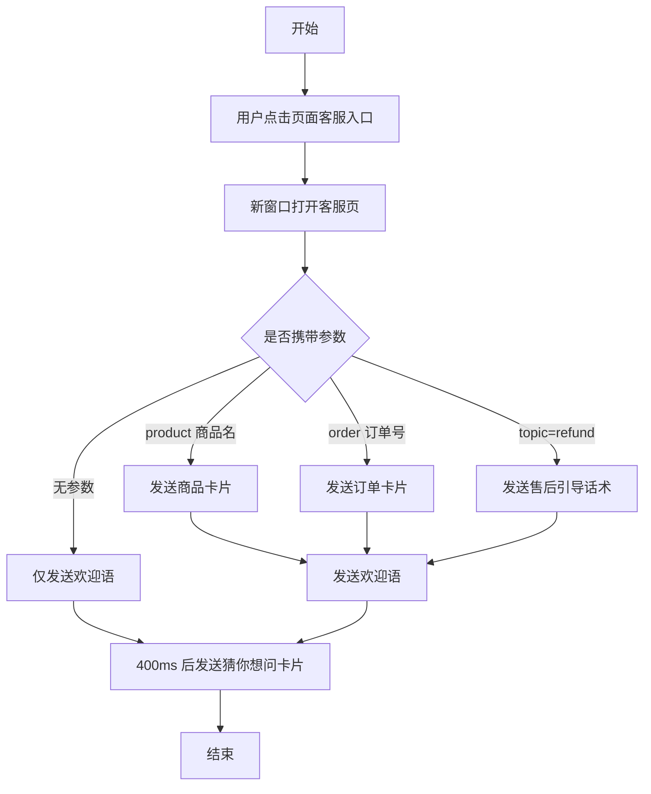

# 苏银豆商城产品需求文档（在线客服）

# 1. 需求背景

---

# 2. 需求分析

---

# 3. 系统流程图

---

# 4. 详细需求

## 4.1. 苏银豆商城系统

### 4.1.1. 在线客服模块

#### 4.1.1.1. 在线客服独立页（26A）

##### 1. 功能概述

- **功能描述**：PC 端在线客服独立窗口页（新浏览器窗口打开），采用三栏布局：左栏消息列表（会话入口）、中栏聊天主体（消息区 + 工具栏 + 输入区）、右栏服务信息（品牌、服务信息、快捷自助、为你推荐）。默认由智能客服接待，支持关键词自动应答、卡片消息（订单/售后/物流/商品/猜你想问）、附件发送（图片/文件/表情）、转人工服务、历史咨询记录逐段加载。
- **业务描述**：为商城全流程（商品咨询、交易流程、订单售后、服务支持）提供统一的在线咨询入口，实现智能客服自助解答常见问题、人工客服兜底复杂问题的分层服务模式，降低人工坐席压力，提升咨询转化与问题解决效率。
- **使用角色**：商城注册用户（买家）。
- **触发条件**：用户在商城任一页面点击客服入口，系统以新浏览器窗口打开本页面，并按入口来源携带 URL 参数（topic 主题 / order 订单号 / product 商品名）自动带入上下文。

**客服入口清单**（各入口均通过 `ProtoCS.openStandalone()` 以新窗口打开本页）：

| 入口页面 | 入口位置 | 携带参数 |
|----------|----------|----------|
| 05.商品详情页 | 商铺卡片「联系客服」按钮 | topic=order、product=商品名 |
| 06.购物车 | 页头客服入口 | — |
| 07.结算付款 | 客服入口 | — |
| 08.支付成功 | 客服入口 | — |
| 09.支付失败-订单关闭 | 客服入口 | — |
| 10.订单页 | 页头客服入口 | order=订单号 |
| 11.订单详情 | 客服入口 | order=订单号 |
| 12.售后记录 | 页头/列表客服入口 | topic=refund |
| 13.申请售后 | 客服入口 | topic=refund |
| 14.售后详情 | 操作区「联系客服」按钮 | topic=refund、order=订单号 |
| 17.积分中心 | 「我的苏银豆」卡片头部「联系客服」链接 | topic=points |
| 24.帮助中心 | 客服入口 | topic |
| 25.设置 | 客服入口 | topic=account |
| 全部页面 | 右下角悬浮栏「客服」图标 | — |
| 26.在线客服（旧版） | 保留页，由旧版页内自行跳转 | 按旧版逻辑 |

##### 2. 界面设计

###### 2.1 页面原型

- 原型路径：`页面原型与PRD/26A.在线客服(新版)-原型页面.html`（浏览器直接打开，窗口尺寸 1240×720）

###### 2.2 输出项说明

| 字段名称 | 字段标识 | 数据类型 | 数据来源 | 格式说明 |
|----------|----------|----------|----------|----------|
| 客服头像 | head_avatar | String | 页面静态 | 智能客服红底"客"；人工客服橙底"王" |
| 客服名称 | head_name | String | 页面状态机 | 智能客服阶段："智能客服 在线客服"；人工阶段："王小明 人工客服 · 售后组" |
| 在线状态 | head_status | String | 页面静态 | 绿点 + "在线" |
| 消息区 | chat_body | DOM 列表 | 会话上下文 | 消息气泡（用户浅灰右侧 / 客服白底左侧）+ 卡片消息 |
| 历史记录入口 | history_link | Link | 页面静态 | "︿ 点击查看历史咨询记录" |
| 工具栏 | tool_bar | Button 组 | 页面静态 | 图片 / 文件 / 订单 / 表情 四个图标按钮 |
| 输入框 | chat_input | Textarea | 用户输入 | 高 96px 起、最大 180px，Enter 发送、Shift+Enter 换行 |
| 发送按钮 | send_btn | Button | 页面静态 | 渐变红胶囊按钮 + 纸飞机图标 |
| 会话列表（左栏） | conv_list | DOM 列表 | 会话上下文 | 仅"在线客服"一条线，预览跟随最后一条消息（截断 18 字） |
| 服务信息（右栏） | cs_info | DOM 区块 | 页面静态 | 服务时间 / 热线 400-888-6688 / 平均响应 <30 秒 |
| 快捷自助按钮 | ci_tool | Button 组 | 页面静态 | 猜你想问 / 查订单 / 苏银豆 三个按钮块（图标+标题+副标题） |
| 为你推荐（右栏） | ci_goods | DOM 列表 | 订单数据 | 仅 product 参数进入时显示，最多 2 个商品 + 咨询按钮 |
| 订单卡片 | order_card | Card | 订单数据 | 订单号 / 实付 / 商品缩略图（最多 2 件）/ 状态徽标 / 操作按钮 |
| 售后卡片 | refund_card | Card | 售后数据 | 售后号 / 类型 / 原因 / 退款金额 / 商品缩略图 / 查看进度 |
| 物流卡片 | logistics_card | Card | 订单数据 | 支持多包裹：包裹号 / 承运商 / 运单号 / 最新轨迹 |
| 商品卡片 | product_card | Card | 订单数据/URL 参数 | 商品图 / 名称 / 规格 / 价格 / 查看商品按钮 |
| 猜你想问卡片 | faq_card | Card | FAQ 库 | 4 条/页 + "↻ 换一换"翻页（共 8 条轮换） |
| 订单选择器弹窗 | picker_mask | Modal | 订单数据 | 列表项：商品图 / 名称 / 订单号·状态·金额 |
| 表情面板 | emoji_panel | Panel | 页面静态 | 8×4 网格共 32 个表情，浮于工具栏上方 |
| 系统提示 | sys_tip | Text | 系统事件 | 居中灰底胶囊（转接中/会话分隔等） |

##### 3. 业务逻辑

###### 3.1 流程图

**进入会话流程**



**消息发送与智能应答流程**

```mermaid
flowchart TD
    A[开始] --> B[用户输入消息并发送]
    B --> C{是否包含"转人工/人工客服"}
    C -->|是| D[执行转人工流程]
    C -->|否| E{关键词匹配}
    E -->|订单/物流/发货类| F{是否已带入订单号}
    F -->|是| G[返回对应订单卡片]
    F -->|否| H[弹出订单选择器]
    H --> I[用户选中订单]
    I --> G
    E -->|售后/退货/退款类| J[返回售后卡片]
    E -->|苏银豆/积分类| K[返回苏银豆说明]
    E -->|优惠券/卡券类| L[返回卡券说明]
    E -->|地址/收货类| M[返回地址规则]
    E -->|你好/在吗类| N[返回欢迎语]
    E -->|谢谢/感谢类| O[返回结束语]
    E -->|无匹配| P[返回兜底话术]
    G --> Q[结束]
    J --> Q
    K --> Q
    L --> Q
    M --> Q
    N --> Q
    O --> Q
    P --> Q
```

**转人工流程**

```mermaid
flowchart TD
    A[开始] --> B[用户发送含"转人工"的消息]
    B --> C[显示系统提示"正在为您转接人工客服…"]
    C --> D[等待 800ms]
    D --> E[头部切换为"王小明 人工客服 · 售后组"橙头像]
    E --> F[发送欢迎语"您好，我是人工客服王小明…"]
    F --> G[后续消息署名"人工客服 王小明"橙色头像]
    G --> H[结束]
```

**历史记录加载流程**

```mermaid
flowchart TD
    A[开始] --> B[点击"查看历史咨询记录"]
    B --> C{是否还有更早记录}
    C -->|否| D[显示"没有更早的咨询记录了"]
    D --> E[结束]
    C -->|是| F[在消息区顶部插入一段历史会话]
    F --> G[渲染日期时间轴分隔线]
    G --> H[历史消息淡入动画 350ms]
    H --> I[滚动锚定：视口保持原位置]
    I --> J[入口文字变为"查看更早的咨询记录"]
    J --> E
```

**附件发送流程（图片）**

```mermaid
flowchart TD
    A[开始] --> B[点击工具栏图片按钮]
    B --> C[打开系统文件选择框]
    C --> D[用户选择文件]
    D --> E{文件类型校验}
    E -->|非图片| F[提示"请选择图片文件"]
    F --> C
    E -->|通过| G[FileReader 读取为预览图]
    G --> H[以图片消息发送至会话]
    H --> I[客服回复"图片已收到，请问这张图片反映的是什么问题呢？"]
    I --> J[结束]
```

###### 3.2 业务规则

| 规则编号 | 规则名称 | 适用场景 | 规则描述 | 错误提示 |
|----------|----------|----------|----------|----------|
| RULE-CS-001 | 入口统一新窗口 | 所有客服入口 | 全部入口以新浏览器窗口（1240×720）打开独立客服页，不在页内弹窗 | — |
| RULE-CS-002 | 上下文带入 | 带参进入 | URL 携带 product 时自动发送商品卡片；携带 order 时自动发送订单卡片；topic=refund 时发送售后引导话术 | — |
| RULE-CS-003 | 欢迎语固定 | 会话开始 | 首条消息固定为"您好，我是在线客服，可以为您查询订单、解答常见问题。请问有什么可以帮您？" | — |
| RULE-CS-004 | 猜你想问自动发送 | 会话开始 | 欢迎语后 400ms 自动发送一张猜你想问卡片（4 条问题） | — |
| RULE-CS-005 | 订单查询需选择订单 | 订单类提问 | 未带入订单号时，先弹出订单选择器由用户选择具体订单，选中后返回该订单卡片 | — |
| RULE-CS-006 | 转人工触发词 | 消息发送 | 智能客服阶段消息包含"转人工"或"人工客服"即触发转接，800ms 后切换为人工客服王小明 | — |
| RULE-CS-007 | 历史记录逐段加载 | 历史查看 | 每次点击加载一段历史会话（按日期），加载后视口锚定原位置；共 3 段演示数据，翻完显示终态文案 | — |
| RULE-CS-008 | 图片类型校验 | 图片上传 | 仅接受 image/* 类型文件，非图片文件提示并允许重新选择 | 请选择图片文件 |
| RULE-CS-009 | 推荐位条件显示 | 右栏展示 | "为你推荐"区块仅在携带 product 参数（商品页进入）时显示，其余入口隐藏 | — |
| RULE-CS-010 | 智能滚动 | 消息渲染 | 新消息到达时若用户滚动位置贴近底部（<80px）则自动跟随，否则不打断阅读；用户自己发送消息强制滚底 | — |
| RULE-CS-011 | 会话单线联系制 | 左栏展示 | 左栏仅展示"在线客服"一条会话线，预览文字实时跟随当前会话最后一条消息（截断 18 字） | — |
| RULE-CS-012 | 商品图回退 | 卡片渲染 | 商品图片 key 无对应资源时，按 key 哈希从 5 张兜底图中稳定取一张，保证卡片始终有图 | — |
| RULE-CS-013 | Enter 发送 | 输入框 | Enter 发送消息，Shift+Enter 换行；输入框高度 96px 起、内容增多最高撑至 180px | — |
| RULE-CS-014 | 猜你想问轮换 | FAQ 卡片 | FAQ 库共 8 条，每卡片展示 4 条，点"换一换"翻至下一页并循环 | — |
| RULE-CS-015 | FAQ 点选即提问 | FAQ 卡片 | 点击卡片中任意问题，该问题作为用户消息发出，客服返回对应答案 | — |

###### 3.3 状态机设计

**客服服务状态机**

**状态定义**

| 状态值 | 状态名称 | 状态说明 | 可见角色 |
|--------|----------|----------|----------|
| bot | 智能客服接待 | 默认状态，智能客服自动应答，红头像"客"，署名"智能客服" | 用户 |
| transferring | 转接中 | 触发转人工后的过渡态（800ms），显示系统提示 | 用户 |
| human | 人工客服接待 | 头部与署名切换为"王小明 人工客服 · 售后组"橙头像"王" | 用户 |

**状态流转规则**

| 当前状态 | 触发操作 | 目标状态 | 操作角色 | 前置条件 |
|----------|----------|----------|----------|----------|
| bot | 发送含"转人工/人工客服"的消息 | transferring | 用户 | 消息命中转人工正则 |
| transferring | 800ms 定时器到期 | human | 系统 | 无 |
| human | 关闭窗口后重新进入 | bot | 用户 | 重新打开页面 |

**状态对应UI差异**

| 状态 | 头部名称 | 客服头像 | 消息署名 | 头像底色 |
|------|----------|----------|----------|----------|
| bot | 智能客服 在线客服 | 客 | 智能客服 | 商城红 #f63218 |
| transferring | 智能客服（未变） | 客 | —（显示转接提示） | 商城红 |
| human | 王小明 人工客服·售后组 | 王 | 人工客服 王小明 | 橙 #ff8a00 |

##### 4. 交互设计

###### 4.1 输入项说明

| 字段名称 | 字段标识 | 字段类型 | 必填 | 数据类型 | 长度限制 | 校验规则 | 取值范围 | 来源 | 提示文案 | 备注 |
|----------|----------|----------|------|----------|----------|----------|----------|------|----------|------|
| 咨询内容 | chat_input | 多行文本 | 发送时非空 | String | 不限制 | 空 内容不可发送 | 自由文本 | 用户输入 | 请输入您想咨询的问题，Enter 发送，Shift+Enter 换行 | Enter 发送 / Shift+Enter 换行 |
| 图片文件 | file_input | 文件选择 | 是 | File | — | 仅 image/* | image/* | 用户本地 | 请选择图片文件 | accept=image/* |
| 普通文件 | file_doc_input | 文件选择 | 是 | File | — | 不限类型 | 任意 | 用户本地 | — | 选择后展示文件名+大小卡片 |
| URL-主题 | topic | URL 参数 | 否 | String | — | — | order/refund/points/shipping/account | 入口页携带 | — | 控制开场引导话术 |
| URL-订单号 | order | URL 参数 | 否 | String | — | 需存在于订单数据 | 订单号 | 入口页携带 | — | 自动发送订单卡片 |
| URL-商品名 | product | URL 参数 | 否 | String | — | 需 encode | 商品名 | 入口页携带 | — | 自动发送商品卡片+显示推荐位 |

###### 4.2 交互说明

1. **进入会话**：用户在任一入口页点击客服入口 → 新窗口打开 → 收到欢迎语 → 400ms 后收到猜你想问卡片；若从商品页进入，追加商品卡片并显示右栏推荐位。
2. **快捷自助**：点击右栏「查订单」/「苏银豆」按钮，等同发送对应文本消息；点击「猜你想问」随时再发一张 FAQ 卡片到会话底部。
3. **猜你想问卡片**：点某条问题 → 该问题以用户消息发出 → 客服返回答案；点「↻ 换一换」翻页不发送消息。
4. **订单类提问**：输入"查订单"等 → 客服反问并弹出订单选择器 → 选中后该订单卡片以用户消息发出，客服追问具体问题；从订单页进入（带 order）则直接返回订单卡片。
5. **发送图片**：工具栏点图片按钮 → 选文件 → 校验类型 → 图片消息入会话（最大 220px 缩略，可点击新窗查看原图）→ 客服回应。
6. **发送文件**：工具栏点文件按钮 → 选文件 → 文件卡片（图标+文件名+KB/MB 大小）入会话 → 客服回应。
7. **发送表情**：工具栏点表情按钮 → 工具栏上方浮出 8×4 表情面板 → 点表情插入输入框光标处 → 面板外点击关闭。
8. **转人工**：发送"转人工" → 系统提示转接中 → 800ms 后头部与消息署名切换为人工客服王小明（橙头像），后续消息以人工身份展示。
9. **查看历史**：点顶部「查看历史咨询记录」→ 立即在上方插入一段带日期时间轴的历史会话（淡显只读）→ 视口保持原位 → 可继续点加载更早，翻完显示终态。
10. **消息滚动**：用户上翻阅读历史时新消息不强制拽底；用户发送消息后强制滚动到底部。

###### 4.3 错误提示文案

**表单校验提示**

| 校验字段 | 校验场景 | 提示文案 |
|----------|----------|----------|
| chat_input | 发送空内容 | 不发送（无提示，静默拦截） |
| file_input | 选择的不是图片文件 | 请选择图片文件 |

**业务异常提示**

| 异常场景 | 错误码 | 提示文案 |
|----------|--------|----------|
| 订单选择器无数据 | CS-001 | 暂无相关记录 |
| 商品信息缺失（product 无匹配） | CS-002 | 使用默认规格兜底卡片展示 |
| 推荐位无商品数据 | CS-003 | 暂无推荐 |

##### 5. 数据设计

###### 5.1 数据流转说明

**数据来源**

| 字段/数据 | 来源 | 获取方式 | 说明 |
|-----------|------|----------|------|
| 订单数据（列表/详情） | 订单模块 mock（order-mock.js） | OrderMock.all() / OrderMock.get(id) | 订单卡片、订单选择器、物流卡片数据源 |
| 售后数据 | 售后模块 mock（refund-mock.js） | RefundMock.all() | 售后卡片数据源 |
| 商品图片 | 商品图库（product-images.js） | IMG[key]，缺失时哈希回退 | 全部卡片缩略图 |
| 页面路由 | 路由表（proto-pages.js） | ProtoPages 映射 | 卡片按钮跳转目标页 |
| 会话上下文 | URL 参数 | topic / order / product | 入口页带入 |

**数据去向**

| 数据 | 目标系统/模块 | 同步时机 | 说明 |
|------|---------------|----------|------|
| 商品卡片「查看商品」 | 05.商品详情页 | 用户点击 | 新窗口打开并带 from=cs 标记 |
| 订单卡片「查看详情/查看物流」 | 11.订单详情 | 用户点击 | 新窗口打开并带 order 参数 |
| 售后卡片「查看进度」 | 14.售后详情 | 用户点击 | 新窗口打开并带 refund 参数 |
| 猜你想问→订单类问题 | 订单选择器 | 用户点选 | 触发订单卡片入会话 |
| 推荐位「咨询」 | 会话消息区 | 用户点击 | 商品卡片以用户消息发出 |

###### 5.2 数据权限设计

**角色数据范围**

| 角色 | 数据范围 | 说明 |
|------|----------|------|
| 注册用户（买家） | 本账号的订单、售后、积分数据 | 客服查询仅返回当前账号数据 |

**功能权限点**

| 权限标识 | 权限名称 |
|----------|----------|
| cs:consult | 发起咨询（文本/图片/文件/表情） |
| cs:order-card | 发送订单卡片 |
| cs:transfer | 转人工服务 |

##### 6. 扩展功能

###### 6.1 批量操作规则

不适用（本页面为会话型交互，无批量操作场景）。

###### 6.2 操作日志要求

| 操作类型 | 记录内容 | 保留时长 |
|----------|----------|----------|
| 会话消息 | 发送方、时间、消息内容（文本/卡片/附件） | 1 年 |
| 转人工事件 | 触发时间、触发词、接入坐席 | 1 年 |
| 历史记录查看 | 查看时间、加载的历史段 | 6 个月 |

#### 4.1.1.2. 在线客服入口跳转说明（跨页面）

##### 1. 功能概述

- **功能描述**：分布于 12 个业务页面 + 全站悬浮栏的客服入口集合，统一通过 `ProtoCS.openStandalone(opts)` API 以新浏览器窗口打开在线客服独立页（26A），并按页面业务语境携带上下文参数。
- **业务描述**：保证用户在商城任意交易/售后环节可一键触达客服，且客服端自动获得业务上下文（商品、订单、售后主题），减少用户重复描述。
- **使用角色**：商城注册用户（买家）。
- **触发条件**：用户在业务页面点击对应客服入口（按钮 / 链接 / 悬浮栏图标）。

##### 2. 界面设计

###### 2.1 页面原型

- 各入口页原型见「功能概述-客服入口清单」；悬浮栏原型为全站右下角 `float-dock` 组件。

###### 2.2 输出项说明

| 字段名称 | 字段标识 | 数据类型 | 数据来源 | 格式说明 |
|----------|----------|----------|----------|----------|
| 新窗尺寸 | window_size | String | openStandalone 固定值 | width=1240,height=720 |
| 主题参数 | topic | String | 入口页静态配置 | order / refund / points / shipping / account |
| 订单号参数 | order | String | 页面上下文订单号 | 订单号原文 |
| 商品名参数 | product | String | 页面上下文商品名 | encodeURIComponent 编码 |

##### 3. 业务逻辑

###### 3.1 流程图

**入口跳转数据流转**


###### 3.2 业务规则

| 规则编号 | 规则名称 | 适用场景 | 规则描述 | 错误提示 |
|----------|----------|----------|----------|----------|
| RULE-ENTRY-001 | 声明式触发 | 页面内入口 | 使用 data-cs-open / data-cs-topic / data-cs-order / data-cs-product 属性声明入口，由全局事件委托统一拦截 | — |
| RULE-ENTRY-002 | 编程式触发 | 按钮场景 | 按钮 onclick 调用 ProtoCS.openStandalone({...}) 传参（如商品详情页） | — |
| RULE-ENTRY-003 | 旧链接拦截 | 存量页面 | href 指向旧版 26.在线客服 的链接统一拦截并改走新窗 26A | — |
| RULE-ENTRY-004 | 悬浮栏统一 | 全站悬浮栏 | 悬浮栏客服图标走同一 openStandalone，与页面内入口行为一致 | — |
| RULE-ENTRY-005 | 旧版保留 | 26 旧版页 | 26.在线客服（旧版原型）整页保留不改动，其内部逻辑不受影响 | — |

###### 3.3 状态机设计

不适用（入口为单步跳转，无状态流转）。

##### 4. 交互设计

###### 4.1 输入项说明

不适用（入口无用户输入字段）。

###### 4.2 交互说明

1. 用户点击入口（按钮/链接/悬浮栏图标）→ 当前页不跳转、不弹窗。
2. 浏览器新开 1240×720 窗口加载 26A 客服页，URL 携带业务参数。
3. 原 页面保持用户所在位置不受影响。

###### 4.3 错误提示文案

**表单校验提示**

| 校验字段 | 校验场景 | 提示文案 |
|----------|----------|----------|

**业务异常提示**

| 异常场景 | 错误码 | 提示文案 |
|----------|--------|----------|
| 浏览器拦截弹窗 | ENTRY-001 | 请允许本站弹出式窗口 |

##### 5. 数据设计

###### 5.1 数据流转说明

**数据去向**

| 数据 | 目标系统/模块 | 同步时机 | 说明 |
|------|---------------|----------|------|
| topic/order/product 参数 | 26A 在线客服独立页 | 新窗打开时 URL 传递 | 客服页据此自动发送上下文卡片 |

###### 5.2 数据权限设计

同 4.1.1.1 第 5.2 节。

##### 6. 扩展功能

###### 6.1 批量操作规则

不适用。

###### 6.2 操作日志要求

| 操作类型 | 记录内容 | 保留时长 |
|----------|----------|----------|
| 入口点击 | 来源页面、入口位置、携带参数 | 6 个月 |

---

# 5. 非功能需求

## 5.1. 性能需求

| 指标名称 | 指标要求 |
|----------|----------|
| 页面加载时间 | 首屏加载 ≤ 3 秒 |
| 消息发送响应 | 用户消息上屏 ≤ 100ms，客服应答 500–850ms（模拟真人节奏） |
| 历史记录加载 | 点击后即时不出loading（同步渲染 + 350ms 淡入） |
| 转人工切换 | 提示后 800ms 内完成身份切换 |

## 5.2. 兼容性需求

| 类型 | 要求 |
|------|------|
| 浏览器 | Chrome 80+、Firefox 75+、Safari 13+、Edge 80+ |
| 分辨率 | 最低支持 1240×720（新窗默认尺寸），推荐 1920×1080 |
| 弹窗 | 需允许弹出式窗口（新窗打开客服页） |

## 5.3. 安全需求

| 安全项 | 要求 |
|--------|------|
| 文件上传 | 校验文件类型（图片仅 image/*），前端预览使用本地 FileReader 不落盘 |
| 数据范围 | 会话仅展示当前账号的订单/售后数据 |
| XSS 防护 | 用户输入内容经 HTML 转义后渲染 |

---

# 6. 附录

## 6.1. 术语表

| 术语 | 说明 |
|------|------|
| 26A | 在线客服新版独立页原型（本 PRD 核心页面） |
| openStandalone | 以新浏览器窗口打开客服页的全局 API（ProtoCS.openStandalone） |
| 联系制 | 会话组织方式：单一"在线客服"会话线承载全部历史，按日期分隔展示 |
| 猜你想问 | FAQ 卡片，4 条/页，支持换一换轮换 |
| 苏银豆 | 商城积分，1 豆 = ¥0.01，可抵扣/兑换、不可提现 |
| 智能客服 | 默认接待的机器人客服（红头像"客"） |
| 人工客服 | 转人工后接入的坐席（演示角色：王小明，售后组） |

## 6.2. 相关文档

| 文档名称 | 文档路径 |
|----------|----------|
| 在线客服独立页原型 | 页面原型与PRD/26A.在线客服(新版)-原型页面.html |
| 在线客服旧版原型（保留） | 页面原型与PRD/26.在线客服-原型页面.html |
| 入口拦截脚本 | assets/cs-widget.js |
| 悬浮栏组件 | assets/float-dock.js |
| 订单 mock 数据 | assets/order-mock.js |
| 售后 mock 数据 | assets/refund-mock.js |
| 页面路由表 | assets/proto-pages.js |

---

# 7. 版本记录

| 版本号 | 修改日期 | 修改人 | 修改内容 |
|--------|----------|--------|----------|
| V1.0 | 2026-08-25 | 产品经理 | 初稿创建（基于 26A 新版客服原型与全站入口改造） |
