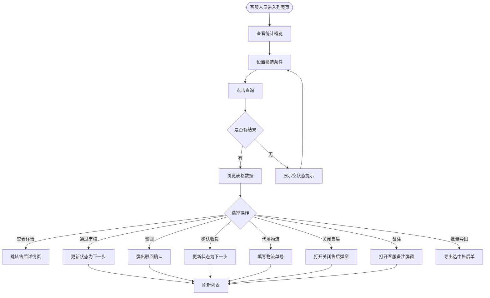
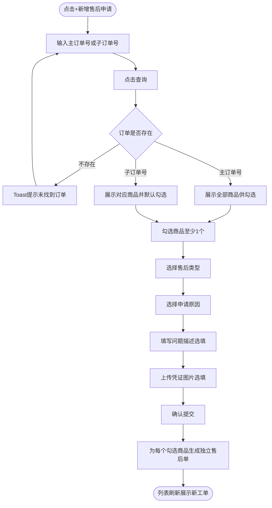
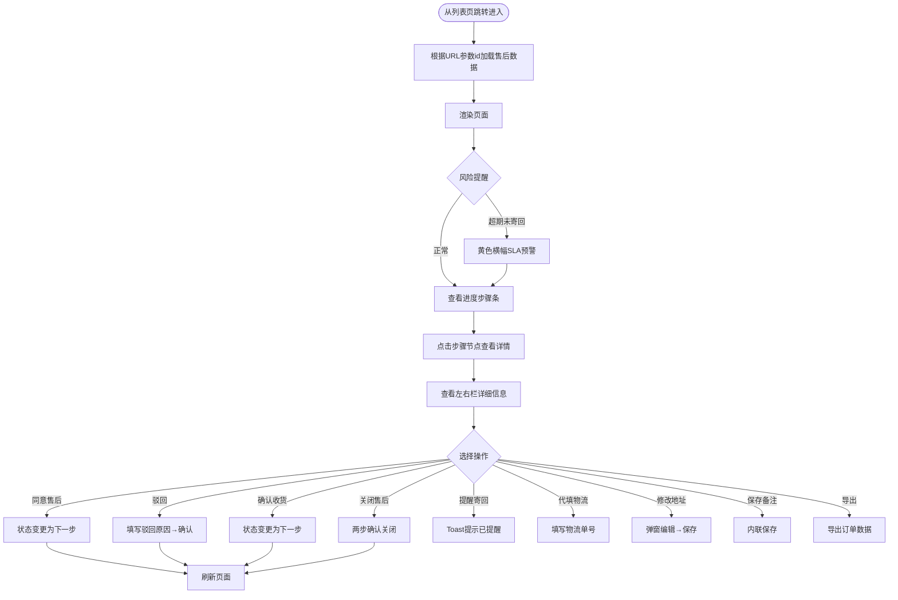
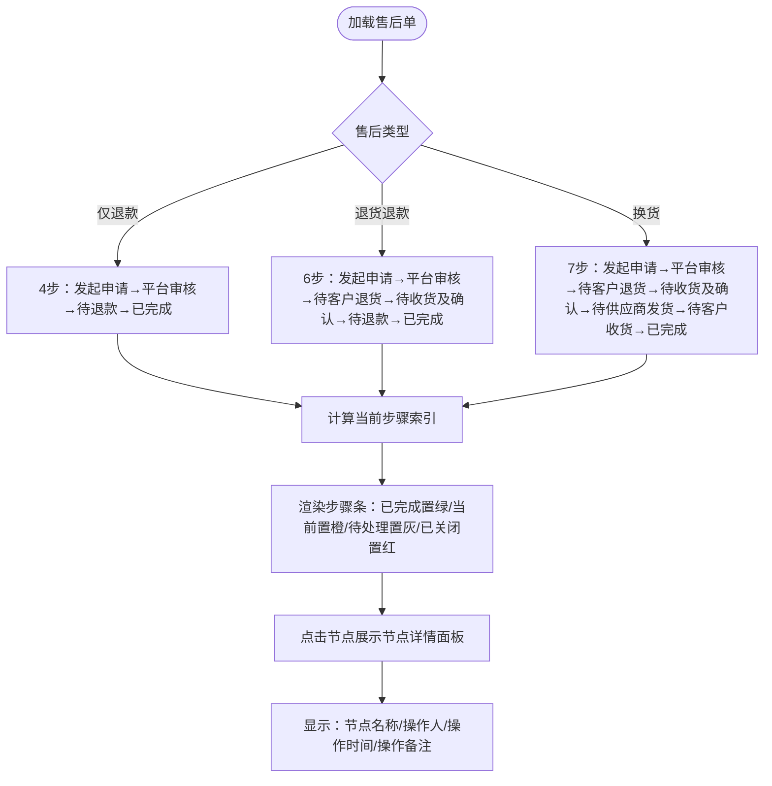
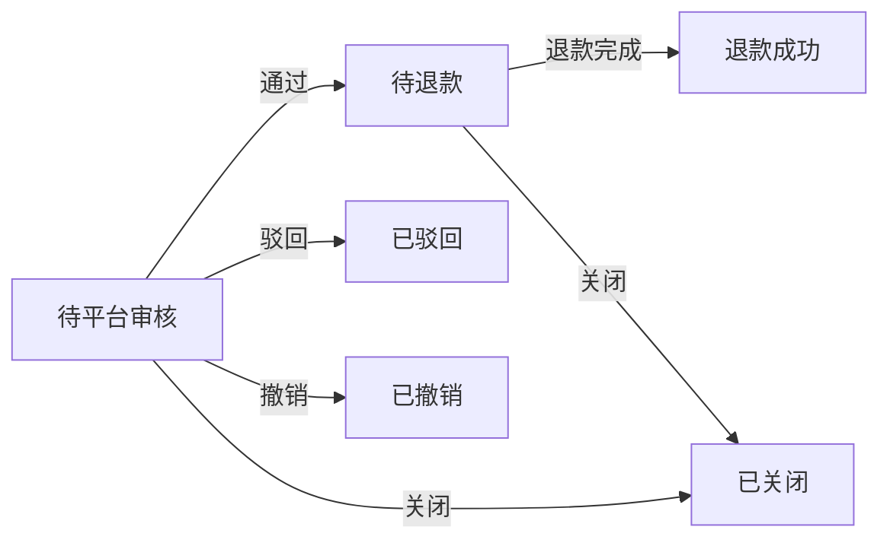
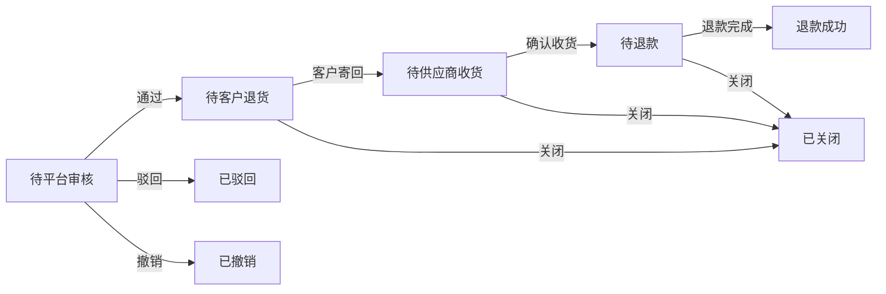
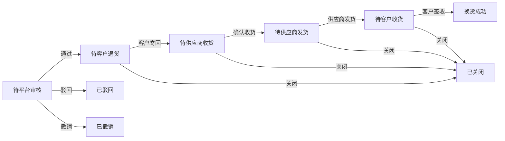

# 商城运营平台 - 售后监控模块 PRD V0.1

> 版本：V0.1 | 最后更新：2026-07-07

---

## 一、版本概述

V0.1 为商城运营平台售后监控模块的首版 PRD，覆盖售后监控列表与售后详情页两个页面，是客服人员处理售后工单的核心工作区。

### 1.1 页面清单

本次 PRD 覆盖以下页面：

| 页面 | 文件路径 | 层级 |
|------|----------|------|
| 售后监控列表 | 18.售后监控列表-原型页面.html | 一级（侧边栏"订单监控"分组） |
| 售后详情页 | 19.售后详情页-原型页面.html | 二级（从列表页跳转进入） |

共 2 个页面。

### 1.2 核心功能

售后监控模块为客服提供售后工单的全生命周期管理能力：列表页支持多维筛选、统计概览、行操作与代客发起售后申请；详情页按售后类型（仅退款/退货退款/换货）动态生成进度步骤条，展示退款明细、物流信息、买家画像与售后时间线，并支持驳回、关闭、确认收货等操作。

### 1.3 数据来源说明

| 数据类型 | 来源 | 说明 |
|----------|------|------|
| 售后工单数据 | 后端接口（原型阶段为静态演示数据） | 包含12笔演示工单，覆盖全部售后类型与状态 |
| 订单关联数据 | 主订单号/子订单号关联查询 | 新增售后申请时根据订单号查询商品列表 |
| 买家画像数据 | 用户中心 | 注册时间、购买次数、累计消费、退款率 |
| 物流数据 | 物流服务商接口 | 退货物流、换货物流的运单号与轨迹 |

### 1.4 统计口径

| 指标 | 计算方式 | 说明 |
|------|----------|------|
| 售后单总数 | 全部售后工单中排除"待平台审核""已驳回""已关闭""已撤销"四种状态后计数 | **排除未进入处理流程和已终止的售后单**：只统计审核通过后进入实际处理流程的售后单（待客户退货、待供应商收货、待退款、待供应商发货、待客户收货、退款成功、换货成功） |
| 退款金额 | 遍历全部售后单，仅统计 `status === '退款成功'` 的 `amount` 汇总 | **仅统计已完成退款**：只有退款成功状态的售后单才计入退款金额。换货类型 amount 为"—"，不计入 |
| 近7天售后单总数 | 申请时间在最近7天内的售后单计数，排除"待平台审核""已驳回""已关闭""已撤销" | 以全部售后单中最新的申请时间为基准，向前推7天。排除规则同售后单总数 |
| 近7天退款金额 | 近7天内 `status === '退款成功'` 的售后单 amount 汇总 | 仅统计退款成功状态，换货类型不计入 |
| 退款明细 | 合计退款 = 实付金额 + 积分抵扣金额 | 优惠券不退回；仅适用于仅退款/退货退款类型 |
| 商品总数（底部汇总） | 已选售后单的 `qty` 字段累加（`qty` 未设置时默认 1） | 每条工单的 qty 来源于关联订单中该商品的购买数量。例如勾选一笔换货工单，该工单关联订单中买了3件同款商品，则商品总数计为 3 件 |

---

## 二、售后监控

售后监控模块是客服处理客户售后申请的核心工作区，包含列表总览和详情处理两个页面。客服人员从列表页筛选定位售后工单，通过行操作快速处理或进入详情页深入了解单笔售后全貌。

### 2.1 售后监控列表（18.售后监控列表-原型页面.html）

#### 2.1.1 功能概述

售后监控列表是客服人员进入售后模块的默认页面，集中展示所有售后工单。页面顶部提供四项统计指标用于快速掌握售后全局，中间表格支持多维度筛选和行操作（操作按钮按售后进展动态变化），底部提供批量导出和选中汇总。页面同时支持运营代客发起售后申请。

#### 2.1.2 页面结构

页面由侧边栏导航（公共组件）、顶部面包屑导航、统计卡片区、筛选工具栏、数据表格、底部固定操作栏和若干弹窗组成。

| 区域 | 说明 |
|------|------|
| 统计卡片区 | 4张卡片横向排列：售后单总数、退款金额、近7天售后单总数、近7天退款金额 |
| 筛选工具栏 | 关键词输入框、售后类型下拉、售后进展下拉、所属商城下拉、供应商下拉、申请时间范围选择器、查询按钮、重置按钮 |
| 数据表格 | 11列：复选框、商品信息、关联订单、供货来源、客户、申请时间、售后类型、退款金额、售后进展、客服备注、操作 |
| 底部操作栏 | 固定于页面底部：批量导出按钮、已选汇总信息（笔数/商品总数/退款总额）、分页器 |
| 新增售后弹窗 | 运营代客发起售后：输入订单号→查询→勾选商品→选择售后类型和原因→提交 |
| 客服备注弹窗 | 编辑某笔售后单的客服备注 |
| 关闭售后弹窗 | 两步流程：选择关闭原因→确认关闭 |

#### 2.1.3 操作流程

**主流程：筛选与处理售后工单**



**子流程：新增售后申请（代客发起）**



#### 2.1.4 字段与交互

**筛选条件**

| 字段名称 | 字段标识 | 字段类型 | 必填 | 数据类型 | 长度限制 | 默认值 | 校验规则 | 取值范围 | 来源 | 错误提示 |
|----------|----------|----------|------|----------|----------|--------|----------|----------|------|----------|
| 关键词 | fKeyword | 文本输入 | 否 | String | 无 | 空 | 模糊匹配 | — | 用户输入 | — |
| 售后类型 | fType | 下拉选择 | 否 | String | — | 全部 | — | 仅退款/退货退款/换货 | 用户选择 | — |
| 售后进展 | fStatus | 下拉选择 | 否 | String | — | 全部 | — | 待平台审核/待客户退货/待供应商收货/待退款/待供应商发货/待客户收货/换货成功/退款成功/已驳回/已关闭/已撤销 | 用户选择 | — |
| 所属商城 | fMall | 下拉选择 | 否 | String | — | 全部 | — | 政企福利商城/航司积分小站/商城会员购 | 用户选择 | — |
| 供应商 | fSupplier | 下拉选择 | 否 | String | — | 全部 | — | 星辰商贸/博源供应链/华茂通/恒通供应链 | 用户选择 | — |
| 申请时间范围 | fDateStart/fTimeStart/fDateEnd/fTimeEnd | 日期+时间选择 | 否 | Date | — | 空 | 开始时间≤结束时间 | — | 用户选择 | — |

**关键词搜索覆盖字段**：主订单号、子订单号、售后单号、商品名称、商城SKU、收货人手机号、收货人姓名，任意一个字段包含关键词即匹配。

**表格列**

| 字段名称 | 字段标识 | 字段类型 | 说明 |
|----------|----------|----------|------|
| 复选框 | selectAll/row-check | 复选框 | 表头全选/反选，行级勾选，用于批量导出 |
| 商品信息 | — | 复合展示 | 商品缩略图+商品名称（规格）+售后单号（可复制） |
| 关联订单 | — | 复合展示 | 主订单号（可复制）+子订单号（可复制） |
| 供货来源 | — | 复合展示 | 供应商名称+供应链SKU（可复制） |
| 客户 | — | 复合展示 | 客户姓名+手机号+所属商城 |
| 申请时间 | — | 复合展示 | 申请时间+来源标签（运营代客时显示操作人） |
| 售后类型 | type | 文本展示 | 仅退款/退货退款/换货 |
| 退款金额 | amount | 金额展示 | 换货显示"—"，其余显示¥金额 |
| 售后进展 | status | 标签展示 | 彩色标签区分状态 |
| 客服备注 | csRemark | 文本展示 | 超长省略，hover显示完整内容 |
| 操作 | — | 按钮组 | 按状态动态展示，见业务规则 |

**进展标签颜色**

标签颜色方案按照供应链售后列表保持一致，具体颜色定义参见供应链侧售后列表页。

| 进展 | 标签样式 |
|------|----------|
| 待平台审核 | 红色标签 |
| 待客户退货/待供应商收货/待退款/待供应商发货/待客户收货 | 蓝色标签 |
| 退款成功/换货成功 | 绿色标签 |
| 已驳回/已关闭/已撤销 | 灰色标签 |

**新增售后弹窗字段**

| 字段名称 | 字段标识 | 字段类型 | 必填 | 数据类型 | 默认值 | 校验规则 | 来源 | 错误提示 |
|----------|----------|----------|------|----------|--------|----------|------|----------|
| 订单号 | newOrderNo | 文本输入 | 是 | String | 空 | 非空，需匹配系统中的主/子订单号 | 用户输入 | 为空：请填写订单号；不匹配：未找到对应订单，请检查订单号 |
| 查询按钮 | — | 按钮 | — | — | — | 触发订单查询 | — | — |
| 商品勾选 | new-product-check | 复选框 | 是 | Boolean | 子订单号查询默认勾选 | 至少勾选一个商品 | 用户操作 | 请至少勾选一个商品 |
| 售后类型 | newType | 下拉选择 | 是 | String | 空 | 非空 | 仅退款/退货退款/换货 | 用户选择 | 请选择售后类型 |
| 申请原因 | newReason | 下拉选择 | 是 | String | 空 | 非空 | 不想要了/发错货/质量问题/少件漏发/商品破损/其他 | 用户选择 | 请填写申请原因 |
| 问题描述 | newDescription | 文本域 | 否 | String | 空 | — | — | 用户输入 | — |
| 凭证图片 | — | 文件上传 | 否 | File | 0张 | 最多3张 | — | 用户上传 | — |

**关闭售后弹窗字段**

| 字段名称 | 字段标识 | 字段类型 | 必填 | 数据类型 | 默认值 | 校验规则 | 取值范围 | 错误提示 |
|----------|----------|----------|------|----------|--------|----------|----------|----------|
| 关闭原因 | closeReasonSelect | 下拉选择 | 是 | String | 空 | 非空 | 已线下协商/买家撤销/重复申请/误操作发起/其他 | 请选择关闭原因 |
| 补充说明 | closeReasonInput | 文本域 | 条件必填 | String | 空 | 选择"其他"时必填 | — | 选择「其他」时请填写补充说明 |

#### 2.1.5 业务规则

**操作按钮对照表**

每行售后的操作按钮按当前进展动态展示，规则如下：

| 售后进展 | 操作按钮 | 说明 |
|----------|----------|------|
| 待平台审核 | 详情 / 通过 / 驳回 / 备注 | 通过→进入下一步；驳回→填写原因后退回 |
| 待客户退货 | 详情 / 代填物流 / 关闭售后 / 备注 | 代填物流→帮客户填写退货快递单号 |
| 待供应商收货 | 详情 / 确认收货 / 关闭售后 / 备注 | 确认收货→供应商签收后推进状态 |
| 待退款 | 详情 / 关闭售后 / 备注 | 等待财务退款，无主动推进操作 |
| 待供应商发货 | 详情 / 关闭售后 / 备注 | 换货场景，等待供应商发出换货商品 |
| 待客户收货 | 详情 / 关闭售后 / 备注 | 换货场景，等待客户签收换货商品 |
| 退款成功 | 详情 / 备注 | 终态，仅查看 |
| 换货成功 | 详情 / 申请退货退款 / 申请仅退款 / 备注 | 终态；可发起二次售后，入口仅列表页 |
| 已驳回 | 详情 / 备注 | 终态，仅查看 |
| 已关闭 | 详情 / 备注 | 终态，仅查看 |
| 已撤销 | 详情 / 备注 | 终态，仅查看 |

| 规则编号 | 规则描述 |
|----------|----------|
| RULE-AS-LIST-001 | 行操作按钮按售后进展动态展示，不同状态展示不同操作按钮组合，详见上方操作按钮对照表 |
| RULE-AS-LIST-002 | 待平台审核状态展示"通过/驳回/详情/备注"四个操作 |
| RULE-AS-LIST-003 | 待客户退货状态展示"代填物流/关闭售后/详情/备注"四个操作 |
| RULE-AS-LIST-004 | 待供应商收货状态展示"确认收货/关闭售后/详情/备注"四个操作 |
| RULE-AS-LIST-005 | 待退款/待供应商发货/待客户收货状态展示"关闭售后/详情/备注"三个操作 |
| RULE-AS-LIST-006 | 终态（退款成功/已驳回/已关闭/已撤销）仅展示"详情/备注"两个操作；换货成功展示"详情/申请退货退款/申请仅退款/备注"（见 RULE-AS-LIST-020） |
| RULE-AS-LIST-007 | 关闭售后仅适用于进行中状态（待客户退货/待供应商收货/待退款/待供应商发货/待客户收货），待平台审核状态应使用"驳回"而非"关闭"，已撤销状态不可关闭 |
| RULE-AS-LIST-008 | 确认供应商收货后：若为换货类型，状态变更为"待供应商发货"；其他类型变更为"待退款" |
| RULE-AS-LIST-009 | 关闭售后为两步流程：第一步选择关闭原因，第二步确认关闭，关闭后不可恢复 |
| RULE-AS-LIST-010 | 关闭原因统一为五类：已线下协商、买家撤销、重复申请、误操作发起、其他 |
| RULE-AS-LIST-011 | 新增售后申请时，主订单号查询展示全部商品供勾选；子订单号查询仅展示对应商品并默认勾选 |
| RULE-AS-LIST-012 | 代客发起的售后单来源标记为"运营代客"并记录操作人姓名，与"C端申请"区分 |
| RULE-AS-LIST-013 | 为每个勾选商品生成独立售后单，初始状态为待平台审核 |
| RULE-AS-LIST-014 | 换货类型的退款金额以"—"展示，不计入退款金额统计 |
| RULE-AS-LIST-015 | 底部汇总栏实时统计：已选售后单数（去重计数）、商品总数（按工单 qty 字段累加，qty 来源于订单商品购买数量，未设置默认1）、退款总额（按 amount 汇总，换货不计入） |
| RULE-AS-LIST-016 | 导出功能支持"导出全部售后单"和"导出全部筛选售后单"两种模式 |
| RULE-AS-LIST-017 | 统计卡片四指标口径：售后单总数排除"待平台审核""已驳回""已关闭""已撤销"四状态后计数；退款金额仅统计"退款成功"状态的 amount 汇总（换货返回0）；近7天以最新申请时间为基准，向前推7天筛选后计数和汇总金额，排除规则和状态过滤同上述口径 |
| RULE-AS-LIST-018 | "已撤销"状态由小程序用户端触发，用户在售后状态为"待平台审核"时可主动撤销售后申请，撤销后状态不可逆，属于终态 |
| RULE-AS-LIST-019 | 已撤销的售后单不计入售后单总数和退款金额统计 |
| RULE-AS-LIST-020 | 二次售后：换货成功后可针对该换货商品再次申请"退货退款"或"仅退款"，点击后创建一笔新的售后单（初始状态待平台审核，来源标记为二次售后）；二次售后入口仅在售后监控列表页，详情页换货成功不展示申请按钮；二次售后仅限退货退款/仅退款，不可再次换货 |

#### 2.1.6 页面跳转

**入口**：
- 侧边栏"订单监控"分组 → 点击"售后监控列表"
- 其他页面通过侧边栏导航进入

**出口**：
- 点击行操作"详情" → 售后详情页（19.售后详情页-原型页面.html?id={售后单号}），新标签页打开
- 点击侧边栏其他菜单 → 对应页面

---

### 2.2 售后详情页（19.售后详情页-原型页面.html）

#### 2.2.1 功能概述

售后详情页展示单笔售后工单的完整信息，客服人员在此页面深入了解售后全貌并执行关键操作。页面核心是动态进度步骤条——根据售后类型（仅退款/退货退款/换货）自动生成不同步骤数量，直观展示当前处理进度。页面同时提供退款明细、物流追踪、买家画像、售后时间线等辅助信息，支持驳回、关闭售后、确认收货、修改地址、编辑备注等操作。

页面通过 URL 参数 `?id={售后单号}` 接收售后单号，加载对应数据。原型阶段内置4个演示案例，可通过页面顶部下拉切换。

#### 2.2.2 页面结构

页面由顶部页面标题区、风险提醒横幅、进度步骤条卡片、左右双栏布局和若干弹窗组成。

| 区域 | 说明 |
|------|------|
| 页面标题区 | 售后单号（可复制）、所属商城、申请时间、售后类型、演示模式下拉切换、操作按钮组 |
| 风险提醒横幅 | 超期未寄回时展示黄色 SLA 预警横幅；已关闭/已撤销信息在步骤条节点展示，不再单独出横幅 |
| 进度步骤条卡片 | 动态步骤条+当前状态摘要+节点详情面板（点击节点展示） |
| 左栏-客户申请资料 | 联系方式、申请原因、问题描述、发起来源、凭证图片 |
| 左栏-关联订单 | 主订单号、子订单号、所属商城（可复制），"查看订单"链接新标签页跳转商城订单详情页 |
| 左栏-订单信息 | 商品表格：商品名、供货来源、销售单价、数量、优惠券、积分抵扣、金额小计、订单状态、运营备注；操作列"订单详情"链接新标签页跳转商城订单详情页 |
| 左栏-退款/换货信息 | 退款明细（实付金额+积分+优惠券）或换货说明 |
| 左栏-买家寄回地址 | 退货/换货场景的供应商寄回地址，支持一键复制和修改 |
| 左栏-供货来源 | 供应商、供应链SKU、退货单号（有则展示，无则显示"待回传"） |
| 右栏-收货信息 | 客户原始收货地址，支持查看完整手机号、一键复制和修改 |
| 右栏-买家画像 | 注册时间、购买次数、累计消费、退款率 |
| 右栏-客服备注 | 内联编辑文本框，保存后即时生效 |
| 右栏-退货/换货物流 | 快递公司、运单号（可复制）、最新轨迹 |
| 右栏-售后时间线 | 按时间倒序展示，区分买家/客服/系统三类角色 |

#### 2.2.3 操作流程

**主流程：查看与处理售后详情**



**进度步骤条流程（按售后类型分支）**



#### 2.2.4 字段与交互

**页面标题区**

| 字段名称 | 字段标识 | 字段类型 | 说明 |
|----------|----------|----------|------|
| 售后单号 | id | 文本展示 | 可复制，等宽字体 |
| 所属商城 | mall | 文本展示 | 括号内展示 |
| 申请时间 | time | 文本展示 | 格式 YYYY-MM-DD HH:mm |
| 售后类型 | type | 文本展示 | 仅退款/退货退款/换货 |
| 演示模式下拉 | — | 下拉选择 | 切换4个演示案例 |
| 操作按钮组 | — | 按钮组 | 按状态动态展示 |

**进度步骤条**

| 售后类型 | 步骤数 | 步骤序列 |
|----------|--------|----------|
| 仅退款 | 4步 | 发起申请 → 平台审核 → 待退款 → 已完成 |
| 退货退款 | 6步 | 发起申请 → 平台审核 → 待客户退货 → 待收货及确认 → 待退款 → 已完成 |
| 换货 | 7步 | 发起申请 → 平台审核 → 待客户退货 → 待收货及确认 → 待供应商发货 → 待客户收货 → 已完成 |

**步骤节点状态**

| 状态 | 视觉表现 | 条件 |
|------|----------|------|
| 已完成（done） | 绿色填充+对勾图标 | 步骤索引 < 当前步骤索引 |
| 当前（current） | 橙色边框+橙色圆点 | 步骤索引 = 当前步骤索引 |
| 待处理（pending） | 灰色边框 | 步骤索引 > 当前步骤索引 |
| 已关闭（closed） | 红色填充+叉号图标 | 售后状态为已关闭且该步骤为关闭节点 |

**节点详情面板**

| 字段名称 | 说明 |
|----------|------|
| 节点名称 | 当前选中步骤的名称 |
| 操作人 | 该节点的操作人（买家/客服/供应商/系统） |
| 操作时间 | 该节点操作发生的时间 |
| 操作备注 | 审核通过/待寄回/已填写物流/待收货等 |
| 关闭原因（仅关闭节点） | 关闭原因文本 |
| 操作备注（仅关闭节点） | 关闭时的操作备注 |

**客户申请资料**

| 字段名称 | 字段标识 | 字段类型 | 说明 |
|----------|----------|----------|------|
| 联系方式 | phoneMask | 文本展示 | 脱敏手机号，可复制完整号码 |
| 申请原因 | reason | 文本展示 | 不想要了/发错货/质量问题/少件漏发/商品破损/其他 |
| 问题描述 | description | 文本展示 | 客户填写的补充说明，空时显示"—" |
| 发起来源 | source | 文本展示 | C端申请 或 运营代客 |
| 凭证图片 | evidence | 图片列表 | 点击预览大图，支持打包下载，最多3张 |
| 查看交易快照 | — | 按钮 | 位于客户申请资料卡片右上角，点击后展示该订单成交时刻的商品信息、价格、优惠活动等冻结快照 |

**订单信息（商品表格）**

| 字段名称 | 字段标识 | 字段类型 | 说明 |
|----------|----------|----------|------|
| 商品 | — | 复合展示 | 商品缩略图+商品名称（规格）+子订单号 |
| 供货来源 | supplier/skuLogistics | 复合展示 | 供应商名称+供应链SKU（可复制） |
| 销售单价 | price | 金额展示 | 单价 |
| 数量 | qty | 数字展示 | 购买数量 |
| 优惠券 | coupon | 金额展示 | 红色负值展示 |
| 积分抵扣 | pointsDeduction | 金额展示 | 红色负值展示 |
| 金额小计 | subtotal | 金额展示 | 单价×数量−优惠券−积分抵扣 |
| 订单状态 | orderStatus | 标签展示 | 绿色标签 |
| 运营备注 | csRemark | 文本展示 | 空时显示"—" |
| 操作 | — | 链接 | "订单详情"链接，新标签页跳转商城订单详情页 `17.商城订单详情页-原型页面.html?id={主订单号}` |

**关联订单**

| 字段名称 | 字段标识 | 字段类型 | 说明 |
|----------|----------|----------|------|
| 主订单号 | mainNo | 文本展示 | 等宽字体，可复制 |
| 子订单号 | subNo | 文本展示 | 等宽字体，可复制 |
| 所属商城 | mall | 文本展示 | — |
| 查看订单 | — | 链接 | 新标签页跳转商城订单详情页 `17.商城订单详情页-原型页面.html?id={主订单号}` |

**退款信息**

| 字段名称 | 字段标识 | 说明 |
|----------|----------|------|
| 合计退款 | — | 实付金额¥{subtotal} + 积分¥{pointsDeduction} |
| 售后类型 | type | 仅退款/退货退款 |
| 支付方式 | paymentMethod | 微信支付/支付宝 |
| 实付金额退 | cashRefund | 退还的现金金额 |
| 应退积分 | pointsRefund | 退还的积分数量 |
| 优惠券 | — | 不退回 |

**换货说明**（换货类型时替换退款信息）

| 字段名称 | 说明 |
|----------|------|
| 换货说明 | "不涉及退款·同款同规格换货" |

**买家寄回地址**

| 字段名称 | 字段标识 | 说明 |
|----------|----------|------|
| 收件人 | returnAddress.name | 供应商退货组收件人 |
| 联系电话 | returnAddress.phone | 供应商联系电话 |
| 寄回地址 | returnAddress.addr | 供应商退货仓库地址 |

**收货信息**

| 字段名称 | 字段标识 | 字段类型 | 说明 |
|----------|----------|----------|------|
| 收货人 | customer | 文本展示 | 客户姓名 |
| 手机号 | phoneMask/phone | 文本展示 | 默认脱敏，点击眼睛图标查看完整号码，5秒后自动恢复脱敏 |
| 收货地址 | address | 文本展示 | 完整地址 |
| 地址预警 | addressWarning | 标签 | 地址不完整时展示橙色警告标签 |

**买家画像**

| 字段名称 | 字段标识 | 说明 |
|----------|----------|------|
| 注册时间 | registrationDate | 格式 YYYY-MM |
| 购买次数 | purchaseCount | 累计购买次数 |
| 累计消费 | totalSpent | 累计消费金额 |
| 退款率 | refundRate | 近30天退款笔数/总笔数百分比 |

**售后时间线**

| 字段名称 | 字段标识 | 说明 |
|----------|----------|------|
| 事件类型 | type | buyer（买家·绿色）/ ops（客服·蓝色）/ sys（系统·灰色） |
| 事件描述 | text | 操作描述，如"买家提交售后申请·原因：质量问题·凭证1张" |
| 事件时间 | time | 格式 YYYY-MM-DD HH:mm |

**退货/换货物流**

| 字段名称 | 字段标识 | 说明 |
|----------|----------|------|
| 快递公司 | company | 顺丰速运/中通快递等 |
| 运单号 | no | 可复制 |
| 退货单号/换货单号 | returnOrderNo/exchangeOrderNo | 系统生成的单号 |
| 最新轨迹 | — | 最新一条物流轨迹描述 |

#### 2.2.5 业务规则

| 规则编号 | 规则描述 |
|----------|----------|
| RULE-AS-DETAIL-001 | 进度步骤条按售后类型动态生成：仅退款4步、退货退款6步、换货7步 |
| RULE-AS-DETAIL-002 | 当前步骤节点高亮（橙色），已完成步骤置绿，待处理步骤置灰 |
| RULE-AS-DETAIL-003 | 点击已完成或当前步骤节点，展示该节点的详情面板（操作人、时间、备注） |
| RULE-AS-DETAIL-004 | 售后状态为"已关闭"时，步骤条在关闭节点置红，详情面板展示关闭原因和操作备注 |
| RULE-AS-DETAIL-005 | 已关闭/已撤销不在顶部单独展示横幅，其关闭原因、操作备注、撤销说明统一在进度步骤条的关闭/撤销节点详情面板中展示 |
| RULE-AS-DETAIL-006 | 客户超期未寄回时顶部展示黄色预警横幅，提示"建议提醒或关闭售后" |
| RULE-AS-DETAIL-007 | 操作按钮按售后进展动态展示（同列表页规则 RULE-AS-LIST-002 至 RULE-AS-LIST-006）；例外：二次售后入口仅在列表页，详情页换货成功不展示"申请退货退款/申请仅退款"（见 RULE-AS-LIST-020） |
| RULE-AS-DETAIL-008 | 退款金额计算：合计退款 = 实付金额（单价×数量−优惠券−积分抵扣）+ 积分抵扣金额；优惠券不退回 |
| RULE-AS-DETAIL-009 | 换货类型不展示退款信息，改为展示"不涉及退款·同款同规格换货" |
| RULE-AS-DETAIL-010 | 手机号默认脱敏展示（前3位+****+后4位），点击眼睛图标查看完整号码，5秒后自动恢复脱敏 |
| RULE-AS-DETAIL-011 | 收货地址支持修改（弹窗编辑），修改后手机号自动同步更新脱敏显示。**修改受状态限制**：待平台审核 / 待客户退货 / 待供应商收货 / 待供应商发货 状态下可修改；待客户收货及之后（待客户收货 / 退款成功 / 换货成功 / 已驳回 / 已关闭 / 已撤销）不可修改（换货商品已发出，收货地址冻结） |
| RULE-AS-DETAIL-012 | 买家寄回地址支持一键复制和一键修改。**修改受状态限制**：仅"待客户退货"状态可修改（买家尚未寄出，修改来得及让买家寄对地址）；待供应商收货及之后（待供应商收货 / 待退款 / 待供应商发货 / 待客户收货 / 各终态）不可修改（货已寄出或已到仓）；待平台审核时寄回地址尚未确认，该卡片不展示，无从修改 |
| RULE-AS-DETAIL-013 | 客服备注支持内联编辑，保存后即时生效 |
| RULE-AS-DETAIL-014 | 售后时间线按时间倒序排列，区分买家、客服、系统三类角色，以不同颜色圆点标识 |
| RULE-AS-DETAIL-015 | 关闭售后规则同列表页 RULE-AS-LIST-007 至 RULE-AS-LIST-010 |
| RULE-AS-DETAIL-016 | 驳回操作需填写驳回原因，必填 |
| RULE-AS-DETAIL-017 | 同意售后（待平台审核→通过）后：仅退款类型状态变更为"待退款"；退货退款/换货类型状态变更为"待客户退货" |
| RULE-AS-DETAIL-018 | 确认收货后：换货类型状态变更为"待供应商发货"；退货退款类型状态变更为"待退款" |
| RULE-AS-DETAIL-019 | 关闭售后需记录关闭节点（closeAtStep），时间线记录"平台关闭售后"事件及关闭原因、操作备注 |
| RULE-AS-DETAIL-020 | 查看交易快照展示的是下单时刻的商品详情页快照（冻结副本），而非当前商品详情页。快照内容包含：商品名称、规格、商品主图、商品单价、购买数量、优惠券抵扣金额、积分抵扣金额、实付金额、支付方式、下单时间、收货地址。即使后续商家修改商品描述或价格，快照内容不变，作为售后纠纷的判定依据 |
| RULE-AS-DETAIL-021 | 售后状态为"已撤销"时，步骤条在平台审核节点置红，显示叉号，详情面板展示"撤销信息"（含撤销说明）；已撤销为终态，不可恢复，不展示操作按钮（仅保留导出） |

#### 2.2.6 页面跳转

**入口**：
- 售后监控列表页行操作点击"详情" → 售后详情页（新标签页打开，URL 携带 `?id={售后单号}`）
- 直接访问 URL（携带售后单号参数）

**出口**：
- 点击订单信息中的"订单详情"链接 → 商城订单详情页（`17.商城订单详情页-原型页面.html?id={主订单号}`，新标签页）
- 点击关联订单卡片中的"查看订单"链接 → 商城订单详情页（同上，新标签页）
- 点击侧边栏导航 → 对应页面
- 面包屑"售后监控列表" → 返回售后监控列表（18.售后监控列表-原型页面.html）

---

## 三、数据模型

### 3.1 售后工单数据结构（workorder）

原型阶段以 JavaScript 对象数组形式存储，数据结构如下：

```javascript
{
  id: 'AF20260326001',          // 售后单号，格式 AF+日期+序号
  mainNo: 'ORD20260323001',     // 主订单号
  subNo: 'ORD2026032300105',    // 子订单号
  mall: '政企福利商城',          // 所属商城
  name: '不锈钢削皮器',          // 商品名称
  spec: '经典款',               // 商品规格
  skuMall: 'SC-A00015-001',     // 商城SKU
  skuLogistics: 'HZ-A00015-001-DF-A001', // 供应链SKU（物流SKU）
  supplier: '星辰商贸',          // 供应商名称
  type: '仅退款',               // 售后类型：仅退款/退货退款/换货
  source: 'C端申请',            // 发起来源：C端申请/运营代客
  agentOperator: '张三',        // 代客发起时的操作人（仅source=运营代客时有值）
  amount: '42.00',              // 退款金额（换货为"—"）
  qty: 1,                       // 商品数量
  time: '2026-03-26 15:20',    // 申请时间
  status: '待退款',             // 售后进展
  customer: '张三',             // 客户姓名
  phone: '138****8888',         // 脱敏手机号
  csRemark: '',                 // 客服备注
  closeReason: '',              // 关闭原因（仅已关闭状态有值）
  // 以下字段仅在详情页使用
  address: '湖北省武汉市洪山区珞喻路1037号', // 收货地址
  addressWarning: '',           // 地址预警
  registrationDate: '2024-03',  // 注册时间
  purchaseCount: '12 次',       // 购买次数
  totalSpent: '¥3,580',         // 累计消费
  refundRate: '8%',             // 退款率
  reason: '不想要了',           // 申请原因
  description: '',              // 问题描述
  evidence: [],                 // 凭证图片
  paymentMethod: '微信支付',     // 支付方式
  cashRefund: '28.00',          // 现金退款
  pointsRefund: '',             // 积分退款
  price: '28.00',               // 销售单价
  coupon: '5.00',               // 优惠券
  pointsDeduction: '0.28',      // 积分抵扣
  returnAddress: {              // 买家寄回地址（退货退款/换货）
    name: '恒通供应链退货组',
    phone: '400-888-3301',
    addr: '江苏省苏州市工业园区星湖街328号'
  },
  returnOrderNo: 'RT20260322001',    // 退货单号
  returnLogistics: {            // 退货物流
    company: '顺丰速运',
    no: 'SF1234567890',
    time: '2026-03-24 09:00'
  },
  exchangeOrderNo: 'EX20260321001',  // 换货单号
  exchangeLogistics: {          // 换货物流
    company: '中通快递',
    no: 'ZT5566778899',
    time: '2026-03-24 16:30'
  },
  timeline: [                   // 售后时间线
    { type: 'buyer', text: '买家提交售后申请', time: '2026-03-22 11:20' },
    { type: 'ops', text: '客服审核通过', time: '2026-03-22 14:00' }
  ]
}
```

### 3.2 售后状态枚举

| 状态值 | 说明 | 适用类型 | 是否为终态 |
|--------|------|----------|-----------|
| 待平台审核 | 售后申请已提交，等待客服审核 | 全部 | 否 |
| 待客户退货 | 审核通过，等待客户寄回商品 | 退货退款/换货 | 否 |
| 待供应商收货 | 客户已寄回，等待供应商签收 | 退货退款/换货 | 否 |
| 待退款 | 等待财务退款 | 仅退款/退货退款 | 否 |
| 待供应商发货 | 供应商确认收货，等待换货发出 | 换货 | 否 |
| 待客户收货 | 换货商品已发出，等待客户签收 | 换货 | 否 |
| 退款成功 | 退款已完成 | 仅退款/退货退款 | 是 |
| 换货成功 | 换货已完成，可发起二次售后 | 换货 | 是 |
| 已驳回 | 平台审核不通过 | 全部 | 是 |
| 已关闭 | 售后被关闭（线下协商等） | 全部 | 是 |
| 已撤销 | 用户在平台审核通过前主动撤销 | 全部 | 是 |

### 3.3 售后类型与状态流转

**仅退款状态流转**：



**退货退款状态流转**：



**换货状态流转**：



### 3.4 售后时间线

售后时间线记录售后单从创建到完结的每一步关键操作轨迹，在售后详情页按时间倒序展示。每条记录包含：角色类型（`type`）、事件描述（`text`）、事件时间（`time`），所有事件由系统自动记录，无需客服手动维护。

#### 3.4.1 时间线事件类型枚举

| 角色类型 | type值 | 圆点颜色 | 说明 |
|----------|--------|:---:|------|
| 买家 | `buyer` | 绿色 | 买家操作的事件 |
| 客服 | `ops` | 蓝色 | 客服操作的事件 |
| 系统 | `sys` | 灰色 | 系统自动触发的事件 |

#### 3.4.2 时间线事件全集

| 事件编号 | 事件描述模板 | 触发者 | 触发条件 | 适用售后类型 |
|----------|------------|:---:|----------|:---:|
| TL-001 | 买家提交售后申请 · 原因：{reason} · 凭证 {n} 张 | 买家 | 买家提交售后申请 | 全部 |
| TL-002 | 客服 {operator} 审核通过 | 客服 | 客服点击"通过" | 全部 |
| TL-003 | 客服驳回：{reason} | 客服 | 客服点击"驳回" | 全部 |
| TL-004 | 买家已撤销售后申请 | 买家 | 买家在小程序端撤销 | 全部 |
| TL-005 | 买家已填写退货物流 · {company} {no} | 买家 | 买家填写退货物流单号 | 退货退款/换货 |
| TL-006 | 客服 {operator} 代填退货物流 · {company} {no} | 客服 | 客服代填退货物流单号 | 退货退款/换货 |
| TL-007 | 客服 {operator} 确认供应商收货 | 客服 | 客服点击"确认收货" | 退货退款/换货 |
| TL-008 | 退款完成 · 到账金额 ¥{amount} | 系统 | 支付渠道回调退款成功 | 仅退款/退货退款 |
| TL-009 | 换货商品已发出 · {company} {no} | 系统 | 供应商填写换货物流单号 | 换货 |
| TL-010 | 买家已签收换货商品 | 系统 | 换货订单签收完成 | 换货 |
| TL-011 | 客服关闭售后 · 原因：{reason} · 备注：{remark} | 客服 | 客服关闭售后 | 全部 |
| TL-012 | 客服 {operator} 修改客服备注 | 客服 | 客服修改客服备注 | 全部 |
| TL-013 | 客服 {operator} 修改收货地址 | 客服 | 客服修改收货地址 | 换货 |
| TL-014 | 客服 {operator} 修改寄回地址 | 客服 | 客服修改寄回地址 | 退货退款/换货 |

#### 3.4.3 仅退款 - 完整时间线示例

售后单号：AF20260323002 | 售后类型：仅退款 | 商品：便携迷你USB风扇（薄荷绿）

| 步骤 | 时间 | 事件 | 角色 |
|------|------|------|:---:|
| 1 | 2026-03-23 16:10 | 买家提交售后申请 · 原因：不想要了 | 买家 |
| 2 | 2026-03-23 16:30 | 客服 张三 审核通过 | 客服 |
| 3 | 2026-03-23 17:00 | 退款完成 · 到账金额 ¥23.72 | 系统 |

#### 3.4.4 退货退款 - 完整时间线示例

售后单号：AF20260322003 | 售后类型：退货退款 | 商品：智能蓝牙体脂秤（白色）

| 步骤 | 时间 | 事件 | 角色 |
|------|------|------|:---:|
| 1 | 2026-03-22 11:20 | 买家提交售后申请 · 原因：发错货 · 凭证 1 张 | 买家 |
| 2 | 2026-03-22 14:00 | 客服 王五 审核通过 | 客服 |
| 3 | 2026-03-24 09:00 | 买家已填写退货物流 · 顺丰速运 SF1234567890 | 买家 |
| 4 | 2026-03-26 11:30 | 客服 张三 确认供应商收货 | 客服 |
| 5 | 2026-03-26 14:00 | 退款完成 · 到账金额 ¥167.11 | 系统 |

#### 3.4.5 退货退款（已关闭场景）- 完整时间线示例

售后单号：AF20260322005 | 售后类型：退货退款 | 商品：智能蓝牙体脂秤（白色）

| 步骤 | 时间 | 事件 | 角色 |
|------|------|------|:---:|
| 1 | 2026-03-22 11:20 | 买家提交售后申请 · 原因：发错货 · 凭证 1 张 | 买家 |
| 2 | 2026-03-22 14:00 | 客服 王五 审核通过 | 客服 |
| 3 | 2026-03-24 15:30 | 客服关闭售后 · 原因：客户放弃退货 · 备注：客户表示商品可接受，不再寄回退货；客服电话确认后关闭售后 | 客服 |

#### 3.4.6 退货退款（已撤销场景）- 完整时间线示例

售后单号：AF20260328003 | 售后类型：退货退款 | 商品：不锈钢保温杯500ml（银色）

| 步骤 | 时间 | 事件 | 角色 |
|------|------|------|:---:|
| 1 | 2026-03-25 10:00 | 买家提交售后申请 · 原因：不想要了 | 买家 |
| 2 | 2026-03-25 11:20 | 买家已撤销售后申请 | 买家 |

#### 3.4.7 换货 - 完整时间线示例

售后单号：AF20260321004 | 售后类型：换货 | 商品：无线蓝牙耳机（黑色）

| 步骤 | 时间 | 事件 | 角色 |
|------|------|------|:---:|
| 1 | 2026-03-21 14:20 | 买家提交售后申请 · 原因：质量问题 · 凭证 1 张 | 买家 |
| 2 | 2026-03-21 16:00 | 客服 李四 审核通过 | 客服 |
| 3 | 2026-03-22 10:00 | 买家已填写退货物流 · 顺丰速运 SF9876543210 | 买家 |
| 4 | 2026-03-23 09:00 | 客服 张三 确认供应商收货 | 客服 |
| 5 | 2026-03-24 16:30 | 换货商品已发出 · 中通快递 ZT5566778899 | 系统 |
| 6 | 2026-03-26 10:00 | 买家已签收换货商品 | 系统 |

---

## 四、页面导航

### 4.1 跳转关系

| 来源页面 | 目标页面 | 触发条件 |
|----------|----------|----------|
| 售后监控列表 | 售后详情页 | 点击行操作"详情"，新标签页打开，传递售后单号参数 |
| 售后详情页 | 售后监控列表 | 点击面包屑"售后监控列表" |
| 售后详情页 | 商城订单详情页 | 点击订单信息中的"订单详情"链接，新标签页打开，URL 携带 `?id={主订单号}` |
| 售后详情页 | 商城订单详情页 | 点击关联订单卡片中的"查看订单"链接，新标签页打开，URL 携带 `?id={主订单号}` |
| 任意页面 | 售后监控列表 | 侧边栏"订单监控"→"售后监控列表" |

### 4.2 返回导航

售后详情页通过面包屑导航返回上一级（售后监控列表），不依赖浏览器 history.back()。

### 4.3 登录拦截

原型阶段未实现登录拦截，页面可直接访问。正式版本中，售后监控模块属于"订单监控"分组，需客服角色权限方可访问。

---

> 文档结束