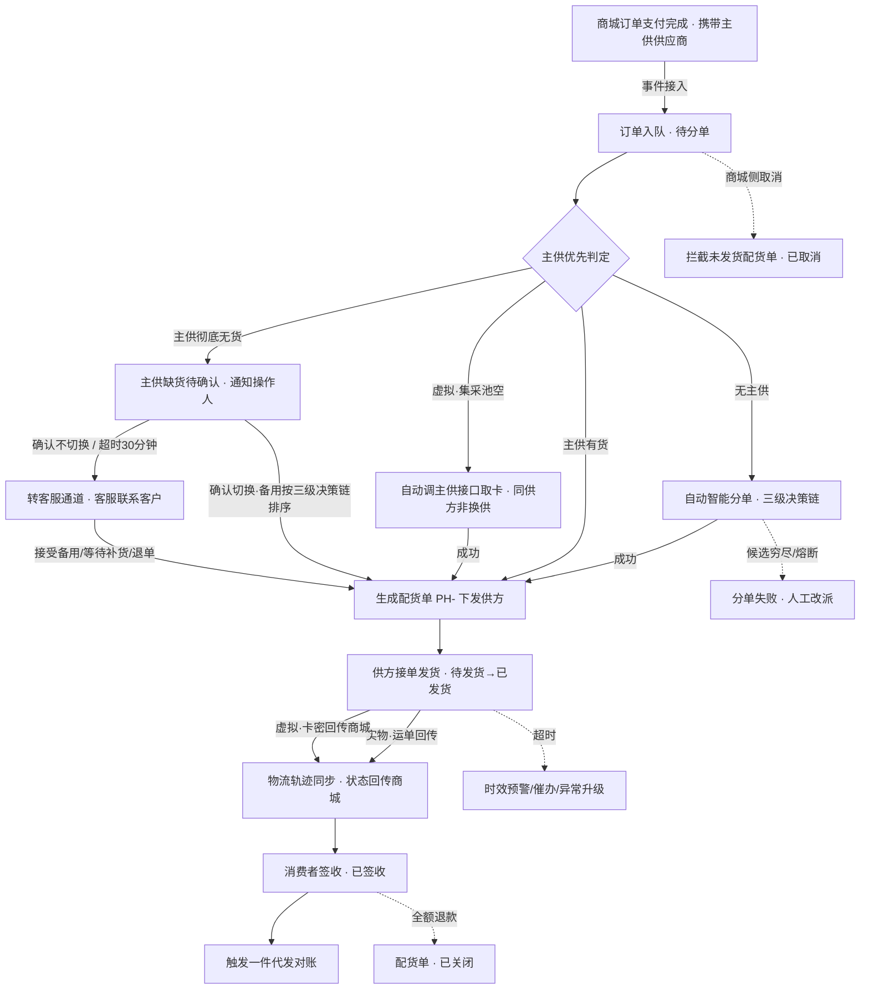

# 一件代发订单 PRD

| 字段 | 内容 |
|------|------|
| 文档名称 | 一件代发订单（列表页 + 订单详情页 + 手动补单页）产品需求文档 |
| 文档层级 | L3（功能级） |
| 当前版本 | v1.3 |
| 文档性质 | 新建（新增页面 PRD） |
| 面向用户 | 供应链管理员、履约调度专员 |
| 所属系统 | 数智链云 S2B2C 协同平台 · 供应链管理平台 · 订单管理 |

**文档变更记录**

| 版本 | 修改日期 | 修改人 | 修改摘要 | 状态 |
|:---|:---|:---|:---|:---|
| v1.0 | 2026-08-24 | 产品部 | 初稿：覆盖一件代发订单列表页与订单详情页 | 已评审 |
| v1.1 | 2026-08-25 | 产品部 | 分单模型重构：主供供应商优先 + 主供缺货人工确认；补全虚拟商品与组合商品履约规则 | 已评审 |
| v1.2 | 2026-08-25 | 产品部 | 细化：新增手动补单页；商城换货按退货协同、退货完成后生成补发换货单挂原主订单；列表履约行补采购/销售单价与配货时间、「发货时间」列双态展示；组合商品展示细化（子件共用子订单号、区分组合套装/营销买赠、价格取聚合值仅主件行展示）；客户备注有留言才展示 | 草稿 |
| v1.3 | 2026-09-02 | 产品部 | 组合商品价格口径重构：拆原单品编码后子件行逐行展示采购单价（原单品供货价）与销售单价（组合销售价按子件采购金额等比分摊，尾差入最大子件行；买赠赠品 ¥0.00、主件承全额）；组合名称行展示聚合价但不显示供应商，供应商随子件行展示；主单头采购金额与已选合计改为子件供货价合计；同步修复组合主数据供货价与 BOM 一致性（套装 ¥51.80 / 买赠 ¥28.50） | 草稿 |

---

## 1. 文档概述

### 1.1 背景与页面定位

**一件代发**是一种无需囤货的零售履约模式：商城不提前备库存，C端用户在品牌商城下单并支付后，订单经编码映射进入供应链系统，由供应链将订单信息（含客户收货地址）下发给供应商，由**供应商直接打包发货给客户**，商城赚取售价与供货价之间的差价。

本页面是供应链端的一件代发**履约调度工作台**，覆盖从订单接入到签收的完整调度链路：

```
商城订单支付完成 ──事件接入（携带主供供应商）──→ 订单入队（待分单）
    → 主供优先分单（主供缺货 → 人工确认是否换供，不自动切换）
    → 按供方拆分生成配货单（PH-）
    → 下发供应商 → 供应商直发消费者（实物回填运单 / 虚拟取卡密回传）
    → 物流轨迹与状态回传 → 签收 → 触发一件代发对账
```

供应链端在本链路中的职责边界：

| 职责 | 归属 |
|------|------|
| 分单调度、配货单生成与下发、发货时效监控、催办、换供确认、人工改派、异常升级 | **本页面（供应链端）** |
| 主供供应商的选定 | 商城运营平台（上架环节：供应商指定 / 最低价优先 / 审批指定），订单事件携带主供 ID 下发；供应链只认主供，不感知选定过程 |
| 订单交易取消、售后仲裁、退款决策 | 商城运营平台（供应链端只协同、不决策） |
| 接单、打包发货、运单回传 | 供应商（经供应商后台执行） |
| 签收后对账、K3 推送 | 一件代发对账（结算管理） |

### 1.2 项目目标

1. **调度可视**：代发订单的分单进度、履约状态、发货时效在统一视图监控，异常第一时间暴露；
2. **主供优先、换供可控**：订单按商城侧选定的主供供应商优先分单；商城回传未携带主供的订单走自动智能分单（三级决策链）；主供缺货不自动切换，操作人确认后按推荐备用换供，超时转客服通道，兜底不卡单；
3. **时效催办**：以承诺发货时效为基准，对即将超时/已超时配货单向供方催办，冷却防打扰；
4. **干预留痕**：催办、换供、改派、取消等人工操作全量留痕，供审计与对账追溯。

### 1.3 核心术语

| 术语 | 解释 |
|------|------|
| 一件代发 | 无需囤货的零售履约模式：订单支付后由供应链下发给供应商，供应商直接发货给消费者，平台赚售价与供货价差价 |
| 集采直发 | 多需求方订单汇总后向源头厂家大批量采购、由厂家直发终端收货方的模式；与本页的一件代发为订单管理下两种并行模式，独立页面承接 |
| 主供供应商 | 商城运营平台上架环节为商品选定的首选履约供方（来源：供应商指定 / 最低价优先 / 审批指定）；订单接入时携带主供 ID，是分单的**第一优先级**，供应链不感知选定过程 |
| 主供缺货待确认 | 主供彻底无货（实物无可售库存；虚拟集采池空且接口额度耗尽）时主订单进入的等待态：已通知操作人确认是否换供，30 分钟未确认默认转客服通道 |
| 集采卡密池 | 虚拟商品的预采囤货库存（供应链自有，可售可控）；虚拟商品取卡优先走池 |
| 接口调用（虚拟） | 虚拟商品的实时取卡方式，消耗采购部维护的接口额度；额度耗尽视为主供无货 |
| 主订单 | C端用户一次结算产生的订单，对应一笔支付、一份收货地址；单号 `ORD` 前缀 |
| 配货单 | 主订单经分单后**按供方拆分**在供应链侧生成的独立履约单，是本页面的核心作业单元；单号 `PH-` 前缀 + 供方编码 + 流水；同主订单同供方的多个商品合并为一单 |
| 履约行 | 列表中主订单下的子行统称：已分单时为配货单行，未分单（待分单 / 主供缺货待确认 / 分单失败）时为待分单行（子订单粒度占位） |
| 分单状态 | 调度域状态，挂在**主订单**级：待分单 / 分单中 / 已分单 / 主供缺货待确认 / 分单失败 |
| 履约状态 | 履约域状态，挂在**配货单**级：待发货 / 已发货 / 已签收 / 已取消 / 已关闭 |
| 智能分单决策链 | 自动供方指派的排序规则：①供应商等级 → ②利润差额 → ③供方评级；适用于**商城回传未携带主供的订单的自动分单**与**换供确认后的备用供方排序**（有主供订单以主供优先为第一规则，不进入自动决策链）；供方统一包邮，距离不参与决策 |
| 采购金额 | 供货价 × 数量，供应链端主口径金额，是对账依据；与商城售价的差额即订单毛利 |
| 发货时间（列） | 列表「发货时间」列双态展示：待发货时为**剩余发货倒计时**（基于主订单**支付时间 + 承诺发货时效（默认 24 小时）**计算，同主订单下所有待发货配货单共用同一截止时间）；发货后为**实际发货时间**（供应商回填运单时间，格式 yyyy-MM-dd HH:mm） |

### 1.4 与上下游的衔接

- **上游（商城运营平台）**：订单与售后的决策权在商城运营平台；订单取消、关闭、退换仲裁由其发起，本页面执行拦截与状态同步。订单事件携带商城侧选定的**主供供应商 ID**，供应链以此为分单第一优先级（见 2.4）。供应链端**不落地商城编码**（编码归一）：本页面以供应链 SKU 为商品唯一标识，商城侧单据仅以主订单号引用。
- **下游（供应商）**：配货单下发供应商后台供方工作台执行接单与发货（供应商端页面另行设计，本期不含）；本页面是供应链端的调度视图。
- **结算（一件代发对账）**：采购口径金额与配货单号是对账追溯主键；配货单签收后触发对账。
- **虚拟商品**：实物与虚拟的上层履约链路一致，**发货执行层分流**——实物回填运单、虚拟取卡密回传商城；虚拟供货方式 = 集采卡密池优先、接口调用兜底（见 2.4、13.1）；卡密池与接口额度的管理页面另行设计，本期不含。
- **组合商品**：组合商品（Z 编码）订单按**下单时锁定的 BOM 快照**展开为子件后参与分单，主供挂在**子项级**（按上架时组合供货配置逐子项指定 / 最低价），配货单按子件供方归集；列表不单独展开 BOM 层级，明细见订单详情页；售后仅支持整单退换（见 13.1）。

---

## 2. 功能架构与交互总览

### 2.1 导航位置

供应链管理平台 → 订单管理 → **一件代发订单**。订单管理下另设「采购集采订单」入口承接集采直发模式，两页互不混杂。

### 2.2 页面布局（列表页）

```
┌──────────┬────────────────────────────────────────────────────────────┐
│          │  面包屑：订单管理 / 一件代发订单            角色 · 头像     │
│  侧边    ├────────────────────────────────────────────────────────────┤
│  导航     │  页面标题 + 一句话说明   [手动补单]（黑主钮）[全量订单导出▾]│
│          ├────────────────────────────────────────────────────────────┤
│  订单     │  ┌────────┐┌────────┐┌────────┐┌────────┐                 │
│  管理     │  │待分单  ││待发货  ││今日已发货││今日采购金额│  ← 统计看板│
│          │  └────────┘└────────┘└────────┘└────────┘                 │
│          ├────────────────────────────────────────────────────────────┤
│          │  筛选区：单号｜渠道｜供应商｜分单状态｜履约状态｜发货时效   │
│          │          ｜下单时间区间  [查询] [重置]     [全部展开/收起]  │
│          ├────────────────────────────────────────────────────────────┤
│          │  ┌─ 主订单头（灰底横条：主单号·渠道·客户·金额·分单状态）─┐ │
│          │  │  ├ 履约行：订单信息 ｜配货信息（PH号/分单问题）｜供方 │ │
│          │  │  └ 履约行：待分单（分单问题标签 + 原因）               │ │
│          │  └─────────────────────────────────────────────────────────┘ │
│          │  （主从结构，默认全部展开）                                │
│          ├────────────────────────────────────────────────────────────┤
│          │  底部固定栏：批量催办｜批量改派供应商｜导出订单 ｜已选统计  │
│          │              ｜ 共 X 主订单 · Y 配货单 · Z 件 ｜ 分页      │
└──────────┴────────────────────────────────────────────────────────────┘
```

### 2.3 核心流程



### 2.4 分单规则：主供优先与缺货确认

#### 第一优先级：主供供应商

订单接入时携带商城侧选定的**主供供应商 ID**（供应链只认主供，不感知商城通过哪种方式选定）：

| 主供来源（商城侧模式） | 主供确定方式 |
|----------------------|-------------|
| 供应商指定 | 上架时指定供方，订单接入即携带固定主供 |
| 最低价优先 | 分单时按当前最低供货价确定**当次主供**，确定后按主供规则执行 |
| 审批指定 | 经审批流确认的供方，同「供应商指定」 |

- **实物商品**：主供有可售库存 → 直接生成配货单下发主供，分单完成；
- **虚拟商品**：主供集采池有卡 → 池内取卡；池空 → **自动调用主供接口**实时取卡（同一供方内的供货方式切换，不属于换供，无需人工确认）；
- **组合商品**：主供挂**子项级**（按上架时组合供货配置逐子项指定 / 最低价），各子项独立按上述规则执行，拆单见 13.1。

#### 主供缺货：人工确认，绝不自动切换

主供彻底无货（实物无可售库存；虚拟集采池空**且**接口额度耗尽）时：

1. 主订单分单状态置「**主供缺货待确认**」，部分子项缺货时头行提示 N/M；
2. 系统通知操作人（站内消息 + 企业微信），通知内容：商品信息、主供名称与缺货原因、可选备用供方列表（含供货价 / 履约率 / 库存状态）、建议操作、确认时限 **30 分钟**；
3. 操作人确认后二选一：
   - **确认切换**：备用供方按三级决策链（①供应商等级 → ②利润差额 → ③供方评级）排序推荐，操作人亦可在候选中指定；生成新配货单并标记「**非主供发货**」，随状态回传商城（商城订单详情可见）；
   - **确认不切换**：订单转**客服通道**，由商城客服联系客户协商（接受备用 / 等待补货 / 协助退单），协商结果回流后按结果执行；
4. **超时未确认（30 分钟）默认按「确认不切换」转客服通道**，转接留痕写入决策日志；
5. **铁律：任何情况下不自动将非主供供应商的货发给客户**——换供必须是人的决策。

> 三级决策链的定位：主供优先是分单第一规则；商城回传未携带主供的订单走**自动智能分单**——按三级决策链自动指派供方，命中熔断顺延下一候选，候选穷尽置分单失败转人工改派；换供确认后的备用供方排序推荐同样按三级决策链执行。主供缺货确认的操作人默认为履约调度专员，决策部门最终归属（履约调度 / 商务）以组织确认为准。

---

## 3. 统计看板

四卡横排展示于筛选区上方，**全局聚合口径，不随筛选变化**。

| 卡片 | 主指标 | 副指标行 | 口径说明 |
|------|--------|---------|---------|
| 待分单 | 待分单主订单数 | 其中主供缺货待确认 N ｜ 分单失败 N | 统计分单状态 ∈ {待分单、分单中、主供缺货待确认、分单失败} 的主订单数；副行分别列待确认与失败数 |
| 待发货 | 待发货配货单数 | 即将超时 N ｜ 已超时 N | 按配货单统计；超时分层口径见第 6 章 |
| 今日已发货 | 今日已发货配货单数 | — | 按供方回传运单时间落在当日统计；虚拟商品按卡密回传时间计 |
| 今日代发采购金额 | 今日支付入队订单的采购金额合计 | ¥ 供货价口径 | 按主订单支付时间（手动补单订单按创建时间）落在当日、Σ(供货价×数量) |

---

## 4. 筛选与查询

### 4.1 筛选字段

| 字段 | 控件 | 默认值 | 规则 |
|------|------|--------|------|
| 单号 | 文本输入框 | 空 | 模糊匹配主订单号 / 配货单号 / 子订单号（未分单态），任一命中即返回 |
| 所属渠道 | 下拉 | 全部 | 全部 + 品牌商城枚举（含已停用渠道，历史订单可查） |
| 供应商 | 下拉（可搜索） | 全部 | 全部 + 供应商档案枚举 |
| 分单状态 | 下拉 | 全部 | 全部 / 待分单 / 分单中 / 已分单 / 主供缺货待确认 / 分单失败 |
| 履约状态 | 下拉 | 全部 | 全部 / 待发货 / 已发货 / 已签收 / 已取消 / 已关闭 |
| 发货时效 | 下拉 | 全部 | 全部 / 正常 / 即将超时 / 已超时 |
| 下单时间 | 日期区间 | 最近 7 天 | 按主订单下单时间闭区间过滤 |

### 4.2 过滤规则

- 分单状态按主订单过滤；履约状态、供应商、发货时效按**配货单/待分单行**过滤；
- 按行级字段过滤时，主订单下**任一履约行命中即展示该主订单**，展开后仅显示命中的履约行；
- 任一筛选条件变化后自动回到第 1 页；[查询] 按当前条件刷新，[重置] 恢复默认值（含时间区间回最近 7 天）。

### 4.3 辅助操作

| 操作 | 说明 |
|------|------|
| 全部展开 / 全部收起 | 一键切换所有主订单的展开状态；进入页面默认**全部展开** |
| 手动刷新 | 立即拉取最新数据，保留当前筛选、展开与勾选状态 |

---

## 5. 列表表格设计

### 5.1 主从结构

列表为**主订单 + 履约行**两层结构（同一张表内两种行）：

- **主订单头行**（灰底横条，跨列展示）：点击横条展开/收起；收起时显示「N 个履约行 · 共 M 件」摘要；
- **履约行**：已分单展示**配货单行**，未分单（待分单 / 主供缺货待确认 / 分单失败）展示**待分单行**；组合商品订单的子件在配货单行内以商品行列出，不展开 BOM 层级。

### 5.2 主订单头字段

| 字段 | 说明 |
|------|------|
| 勾选框 | 级联选中该主订单下全部履约行，部分选中时显示半选态 |
| 展开箭头 | 切换展开/收起 |
| 主订单号 | 支持一键复制 |
| 所属渠道 | 品牌商城名称；已停用渠道追加「已停用」标记 |
| 下单时间 | 格式 yyyy-MM-dd HH:mm；支付时间不在列表头展示（见订单详情页） |
| 客户 | 姓名 + 脱敏手机号同行展示（如 张三 138\*\*\*\*8888） |
| 金额（双口径同行） | 采购成本在前加粗（供货价×数量，主口径）；商城订单金额随后灰字参考（如 ¥56.00 商城 ¥118.00）；手动补单无销售口径，显示「补单 · 无支付」 |
| 客户备注 | 主订单买家留言；**有备注才展示**，无备注不占位；超长省略，悬停查看全文（与商城订单列表对齐） |
| 操作 | 详情（新窗口打开订单详情页）、整单催办（存在待发货配货单时可用） |

### 5.3 履约行列定义

两种履约行共用一套列：

| 列 | 配货单行 | 待分单行 |
|----|---------|---------|
| 勾选框 | 履约行级勾选 | 同左 |
| 订单信息 | 商品名称+规格 / 供应链 SKU（支持复制）/ 子订单号（支持复制）/ ×数量；同供方多商品逐行列出；**组合商品各子件共用一个子订单号**：先列组合名称+模式标签（**组合套装** 或 **营销买赠**）+子订单号，再列本单子件商品信息行（组合套装角色：主件/配件；营销买赠角色：主件/赠品；子件行不重复子订单号）；非主件拆出的配货单同样展示组合名称，标明隶属关系 | 同左 |
| 配货信息 | 配货单号（PH- 前缀，支持复制）+ 配货时间（配货单下发给供方的时间，格式 yyyy-MM-dd HH:mm） | 分单状态标签（待分单 / 分单中 / 主供缺货待确认 / 分单失败）；分单失败展示失败原因；主供缺货处置进度仅在非「待确认」时展示（已通知客服 / 客服跟进中），缺货原因不在本列重复；无配货时间 |
| 供应商 | 供方名称；组合商品订单随子件行对齐展示（组合名称行位置显示 —，取该配货单履约供方）；实际供方 ≠ 主供时第二行「换供」；补发换货配货单第二行「补发换货」（挂原主订单下） | —（未指派；主供缺货待确认时第一行供方名、第二行「主供缺货」） |
| 采购单价 | 分单时供货价**单价**快照；同配货单多商品逐行对应；**组合商品拆原单品编码后，子件行取该单品供货价单价**，逐子件行展示（含非主件拆出的配货单）；组合名称行展示聚合价（=子件供货价合计） | 商品档案供货价单价（尚未分单）；组合商品同左，逐子件行 |
| 销售单价 | SKU 商城销售价（目录价，参考）；赠品 ¥0.00；手动补单 / 补发换货无支付显示 —；**组合商品将组合销售价（聚合值）按子件采购金额（供货价×数量）等比例拆分至子件行**，尾差计入采购金额最大的子件行；营销买赠赠品不参与分摊（¥0.00，主件行承全额）；组合名称行展示组合销售价（聚合值） | 同左（有销售口径时） |
| 履约状态 | 状态标签，见 5.4 | —（以分单状态标签表达） |
| 发货时间 | 「待发货」展示剩余发货倒计时（规则见第 6 章）；已发货 / 已签收 / 已关闭展示实际发货时间（yyyy-MM-dd HH:mm）；已取消（未发货）显示 — | — |
| 物流运单 | 快递公司 + 运单号（支持复制）；一单多运单逐行列出；未发货显示 — | — |
| 售后协同 | 只读标签：—（无售后）/ 退货协同中 / 退货完成 | — |
| 操作 | 催办（待发货）/ 改派（未发货）/ 取消配货单（未发货）/ 详情 | 处理换供（主供缺货待确认）/ 改派（待分单、分单失败）/ 详情 |

> 虚拟商品配货单：无物流运单，运单位置以普通文案显示「卡密发放」（不用标签）；商品编码为虚拟类编码（X 前缀体系），履约流转见 12.1。

> 本页面**不展示商城 SKU 列**：商城编码不在供应链侧落地（编码归一），商品以供应链 SKU 为唯一标识，商城侧单据仅以主订单号引用。

### 5.4 状态枚举

**分单状态（主订单级）**

| 状态 | 标签色 | 说明 |
|------|--------|------|
| 待分单 | 灰 | 已支付入队，等待分单引擎处理 |
| 分单中 | 蓝 | 分单引擎处理中（读主供、查库存、虚拟取卡执行；含决策超时重试） |
| 已分单 | 绿 | 全部子项完成供方指派并生成配货单 |
| 主供缺货待确认 | 橙 | 主供彻底无货，已通知操作人确认是否换供（30 分钟时限）；部分子项缺货同样归此态并提示「N/M 子项待确认」；确认不切换或超时后转客服通道，行内以处置进度标签（待确认 / 已通知客服 / 客服跟进中）表达 |
| 分单失败 | 红 | 无主供订单经自动智能分单后候选穷尽、供方熔断、引擎异常等系统性失败，需人工改派；部分失败同样归此态并提示「N/M 项成功，M 项待人工改派」 |

**履约状态（配货单级）**

| 状态 | 标签色 | 说明 |
|------|--------|------|
| 待发货 | 蓝 | 配货单已下发供方，等待供方发货 |
| 已发货 | 绿 | 供方回传运单（虚拟为卡密回传商城），供应链侧为状态源，回传商城 |
| 已签收 | 灰 | 消费者确认收货或系统自动签收（虚拟商品 T+0 自动）；触发对账（终态） |
| 已取消 | 灰 | 商城侧发起交易取消，供应链拦截未发货配货单（终态） |
| 已关闭 | 灰 | 履约后因全额退款被关闭，区别于已取消（终态） |

**异常不设独立状态枚举**：发货超时以「待发货 + 红色时效」表达；供方熔断在分单决策日志留痕并将该子项回退至分单失败。

### 5.5 与商城侧状态映射

| 商城侧状态 | 供应链侧呈现 | 说明 |
|-----------|-------------|------|
| 待付款 | **不接入** | 待付款订单不进入供应链；仅在商城侧预占库存，不生成配货单 |
| 待发货 | 配货单 · 待发货 | 下发供方后处于此态，供应链为责任方 |
| 已发货 | 配货单 · 已发货 | 供方回传运单（虚拟为卡密回传）→ 供应链 → 事件回传商城与 C 端，供应链为状态源 |
| 已完成 | 配货单 · 已签收 | 签收事件由 C 端确认或自动签收触发 |
| 已取消 | 配货单 · 已取消 | 商城侧决策（未履约取消）→ 供应链执行拦截并释放占用库存 |
| 已关闭 | 配货单 · 已关闭 | 履约后全额退款关闭，由商城侧售后完成事件驱动 |

### 5.6 售后联动规则

售后处理权归商城运营平台，供应链侧**只协同、不决策**：

| 场景 | 供应链侧行为 |
|------|-------------|
| 售后协同标签 | 履约行只读展示：退货协同中 / 退货完成 |
| 商城侧换货 | 供应链**不按换货履约**：原配货单按退货协同（标签「退货协同中」）；退货收货完成后原单置「退货完成」，系统生成新的**补发换货配货单**挂在**原主订单下**（不另开主订单行），**子订单号沿用原子订单号**；供应商列第二行标「补发换货」，无新支付，时效以创建时间为基准 |
| 未发货配货单收到退款协同 | 拦截并取消配货单（需人工确认），释放占用库存（列表不展示「退款协同中」标签，以履约状态「已取消」表达） |
| 已发货订单的退换举证 | 经售后协同工单与供方沟通举证，不在本页面处理 |
| 全额退款完成 | 对应配货单自动置为「已关闭」（非「已取消」） |

---

## 6. 发货时效

| 规则 | 内容 |
|------|------|
| 适用范围 | 实物与虚拟配货单均适用；虚拟以卡密成功回传时间计为发货时间 |
| 计算口径 | 承诺截止时间 = 主订单**支付时间** + 承诺发货时效（默认 24 小时，时效值在配货单生成时快照，配置变更仅对新单生效） |
| 共用截止 | 同一主订单下所有待发货配货单**共用同一承诺截止时间** |
| 手动补单订单 | 无支付环节，以**创建（入队）时间**代替支付时间作为时效基准 |
| 补发换货单 | 无新支付，以**创建时间**代替支付时间作为时效基准 |
| 展示范围 | 仅履约状态为「待发货」的配货单展示倒计时；已发货 / 已签收 / 已关闭展示实际发货时间（yyyy-MM-dd HH:mm）；已取消（未发货）显示 — |
| 展示格式 | 保留 1 位小数，如「16.5h」；超时后展示绝对超时时长，如「已超时 3.0h」 |
| 分层 | 剩余 ≥ 2 小时：默认色；0 < 剩余 < 2 小时：橙色；已超时：红色 |
| 悬停说明 | 悬停展示「支付时间：xxx ｜ 承诺时效：24h ｜ 剩余：xxx」 |

---

## 7. 操作与交互

### 7.1 勾选与批量操作

- **勾选粒度 = 履约行**（配货单行 / 待分单行）；主订单头勾选级联全部子行，部分选中显示半选；
- 表头全选 = 当前筛选结果的全部履约行，**跨页保留**勾选状态；单次批量操作上限 **500** 条，超出弹窗阻断提示；
- 选中统计（底部固定栏）：`已选 {N} 个履约单 ｜ 采购金额合计 ¥{X} ｜ 待发货 {K} 个`；
- 批量操作按钮（白描边样式）：

| 操作 | 生效范围 | 说明 |
|------|---------|------|
| 批量催办 | 已选中且状态为「待发货」的配货单 | 无待发货单时提示「所选订单中无待发货配货单」 |
| 批量改派供应商 | 已选中且未发货的履约行 | 打开改派弹窗，逐单确认或统一指定供方 |
| 导出订单 | 已选履约行 | 导出 Excel；含收货信息字段需二次鉴权（见 13.1） |

### 7.2 行操作

| 操作 | 可用条件 | 行为 |
|------|---------|------|
| 催办 | 配货单状态 = 待发货 | 向供方发送催办通知；成功后**该行催办按钮 5 分钟内置灰**（行级与整单/批量共享冷却），防止重复打扰 |
| 处理换供 | 待分单行标签 = 主供缺货待确认 | 打开换供确认弹窗（改派弹窗的预填形态，见 8.1）：预填主供与缺货原因、默认选中推荐备用；确认切换 / 确认不切换二选一，规则见 2.4 |
| 改派 | 履约行未发货（含待分单/分单失败/待发货） | 打开改派供应商弹窗，规则见 9.3 |
| 取消配货单 | 配货单未发货 | 二次确认后拦截：通知商城侧走退款流程、释放占用库存、状态置「已取消」；**交易取消的决策权在商城侧**，此处仅用于执行商城侧指令或协同拦截 |
| 详情 | 任意 | 新窗口打开订单详情页，定位到该主订单 |

页头按钮组：**[手动补单]**（唯一主按钮，跳转「新增订单（手动补单）」页面——线下补单等特殊场景由运营手工创建代发订单并指定供方，详见该页面 PRD）+ **[全量订单导出 ▾]**（白描边下拉按钮，交互对齐商城订单列表（运营平台））：

| 菜单项 | 逻辑 |
|--------|------|
| 导出全部订单 | 忽略当前筛选，导出全部主订单及其履约行；结果以轻提示汇报「已导出全部 X 个主订单 · Y 个履约单」 |
| 导出全部筛选订单 | 按当前筛选结果导出；筛选结果为空时提示「当前筛选结果为空，无可导出订单」，不发导出请求 |

页头导出与底部「按勾选导出」并存、互不影响；两者含收货信息字段的导出均需二次鉴权（见 13.1）。

### 7.3 一键复制

主订单号 / 配货单号 / 子订单号 / 供应链 SKU / 运单号 / traceId 均支持一键复制，复制成功以轻提示反馈。

### 7.4 自动刷新

列表每 60 秒自动刷新，刷新时**保留筛选、展开与勾选状态**。

### 7.5 操作留痕

催办、换供、改派、取消、异常升级均写入操作日志（操作人、时间、对象、原因），可在订单详情页查看；导出行为记录审计日志。

---

## 8. 弹窗设计

### 8.1 换供确认 / 改派供应商弹窗（单笔与批量共用）

| 要素 | 内容 |
|------|------|
| 触发形态 | ① **换供确认**：主供缺货待确认行「处理换供」（系统预填：主供名称、缺货原因、备用推荐）；② **人工改派**：待分单/分单失败/待发货行与批量改派（操作人主动发起） |
| 目标供应商 | 下拉（可搜索），候选 = 该供应链 SKU 的可用供方（同款备选池），排除当前供方与熔断供方；主供供应商带「主供」徽标；换供形态默认选中三级决策链排序首位；批量改派时仅展示各单可选供方的交集 |
| 原因 | 必填，单选（主供缺货切换 / 原供方超时未发 / 价格更优 / 其他）+「其他」时自定义文本（必填，上限 200 字）；换供形态默认选中「主供缺货切换」 |
| 不切换选项 | 仅换供形态展示：[确认不切换 · 转客服通道]（次按钮），点击后订单转客服通道并留痕，弹窗关闭 |
| 说明区 | 实际供方 ≠ 主供时，新配货单标记「非主供发货」并随状态回传商城；改派将跳过智能分单逻辑；原配货单作废（标记「已改派作废」）、生成新配货单下发新供方；操作全程留痕；订单金额不变，采购价可能变化导致毛利变化 |
| 确认 | [确认切换] / [确认改派]（主按钮）；校验不通过时按钮置灰并定位到未填项 |

### 8.2 取消配货单确认弹窗

说明后果：该配货单停止履约、通知商城侧进入退款流程、占用库存释放；以危险样式按钮二次确认，需填写取消备注（必填）。

### 8.3 通用确认弹窗

批量催办、导出订单执行前的确认；超 500 条勾选的阻断提示。

---

## 9. 订单详情页设计

### 9.1 入口与页头

- 入口：列表行/主订单头「详情」；新窗口打开；
- 页头：主订单号（支持复制）+ 分单状态 / 履约进度标签组；右侧操作组：[返回列表]、[催办]、[取消配货单]、[发起异常升级]（白描边）+ **[人工改派供应商]（唯一主按钮）**；主供缺货待确认订单额外展示 [处理换供确认]（白描边，打开换供确认弹窗）；
- 摘要条：所属渠道 ｜ 分单状态 ｜ 履约进度 ｜ traceId（支持复制）｜ 下单/支付时间。

### 9.2 页面板块（自上而下）

| 板块 | 内容要点 |
|------|---------|
| ① 订单信息 | 所属渠道（含停用标记）、主订单号、下单/支付时间、traceId、买家留言；**金额双口径**：采购口径合计（主口径，供货价×数量）+ 销售口径构成（实付 + 优惠券 + 积分折算，标注「商城口径，仅供参考」） |
| ② 消费者收货信息 | 收货人姓名（明文）、手机号脱敏展示、完整收货地址（履约必需信息，随配货单下发供方）；查看明文手机号与导出需二次鉴权；虚拟商品订单此板块以「虚拟商品无需收货地址」占位说明 |
| ③ 商品与供方履约明细 | 按**配货单分组**的卡片：配货单号（复制）、配货时间、供方（实际供方≠主供时追加「换供」标记）、履约状态、承诺时效、发货时间（已发货）；商品行：供应链 SKU（复制）/ 名称 / 规格 / 品牌 / 数量 / 采购价（供货价单价）/ 销售价 / 采购小计；组合套装子件逐行列出（主件/配件），营销买赠子件逐行列出（主件/赠品），子件采购价取原单品供货价、销售价取等比例分摊值（同 5.3 列口径）；实物运单信息随组展示，虚拟商品以「卡密发放」标记替代运单；未分单部分以「待分单」分组展示（子订单号 + SKU + 原因：主供缺货待确认 / 分单失败）；收货人与完整地址见板块②，不在列表重复 |
| ④ 分单决策日志 | 按子项展示两段式记录：**主供指派段**（订单携带的主供 ID 与来源模式、主供有货判定、指派结果）；主供缺货时增列**缺货确认段**（通知时间与渠道、通知对象、备用供方列表与三级决策链排序依据：①供应商等级 → ②利润差额 → ③供方评级、确认人、确认结果与耗时、超时转客服通道留痕）；确认换供后展示最终指派与「非主供发货」标记；人工改派记录以标记区分，含被跳过候选及原因（熔断/超时跳过）与决策耗时 |
| ⑤ 全链路时间线 | 以 traceId 串联：下单 → 支付 → 库存预占/扣减 → 分单（主供指派；如缺货：缺货通知 → 换供确认/转客服）→ 配货单下发 → 供方发货（实物运单回传 / 虚拟卡密回传）→ 签收 → 结算触发；系统节点与人工操作节点以样式区分 |
| ⑥ 物流轨迹 | 已发货配货单按运单分组的物流节点时间线（揽收/中转/派送/签收）；虚拟商品无此板块内容，以「卡密发放记录」事件替代 |
| ⑦ 售后协同 | 只读展示售后协同状态与关键事件；入口：[发起售后协同工单]（跳转售后协同工单） |
| ⑧ 操作日志 | 催办 / 换供 / 改派 / 取消 / 异常升级的留痕：操作人、时间、操作对象、原因 |

### 9.3 人工改派规则

| 规则 | 内容 |
|------|------|
| 可改派范围 | 履约行未发货：待分单 / 主供缺货待确认 / 分单失败 / 待发货 |
| 候选供方 | 该供应链 SKU 的可用供方（同款备选池），排除熔断供方；主供供应商带「主供」徽标；换供场景默认推荐三级决策链排序首位 |
| 必填项 | 改派原因（单选 + 自定义） |
| 执行逻辑 | **跳过智能分单逻辑**（人工决策优先于推荐排序）；原配货单作废并标记「已改派作废」，按新流水生成新配货单下发新供方 |
| 影响与通知 | 订单金额不变；采购价可能变化 → 毛利随之变化；实际供方 ≠ 主供时新配货单标记「非主供发货」并回传商城；通知新供方接单，状态回传商城侧 |
| 留痕 | 改派人、时间、原供方 → 新供方、原因全量写入操作日志与分单决策日志 |

### 9.4 异常升级链

发货超时配货单按超时时长自动逐级升级，页内展示当前所处层级：

| 层级 | 触发 | 动作 |
|------|------|------|
| L1 提醒 | 超时 2 小时 | 通知责任调度专员 |
| L2 升级 | 超时 4 小时 | 升级主管，配货单标记异常 |
| L3 兜底 | 超时 8 小时 | 平台兜底介入，强制处理（换供 / 取消） |

手动 [发起异常升级]：拉起售后协同工单，带出订单上下文。

---

## 10. 手动补单（新增订单）页设计

### 10.1 功能定位与入口

线下补单、特殊场景下单（如大宗协议客户补录、活动补发）等非 C 端交易场景，由运营在「新增订单（手动补单）」页手工创建一件代发订单并**指定供方**：跳过支付环节 → 直接入分单 → 按指定供方生成配货单（指定供方即**人工指定主供**，跳过智能分单）。补单订单带「手动补单」来源标记，其余履约、留痕、售后、对账链路与正常订单完全一致。

- **入口**：列表页头 [手动补单]（唯一主按钮）；
- **权限**：一件代发订单-手动补单（无权限时入口按钮隐藏、路由不可达，见 12.1）；
- **返回**：页面 [返回] 回列表；存在未保存修改时二次确认。

```
┌──────────────────────────────────────────────────────────────┐
│  面包屑：订单管理 / 一件代发订单 / 手动补单    角色 · 头像   │
├──────────────────────────────────────────────────────────────┤
│  [< 返回]  新增订单（手动补单）                              │
│                                                              │
│  渠道 *：[___v]     供应商 *：[___v]（下拉搜索 · 指定供方）   │
│                                                              │
│  消费者信息：                                                │
│  姓名 *：[________]   手机号 *：[________]                   │
│  收货地址 *：[省 v][市 v][区 v] [________详细地址________]   │
│                                                              │
│  商品明细（至少 1 行）：                       [+ 添加商品]   │
│  # | 商品（供应链SKU） | 单价(自动回填) | 数量 | 小计 | 操作 │
│  1 | [___v]            | 只读        | [__] | ¥xx | [删除] │
│                                                              │
│  订单总金额（采购口径）：¥xxx          备注：[____________]   │
│                       [保存草稿]  [确认创建订单]（主按钮）   │
└──────────────────────────────────────────────────────────────┘
```

### 10.2 表单字段规范

| 分区 | 字段 | 必填 | 规则 |
|------|------|:---:|------|
| 基本信息 | 所属渠道 | 是 | 下拉，仅**启用中**的品牌商城可选（已停用渠道不可补单；停用渠道历史订单仍可查询） |
| | 供应商 | 是 | 下拉（可搜索），展示供方等级；选定后即本单指定供方，并约束商品明细候选 |
| 消费者信息 | 收货人姓名 | 是 | ≤ 20 字 |
| | 手机号 | 是 | 11 位手机号格式校验；入库脱敏存储，明文查看与导出需二次鉴权（同 12.1） |
| | 省 / 市 / 区 + 详细地址 | 实物单必填 | 三级级联 + 详细地址 ≤ 200 字；**纯虚拟商品补单时整组转为非必填**并提示「虚拟商品无需收货地址」 |
| 商品明细 | 商品（供应链 SKU） | 至少 1 行 | 下拉（可搜索），候选 = **指定供方可供货**的供应链 SKU（一品多商过滤）；已停用商品不可选 |
| | 供货价 | — | 选中自动回填当前供货价，**只读**（补单不做议价，价格异常走供方调价审批） |
| | 数量 | 是 | 正整数 ≥ 1，≤ 供方当前可售库存（虚拟商品不受库存上限约束） |
| | 小计 / 订单总金额 | — | 供货价 × 数量自动计算；总金额为**采购口径**（补单无支付环节，无销售口径金额） |
| | 备注 | 否 | ≤ 200 字 |

明细行交互：

- [+ 添加商品] 追加空行；添加已存在 SKU 时与既有行合并数量并轻提示；
- **切换供应商联动**：已填明细中含新供方不可供货的 SKU 时提示二选一——「删除不可供商品行」或「返回重选供应商」，不静默丢弃数据；
- 明细**至少保留 1 行**，仅剩 1 行时删除按钮置灰。

### 10.3 操作与校验

| 操作 | 行为 |
|------|------|
| 保存草稿 | 暂存表单；**不生成订单、不入列表、不占用库存**；草稿仅创建人可见，可再次进入编辑 |
| 确认创建订单（主按钮） | 全量校验 → 二次确认弹窗（渠道 / 供方 / 明细行数 / 总金额摘要，含「补单订单无支付环节」提示）→ 创建；提交期间按钮置灰防重复建单 |
| 校验失败 | 定位到首个未通过字段，红字提示，订单不创建 |

### 10.4 创建后流转与单据特征

1. **跳过支付环节**，主订单直接进入分单流程；按指定供方生成配货单（`PH-` 前缀，同主订单同供方合并一单），分单状态「已分单」；
2. 分单决策日志记录**「手动补单 · 人工指定供方」**段：操作人、所属渠道、指定供方、商品明细、创建时间；跳过智能分单留痕；
3. 主订单头带「手动补单」标签（橙）；支付时间显示「—」；**发货时效以创建时间为基准**（见第 6 章）；
4. 今日代发采购金额看板按**创建时间**落入当日统计（见第 3 章）；
5. 创建成功轻提示「订单创建成功」→ 返回列表并定位到新单（新单置顶高亮）。

### 10.5 边界条件

| 场景 | 处理 |
|------|------|
| 指定供方无可供货商品 | 商品下拉为空并提示「该供方暂无可代发商品，请更换供应商」；表单其余部分可继续填写 |
| 数量超供方可售库存 | 失焦 + 提交双重校验阻断，提示库存上限 |
| 纯虚拟商品补单 | 收货地址整组转选填；履约走虚拟链路（集采池 / 接口取卡 / 卡密回传，见 13.1） |
| 已停用渠道 / 已停用商品 | 均不可选 |
| 重复提交 | 提交中按钮置灰防抖；二次确认弹窗承担防误触 |
| 创建后取消 | 走列表 / 详情既有「取消配货单」链路，标记与留痕规则同正常订单 |

---

## 11. 分页与统计口径

| 项 | 规则 |
|----|------|
| 分页对象 | **主订单**，每页默认 10 条（与商城订单列表（运营平台）同为主从订单结构，分页口径保持一致） |
| 条数统计 | `共 {X} 个主订单 · {Y} 个履约单 · {Z} 件商品`（随筛选联动） |
| 排序 | 默认按主订单下单时间倒序 |
| 页内条数切换 | 支持切换每页条数，切换后回到第 1 页 |
| 跳转 | 支持页码跳转，输入越界自动收敛到有效页 |

---

## 12. 权限与数据口径

### 12.1 权限点

| 权限点 | 说明 | 无权限表现 |
|--------|------|-----------|
| 一件代发订单-查看 | 列表与详情可见 | 菜单不可见 |
| 一件代发订单-催办 | 行/整单/批量催办 | 按钮隐藏 |
| 一件代发订单-改派 | 人工改派供应商、处理换供确认 | 按钮隐藏 |
| 一件代发订单-取消 | 取消配货单 | 按钮隐藏 |
| 一件代发订单-导出 | 页头全量导出（全部 / 全部筛选）与按勾选导出 | 按钮隐藏 |
| 一件代发订单-导出含收货信息 | 导出明文收货信息、查看明文手机号 | 导出自动脱敏列、明文查看按钮隐藏 |
| 一件代发订单-手动补单 | 新增订单（手动补单）页面的表单填写、草稿保存与订单创建 | 入口按钮隐藏、路由不可达 |

角色与权限点的绑定在「系统设置 → 角色权限」中配置（建议：供应链管理员全量；履约调度专员开放查看/催办/改派/取消，不开导出含收货信息）。

### 12.2 数据口径

| 项 | 口径 |
|----|------|
| 主口径金额 | 采购金额 = 供货价 × 数量（供货价取分单时快照，是对账依据） |
| 参考口径金额 | 商城订单金额 = 实付 + 优惠券 + 积分折算（展示时标注商城口径） |
| 商品标识 | 供应链 SKU 唯一标识；不展示、不落地商城 SKU（编码归一） |
| 时间 | 统一 yyyy-MM-dd HH:mm（不含秒）；导出文件名时间戳除外 |
| 消费者信息 | 手机号默认脱敏（如 138\*\*\*\*8888）；明文查看与导出需二次鉴权并留审计日志 |
| 虚拟商品卡密 | 本页面不展示、不落地卡密明文；取卡结果以事件留痕（成功/失败/耗时），卡密经系统通道回传商城，由商城发放至消费者 |
| 渠道数据 | 渠道枚举取品牌商城主数据，含停用渠道（历史订单可查） |

---

## 13. 边界条件、异常处理与验收标准

### 13.1 边界条件

| 场景 | 处理 |
|------|------|
| 主订单部分子项待处理 | 主订单分单状态 = 主供缺货待确认或分单失败，头行提示「N/M 子项待确认」「N/M 项成功」；成功子项正常生成配货单，待处理子项以待分单行展示原因并提供处理入口 |
| 一主订单多供方 | 按供方拆分为多个配货单行；同供方多商品合并为一单；组合商品按 BOM 子件供方聚合 |
| 同 SKU 一品多商 | 分单只指派主供一家；其余候选仅出现在换供/改派下拉与决策日志 |
| 一配货单多运单 | 运单在履约行与详情页逐行列出，不拆分配货单 |
| 组合商品订单 | 按 **BOM 快照**（下单时锁定，不受后续组合变更影响）展开子件后参与分单；主供挂子项级、各子项独立判定；配货单按子件供方归集；**各子件共用一个子订单号**，列表先展示组合信息（含子订单号），再列本单子件商品信息（子件行不重复子订单号）；每张配货单均展示组合名称（标明隶属）及本单子件明细（**组合套装：主件/配件；营销买赠：主件/赠品**）；列表子件行采购单价取**原单品供货价**、销售单价取组合销售价（聚合值）**按子件采购金额等比例分摊值**（尾差计入采购金额最大的子件行；营销买赠赠品 ¥0.00、主件承全额），含非主件拆出的配货单；组合名称行展示聚合价（采购=子件供货价合计、销售=组合销售价）且不显示供应商（供应商随子件行对齐展示，名称行位置显示 —）；主单头采购金额 = 子件供货价合计；子件供货明细见详情；C 端多包裹感知由状态回传承接；售后仅支持**整单退换**，不支持部分子项退款（规则见组合商品全链路解决方案） |
| 虚拟商品订单 | 无物流运单；履约链路：主供集采池取卡 → 池空自动调主供接口 → 主供彻底无货转人工确认（见 2.4）；取卡成功即回传商城、配货单流转已发货，签收 T+0 自动完成触发结算；发货时效承诺与实物一致 |
| 主供缺货超时 | 通知后 30 分钟未确认，默认转客服通道；客服协商结果（接受备用 / 等待补货 / 协助退单）回流后按结果执行，全程留痕 |
| 已停用渠道的历史订单 | 正常展示与查询，渠道名追加停用标记 |
| 供方熔断 | 该子项回退分单失败并留痕，可人工改派 |

### 13.2 异常处理

| 异常 | 处理 |
|------|------|
| 分单引擎超时 | 主订单置「分单中」，自动重试；超过阈值（默认 10 分钟）告警并提示人工介入 |
| 状态回传商城失败 | 本地状态正常流转，回传任务自动重试；连续失败告警，不影响履约 |
| 列表自动刷新失败 | 保留当前数据与操作状态，顶部轻提示「刷新失败，显示的是 xx:xx 的数据」 |

### 13.3 验收标准（Given / When / Then）

| 编号 | 前置条件 | 操作 | 预期结果 | 路径 |
|------|---------|------|---------|------|
| AC-01 | 存在一笔刚支付的主订单 | 打开列表 | 该主订单分单状态为「待分单」，无配货单号，履约行为待分单行 | 正常 |
| AC-02 | 某主订单候选供方全部熔断 | 查看该订单 | 分单状态「分单失败」，失败原因可见，改派入口可用 | 异常 |
| AC-03 | 配货单剩余发货时间 1.5 小时 | 查看列表 | 发货时间列橙色展示「剩余 1.5h」，悬停可见口径说明 | 正常 |
| AC-04 | 配货单已超时 3 小时 | 查看列表与详情 | 发货时间列红色展示「已超时 3.0h」，异常层级按升级链展示 | 异常 |
| AC-05 | 已选 3 个待发货配货单 | 点击批量催办 | 全部发起催办，对应行催办按钮 5 分钟内置灰 | 正常 |
| AC-06 | 改派弹窗未选原因 | 点击确认改派 | 按钮置灰并提示补全必填项，弹窗不关闭 | 异常 |
| AC-07 | 待发货配货单完成改派 | 确认改派至新供方 | 原配货单标记「已改派作废」，生成新配货单号下发新供方，操作日志与决策日志留痕 | 正常 |
| AC-08 | 未发货配货单收到商城退款协同 | 确认拦截 | 配货单置「已取消」，占用库存释放，商城侧进入退款流程 | 异常 |
| AC-09 | 无任何履约行勾选 | 点击批量催办 | 提示「所选订单中无待发货配货单」，不发请求 | 异常 |
| AC-10 | 勾选超 500 条履约行 | 点击导出订单 | 弹窗阻断并提示上限 | 异常 |
| AC-11 | 商品上架模式为供应商指定（主供 A 且有货） | 订单支付完成接入 | 直接生成配货单下发主供 A，分单状态「已分单」，决策日志记录主供指派 | 正常 |
| AC-12 | 主供 A 彻底无货（实物无可售库存） | 订单分单 | 不自动切换供方；主订单置「主供缺货待确认」并通知操作人，通知含备用列表与 30 分钟时限 | 异常 |
| AC-13 | 主供缺货通知发出 30 分钟无人确认 | 到达超时时限 | 默认转客服通道，决策日志留痕，行内处置进度显示「已通知客服」 | 异常 |
| AC-14 | 虚拟商品主供集采池空、接口额度充足 | 订单分单 | 自动调用主供接口取卡，无需人工确认，配货单正常生成并回传卡密 | 正常 |
| AC-15 | 组合订单两个子项分属不同供方 | 支付完成 | 按 BOM 快照拆两张配货单，各子项独立履约与回传状态 | 正常 |
| AC-16 | 当前筛选结果为空 | 页头点击「导出全部筛选订单」 | 提示「当前筛选结果为空，无可导出订单」，不发导出请求 | 异常 |
| AC-17 | 商城回传订单未携带主供供应商 | 订单分单 | 走自动智能分单：按等级→利润差额→评级自动指派，决策日志留痕；候选穷尽置分单失败转人工改派 | 正常 |
| AC-18 | 操作人具备手动补单权限 | 在新增订单（手动补单）页填写完整表单并确认创建 | 跳过支付环节直接进入分单，按指定供方生成配货单，主订单带「手动补单」标记，时效以创建时间为基准 | 正常 |
| AC-19 | 手动补单表单已选择供应商 | 展开商品明细下拉 | 候选仅展示该供方可供货的供应链 SKU（一品多商过滤），选中后供货价自动回填且只读 | 正常 |
| AC-20 | 手动补单表单存在未填必填项 | 点击确认创建订单 | 提示并定位到未填项，订单不创建、不进入列表 | 异常 |
| AC-21 | 补单明细仅含虚拟商品 | 查看消费者信息区 | 收货地址整组转为非必填并提示「虚拟商品无需收货地址」 | 正常 |
| AC-22 | 商品数量超过供方可售库存 | 点击确认创建订单 | 校验阻断并提示库存上限，订单不创建 | 异常 |
| AC-23 | 表单填写中途 | 点击保存草稿 | 草稿暂存，不生成主订单（列表不出现新单），可再次进入编辑 | 正常 |

---

## 14. 后续迭代（本期不含）

- **人工修正运单**：供方回传运单号错误时的单笔修正入口（详情页低频操作）；
- **售后状态筛选**：列表按售后协同状态过滤（当前为只读标签）；
- **分单执行日志独立页**：全量分单决策（含主供缺货确认记录）的检索与分析视图；
- **智能分单配置**：三级决策链参数（无主供订单自动指派与换供备用排序）与熔断规则的可视化配置；
- **虚拟商品卡密管理**：集采池入库、接口额度维护与直充模式（实时充值类虚拟商品，后期规划）；
- 供应商端（供方工作台）接单/发货页面，承接配货单下发。
