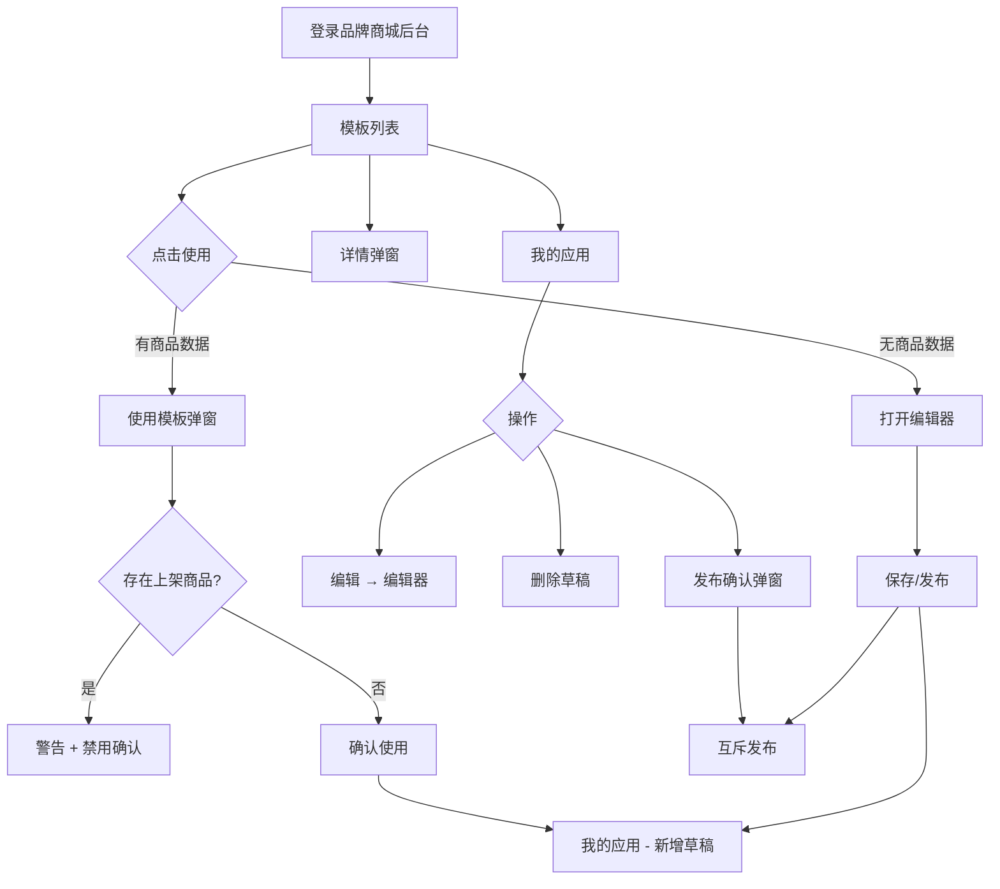

# 产品需求文档（PRD）

## 1. 文档信息


| 字段     | 内容                                           |
| ------ | -------------------------------------------- |
| 文档名称   | 商城端工作台 — 模板选用与应用管理                         |
| 版本号    | v1.1                                         |
| 产品经理   | —                                            |
| 关联需求编号 | MALL-OPS-2026-001                            |
| 优先级    | P0                                           |
| 对应原型   | `7.商城端工作台-原型`（`index.html`、`editor.html`） |


**修订历史：**


| 版本   | 修订日期       | 修订人 | 修订内容                                           |
| ---- | ---------- | --- | ---------------------------------------------- |
| v1.0 | —          | —   | 初版：模板全生命周期管理、商城列表表格形态                          |
| v1.1 | 2026-06-10 | —   | 收敛为「选用模板 → 管理我的应用」主流程；新增带数据模板使用校验、应用发布互斥、编辑器联动 |


---

## 2. 背景与目标

### 2.1 业务背景

平台侧已维护大量商城装修模板，并可将模板连同商品、分类、活动等数据一并推送给品牌方。品牌运营人员需要在统一工作台中：

- 快速浏览**已发布**模板，按需选用并生成自己的商城应用；
- 管理基于模板创建的**我的应用**，控制线上唯一可见的已发布版本；
- 在使用**带商品数据**的模板时，明确数据覆盖范围，并避免与当前上架商品冲突。

原「商城搭建系统」将模板创建、编辑、批量标签、推送等能力集中在运营端，流程冗长、职责不清。本次迭代将运营端定位为**选用方**，模板生产与推送由平台/品牌侧其他模块承担。

### 2.2 用户故事


| 编号    | 用户故事                                                       |
| ----- | ---------------------------------------------------------- |
| US-01 | 作为**平台运营**，我想要**按标签和名称筛选已发布模板**，以便**快速找到适合当前业务的模板**。       |
| US-02 | 作为**平台运营**，我想要**预览模板效果并一键使用**，以便**基于模板创建商城应用**。            |
| US-03 | 作为**平台运营**，我想要**在使用带商品数据模板前看到覆盖范围与价格规则**，以便**评估风险后再确认**。   |
| US-04 | 作为**平台运营**，我想要**在上架商品未清空时被阻止使用带数据模板**，以便**避免商品数据被误覆盖**。    |
| US-05 | 作为**平台运营**，我想要**在「我的应用」中管理草稿与已发布应用**，以便**控制线上仅展示一个已发布版本**。 |
| US-06 | 作为**平台运营**，我想要**在编辑器保存或发布后同步到我的应用列表**，以便**减少重复操作**。        |


### 2.3 产品目标


| 目标项  | 描述                                                       |
| ---- | -------------------------------------------------------- |
| 流程简化 | 从「选用模板到创建应用」主路径操作步骤由 5+ 步缩减为 2～3 步（选用 → 确认[可选] → 进入应用列表） |
| 职责清晰 | 运营工作台仅保留「选用 + 管理应用」，模板 CRUD、批量标签、推送下沉至平台管理端              |
| 风险可控 | 带商品数据模板使用前 100% 经过确认弹窗；存在上架商品时阻断使用                       |
| 发布唯一 | 全租户/全平台同时仅 1 个应用处于「已发布」，切换发布时自动降级其他应用                    |


### 2.4 成功指标


| 指标        | 基线   | 目标                      | 统计周期     |
| --------- | ---- | ----------------------- | -------- |
| 模板选用完成率   | —    | ≥ 85%（进入列表 → 成功创建应用）    | 上线后 30 天 |
| 带数据模板误操作率 | —    | 因上架拦截导致的放弃率可监控，误覆盖工单为 0 | 上线后 30 天 |
| 应用发布切换耗时  | —    | 从点击「发布」到线上生效 ≤ 5s（含接口）  | 上线后 7 天  |
| 运营主路径步骤数  | 5+ 步 | ≤ 3 步                   | 验收时      |


---

## 3. 范围说明

### 3.1 包含的功能

- 侧栏导航：模板列表、我的应用、品牌商城端（外链入口）
- 模板列表：标签筛选、名称搜索、重置、卡片画廊、分页（每页 5 条）
- 模板卡片：预览、使用（分支：直进编辑器 / 弹窗确认）、详情（仅带商品数据模板）
- 使用模板弹窗：应用名称、数据覆盖项展示、上架商品校验、确认加入我的应用
- 模板详情弹窗：模板名称、包含页面、商品数据、价格规则
- 我的应用：搜索、卡片画廊、预览/编辑/删除（草稿）/发布
- 应用发布确认弹窗：互斥发布二次确认
- 编辑器联动：保存为草稿应用、发布为已发布应用（回写父窗口列表）
- 分类页模板选择弹窗（从编辑器/页面管理流程触发，逻辑保留）

### 3.2 不包含的功能

- 运营端新建/编辑/删除/发布模板
- 批量设置标签、模板全选与批量操作
- 推送到品牌商城（弹窗已从工作台移除）
- 模板下「页面管理」中间页（UI 已移除，平台侧另入口承接）
- 我的应用「一键复制商城」
- 新建商城完整向导（原型仅占位 alert）
- 真实预览 URL / 二维码、真实接口持久化（本期原型为前端 Mock）
- 电影票次卡运营模块（独立原型页，不在本 PRD 范围）

### 3.3 依赖条件


| 依赖项     | 说明                                                        | 责任方     |
| ------- | --------------------------------------------------------- | ------- |
| 账号与权限体系 | 运营账号登录、租户隔离                                               | 平台基础服务  |
| 模板服务    | 提供已发布/已推送模板列表、模板详情、pushConfig                             | 模板/装修服务 |
| 应用服务    | 创建/删除/发布应用，发布互斥逻辑                                         | 商城应用服务  |
| 商品服务    | 查询当前商城上架商品数量与状态                                           | 商品中心    |
| 编辑器     | `editor.html` 可视化编辑，URL 参数 `id`、`name`、`categoryTemplate` | 装修编辑器   |
| 品牌商城端   | 侧栏外链 `品牌商城端.html` 可访问                                     | 品牌端产品   |


---

## 4. 详细需求描述

### 4.1 功能名称：模板列表浏览与筛选

**前置条件：** 用户已登录运营工作台，默认进入「模板列表」页（`#page-templates`）

**操作步骤：**

1. 用户在模板列表页查看说明文案：「以下为已发布的模板，可直接选择使用」
2. 用户可通过「标签」下拉（全部/美妆/食品/服饰/618大促）筛选，变更后立即刷新列表
3. 用户可在搜索框输入模板名称，点击「搜索」或按回车过滤
4. 用户可点击「重置」清空标签与搜索词，列表恢复默认并重置到第 1 页
5. 列表以卡片形式展示，每页 5 条，底部分页器支持上一页/下一页/页码切换

**后置结果：** 列表仅展示 `status` 为 `published` 或 `pushed` 的模板；筛选与分页状态在前端即时生效

**异常处理：**

- 无符合条件模板 → 卡片区域展示「暂无符合条件的模板」，分页器隐藏
- 网络异常时 → 提示「加载失败，请检查网络后重试」，提供「重新加载」按钮
- 接口超时时 → Toast 提示「请求超时，请稍后重试」

---

### 4.2 功能名称：使用模板（无商品数据）

**前置条件：** 用户在模板列表，存在模板数据

**操作步骤：**

1. 用户点击模板卡片「使用」按钮
2. 系统新窗口打开 `editor.html?id={templateId}&name={templateName}`

**后置结果：** 进入模板可视化编辑器，可配置页面与楼层

**异常处理：**

- 模板不存在或已下架 → 提示「模板不可用，请刷新列表」
- 弹窗被浏览器拦截 → 提示「请允许弹出窗口后重试」

---

### 4.3 功能名称：使用模板（带商品数据）

**前置条件：** 用户在模板列表，目标模板标记为「带商品数据」（封面角标）

**操作步骤：**

1. 用户点击模板卡片「使用」按钮
2. 系统弹出「使用模板」弹窗，应用名称只读展示为模板名称
3. 弹窗展示数据处理方式（覆盖商品数据、前台分类、商品标签、活动），四项默认勾选且不可取消
4. 系统查询当前商城上架商品状态：
  - 若存在上架商品：展示警告「检测到现有商城中有 N 个商品仍在上架，会自动下架所有商品，并全量覆盖数据」，「确认使用」按钮「确认使用」可点击
  - 若无上架商品：「确认使用」可点击
5. 用户点击「确认使用」
6. 系统创建一条「草稿」应用记录，提示成功，并自动切换侧栏至「我的应用」

**后置结果：** `MOCK_MALLS`（实作：应用服务）新增一条 `status=draft` 的应用，关联 `templateId`；不触发发布互斥

**异常处理：**

- 存在上架商品 → 禁用提交，展示具体上架数量
- 创建失败 → 提示「创建应用失败：{原因}」，弹窗保持打开
- 用户点击取消/关闭 → 关闭弹窗，不创建应用

---

### 4.4 功能名称：查看模板详情

**前置条件：** 用户在模板列表，目标模板为「带商品数据」类型（卡片展示「详情」按钮）

**操作步骤：**

1. 用户点击「详情」按钮
2. 系统弹出「详情」弹窗，只读展示：
  - 模板名称
  - 包含页面（应用中包含的页面）
  - 是否包含商品数据（是/否）
  - 商品价格规则（仅含商品数据时：「该商城的商品价格」或「商品供应商价格 × 系数」）
3. 用户点击「关闭」或弹窗关闭按钮

**后置结果：** 无数据变更，仅信息浏览

**异常处理：**

- 详情加载失败 → 提示「详情加载失败，请重试」

---

### 4.5 功能名称：我的应用列表管理

**前置条件：** 用户已登录，点击侧栏「我的应用」进入 `#page-mall-list`

**操作步骤：**

1. 用户查看说明：「应用基于模板创建：仅一个应用处于「已发布」，其余为「草稿」
2. 用户可通过搜索框按应用名称或品牌名称过滤，点击「搜索」或回车生效
3. 列表以卡片展示：封面（继承模板）、状态角标（已发布/草稿）、名称、标签、创建时间
4. 用户可对卡片执行操作：
  - **预览**：演示提示关联模板预览（实作：打开预览链接）
  - **编辑**：新窗口打开 `editor.html?id={templateId}`
  - **删除**：仅草稿展示；二次确认后删除
  - **发布**：仅草稿可点；已发布应用按钮禁用并展示「已发布」

**后置结果：** 列表随操作实时刷新；删除后应用不可恢复（实作建议软删）

**异常处理：**

- 列表为空 → 展示「暂无应用」
- 删除已发布应用 → 前端不展示删除按钮；接口层须拒绝
- 删除失败 → 提示「删除失败：{原因}」

---

### 4.6 功能名称：发布应用（互斥规则）

**前置条件：** 用户在「我的应用」，目标应用 `status=draft`

**操作步骤：**

1. 用户点击草稿卡片「发布」按钮
2. 系统弹出「确认发布」弹窗，文案：「确定将该应用设为「已发布」吗？其他已发布应用会变为「草稿」。」
3. 用户点击「确定发布」
4. 系统将目标应用设为 `published`，其余原 `published` 应用全部降为 `draft`
5. 列表刷新，目标卡片发布按钮变为禁用态「已发布」

**后置结果：** 全列表同时最多 1 条 `published`；线上小程序展示已发布应用（实作由发布服务下发）

**异常处理：**

- 用户取消 → 关闭弹窗，状态不变
- 发布接口失败 → 提示「发布失败：{原因}」，状态回滚
- 并发发布 → 服务端加锁或乐观锁，仅一个成功，失败者提示「已有其他应用发布，请刷新后重试」

---

### 4.7 功能名称：编辑器保存/发布联动我的应用

**前置条件：** 用户从模板列表或我的应用打开 `editor.html`，且父窗口为运营工作台（`window.opener` 可用）

**操作步骤：**

1. 用户在编辑器顶栏点击「保存」或「发布」
2. 系统通过 `window.opener.addMallFromTemplate(templateId, action)` 通知父窗口：
  - `save` → 创建草稿应用
  - `publish` → 创建已发布应用并触发互斥规则
3. 系统提示「已将当前模板作为应用复制到我的应用列表」

**后置结果：** 父窗口「我的应用」列表新增或更新记录（实作：统一走应用创建/发布 API）

**异常处理：**

- 父窗口已关闭 → 仅本地提示保存成功，引导用户回到工作台查看
- 接口失败 → 编辑器内 Toast 提示失败原因，不关闭编辑页

---

### 4.8 功能名称：预览模板

**前置条件：** 用户在模板列表或我的应用

**操作步骤：**

1. 用户点击「预览」
2. 原型：alert 演示说明
3. 实作：新窗口或抽屉打开预览页 / 扫码预览小程序

**后置结果：** 用户可查看模板或应用在 PC/移动端的渲染效果，不产生数据变更

**异常处理：**

- 预览资源加载失败 → 提示「预览加载失败，请稍后重试」

---

## 5. 交互与视觉

### 5.1 页面流程图




**信息架构：**

```
商城端
├── 模板列表（默认页）
└── 我的应用
```

### 5.2 关键交互说明


| 交互场景 | 说明                                       |
| ---- | ---------------------------------------- |
| 加载态  | 列表首次加载显示骨架屏或 Loading；分页切换时列表区域轻量 Loading |
| 空状态  | 模板列表：「暂无符合条件的模板」；我的应用：「暂无应用」             |
| 动效   | 弹窗淡入；卡片 hover 轻微阴影；禁用按钮无 hover 反馈        |
| 手势操作 | PC 端为主；移动端浏览器可访问但非本期优化重点                 |
| 分页   | 模板列表每页 5 条；我的应用原型仅展示总条数（实作建议统一分页组件）      |
| 弹窗关闭 | 支持关闭按钮、取消按钮、点击遮罩关闭                       |


### 5.3 文案规范


| 场景      | 文案                                       |
| ------- | ---------------------------------------- |
| 模板列表说明  | 以下为已发布的模板，可直接选择使用                        |
| 我的应用说明  | 应用基于模板创建：仅一个应用处于「已发布」，其余为「草稿」            |
| 带数据角标   | 带商品数据                                    |
| 使用模板提示  | 确认后将加入到我的应用中。                            |
| 上架拦截    | 检测到现有商城中有 {N} 个商品仍在上架，请先下架商品，才能使用带数据的模板。 |
| 发布确认    | 确定将该应用设为「已发布」吗？其他已发布应用会变为「草稿」。           |
| 删除确认    | 确定删除草稿应用「{应用名}」吗？删除后不可恢复。                |
| 按钮-搜索   | 搜索                                       |
| 按钮-重置   | 重置                                       |
| 按钮-使用   | 使用                                       |
| 按钮-详情   | 详情                                       |
| 按钮-确认使用 | 确认使用                                     |
| 按钮-确定发布 | 确定发布                                     |
| 按钮-已发布  | 已发布                                      |
| 成功提示    | 已使用模板「{模板名}」，并已加入到我的应用列表。                |
| 错误提示    | 加载失败，请检查网络后重试 / 创建应用失败：{原因}              |


---

## 6. 边界与异常

### 6.1 极限情况


| 场景            | 处理方式                           |
| ------------- | ------------------------------ |
| 模板列表为空        | 展示空状态文案，隐藏分页                   |
| 模板名称超长        | 卡片标题单行省略，hover 展示完整名称（实作）      |
| 标签过多          | 卡片内标签换行展示，不截断                  |
| 并发发布两个应用      | 服务端保证仅一个 `published`；后提交者失败并提示 |
| 使用带数据模板同时多人操作 | 以上架商品校验为准；覆盖操作加操作锁或版本号         |
| 编辑器与列表窗口通信失败  | 降级为接口轮询或手动刷新我的应用               |


### 6.2 权限控制


| 角色    | 可见                | 可操作                    |
| ----- | ----------------- | ---------------------- |
| 平台运营  | 模板列表、我的应用、品牌商城端入口 | 选用模板、创建/删除草稿应用、发布应用、编辑 |
| 平台管理员 | 同上 + 平台管理端模板 CRUD | 运营全部能力 + 模板生产与推送（管理端）  |
| 品牌方用户 | 品牌商城端（非本工作台）      | 不可访问本运营工作台             |
| 游客    | 无                 | 无                      |


### 6.3 兼容性


| 项            | 要求                                         |
| ------------ | ------------------------------------------ |
| 最低支持的 App 版本 | 不涉及原生 App；小程序端由已发布应用下发，随商城小程序现有版本策略        |
| 最低支持的浏览器     | Chrome 90+、Edge 90+、Firefox 88+、Safari 14+ |
| 屏幕分辨率        | 最低 1280×720，推荐 1440×900 及以上                |


### 6.4 数据埋点


| 事件名                             | 参数                                 | 说明        |
| ------------------------------- | ---------------------------------- | --------- |
| `mall_ops_template_list_view`   | `tenant_id`                        | 进入模板列表    |
| `mall_ops_template_search`      | `keyword`, `result_count`          | 模板搜索      |
| `mall_ops_template_use_click`   | `template_id`, `has_products`      | 点击使用      |
| `mall_ops_template_use_confirm` | `template_id`, `success`           | 确认使用带数据模板 |
| `mall_ops_template_use_block`   | `template_id`, `on_shelf_count`    | 上架拦截      |
| `mall_ops_template_detail_view` | `template_id`                      | 查看模板详情    |
| `mall_ops_app_list_view`        | `tenant_id`                        | 进入我的应用    |
| `mall_ops_app_publish`          | `app_id`, `template_id`, `success` | 发布应用      |
| `mall_ops_app_delete`           | `app_id`, `success`                | 删除草稿应用    |
| `mall_ops_editor_save`          | `template_id`, `action`            | 编辑器保存/发布  |


---

## 7. 验收标准

- 模板列表仅展示 `published` / `pushed` 状态模板，草稿模板不可见
- 标签筛选、名称搜索、重置均正确，重置后页码回到第 1 页
- 模板列表分页每页 5 条，边界页翻页按钮正确禁用
- 无商品数据模板点击「使用」后 1 秒内打开编辑器新窗口
- 带商品数据模板展示「带商品数据」角标及「详情」按钮
- 存在上架商品时，「使用模板」弹窗展示警告且「确认使用」禁用
- 无上架商品时，确认使用后我的应用新增草稿记录，并自动跳转「我的应用」页签
- 模板详情弹窗正确展示页面列表、商品数据、价格规则
- 我的应用卡片正确展示已发布/草稿状态，且全列表仅一条已发布
- 草稿应用可删除，已发布应用不展示删除按钮
- 发布草稿应用时弹出二次确认，确认后原已发布应用变为草稿
- 编辑器点击「保存」在我的应用新增草稿；点击「发布」新增已发布并互斥
- 列表无数据时展示对应空状态文案
- 网络异常时展示错误提示并支持重试（实作阶段）

---

## 8. 附录

### 8.1 竞品参考


| 产品           | 可借鉴点                         |
| ------------ | ---------------------------- |
| 有赞微商城 / 店铺装修 | 模板市场选用 + 我的店铺分离；装修编辑器与店铺实例解耦 |
| 微信小程序官方装修组件  | 模板化页面结构、发布前预览流程              |


### 8.2 数据字典

**模板 Template**


| 字段名                       | 类型       | 说明                                       |
| ------------------------- | -------- | ---------------------------------------- |
| `id`                      | string   | 模板唯一标识                                   |
| `name`                    | string   | 模板名称                                     |
| `status`                  | enum     | `draft` / `published` / `pushed`；列表仅见后两者 |
| `tags`                    | string[] | 业务标签                                     |
| `updatedAt`               | string   | 最近修改时间                                   |
| `useCount`                | number   | 使用次数（列表不展示，统计用）                          |
| `hasProducts`             | boolean  | 是否带商品数据                                  |
| `pushConfig`              | object   | 推送/详情配置                                  |
| `pushConfig.copyProducts` | boolean  | 是否复制商品                                   |
| `pushConfig.priceMode`    | enum     | `default` / `supplier`                   |
| `pushConfig.priceCoeff`   | number   | 供应商价系数，默认 1.2                            |
| `pushConfig.pageNames`    | string[] | 包含页面名称                                   |


**我的应用 MallApp**


| 字段名          | 类型     | 说明                    |
| ------------ | ------ | --------------------- |
| `id`         | string | 应用唯一标识                |
| `name`       | string | 应用名称                  |
| `brandName`  | string | 关联品牌名称                |
| `templateId` | string | 来源模板 ID               |
| `status`     | enum   | `draft` / `published` |
| `createdAt`  | string | 创建时间                  |


**商城商品状态 MallProductStatus**（校验用）


| 字段名                  | 类型      | 说明       |
| -------------------- | ------- | -------- |
| `hasOnShelfProducts` | boolean | 是否存在上架商品 |
| `onShelfCount`       | number  | 上架商品数量   |


### 8.3 消息通知模板

本期原型不涉及自动通知；实作可选：


| 类型  | 文案                                     |
| --- | -------------------------------------- |
| 站内信 | 您的商城应用「{应用名}」已发布成功，原线上应用「{旧应用名}」已转为草稿。 |
| 站内信 | 应用「{应用名}」创建成功，当前为草稿状态，发布后即可在小程序展示。     |
| 邮件  | 【商城端】应用发布通知：{应用名} 已于 {时间} 发布。          |
| 短信  | 不默认开启                                  |


### 8.4 业务规则速查


| 编号  | 规则                             |
| --- | ------------------------------ |
| R1  | 模板列表仅展示已发布/已推送模板               |
| R2  | 同时最多一个应用为「已发布」，发布新应用时其余已发布降为草稿 |
| R3  | 新建分类页须先选择六种分类页模板之一（编辑器流程）      |
| R4  | 预览须支持真实预览能力（实作）                |
| R5  | 带商品数据模板使用前须弹窗确认数据覆盖范围          |
| R6  | 使用带商品数据模板前须无上架商品               |
| R7  | 仅草稿应用允许删除                      |
| R8  | 运营在模板列表仅可选用，不可编辑/删除模板          |


### 8.5 原型文件索引


| 文件            | 用途           |
| ------------- | ------------ |
| `index.html`  | 运营工作台主页面     |
| `editor.html` | 模板可视化编辑器     |
| `app.js`      | 列表、弹窗、发布互斥逻辑 |
| `data.js`     | Mock 数据      |
| `styles.css`  | 全局样式         |


---

**文档结束**