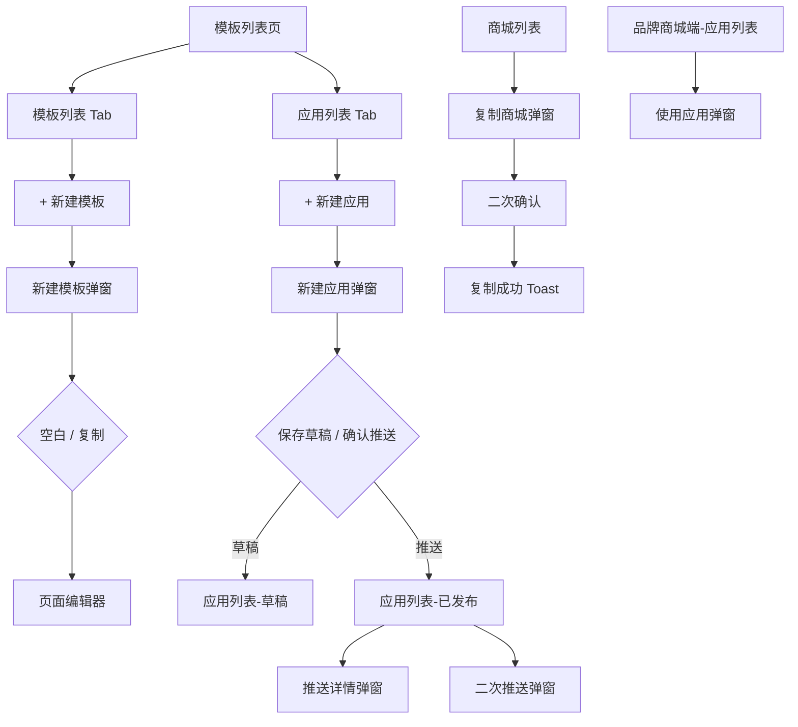

# 产品需求文档（PRD）

## 1. 文档信息

| 字段     | 内容                  |
| ------ | ------------------- |
| 文档名称   | 商城搭建与渠道应用管理 PRD     |
| 版本号    | v1.2                |
| 产品经理   | 肖喜龙                 |
| 关联需求编号 | MALL-BUILD-2026-001 |
| 优先级    | P0                  |

**修订历史：**

| 版本   | 修订日期       | 修订人 | 修订内容                                                      |
| ---- | ---------- | --- | --------------------------------------------------------- |
| v1.0 | 2026-06-10 | —   | 基于交互原型初版（模板列表、应用管理、品牌商城端、商城复制）                            |
| v1.1 | 2026-06-10 | —   | 对齐原型迭代：优化新建入口（去掉「选择新建类型」中间层）；补充新建应用默认命名、价格系数交互；完善新建模板流程描述 |
| v1.2 | 2026-06-10 | —   | 明确本期不含「渠道推送记录」功能；推送追溯相关描述调整为后续规划                          |

---

## 2. 背景与目标

### 2.1 业务背景

当前品牌/渠道商城数量多、页面与商品配置重复度高。运营需要在**不重复搭建**的前提下，快速将成熟渠道商城的页面装修、商品数据复制到新应用或新商城，并推送到目标渠道。

现有痛点：

- 跨渠道复制页面与商品依赖人工导出导入，耗时长、易出错
- 模板与应用概念混杂，运营难以区分「可复用模板」与「可推送应用」
- 新建流程存在多余中间步骤（先选类型再填表单），操作路径偏长
- 多渠道推送缺乏统一配置入口
- 品牌商城侧缺少「一键使用已推送应用」能力

> 说明：推送结果追溯（渠道推送记录查询页）为后续规划，**本期不提供**。

### 2.2 用户故事

| 角色   | 用户故事                                            |
| ---- | ----------------------------------------------- |
| 平台运营 | 作为平台运营，我想要在模板列表 Tab 一键新建模板，以便减少操作步骤、快速进入编辑器     |
| 平台运营 | 作为平台运营，我想要在应用列表 Tab 一键新建应用并配置复制范围，以便批量推送到多个渠道商城 |
| 平台运营 | 作为平台运营，我想要新建应用时自动带出默认名称与价格系数配置，以便减少重复输入         |
| 平台运营 | 作为平台运营，我想要管理模板列表、发布模板并推送给品牌方，以便品牌复用标准页面布局       |
| 品牌运营 | 作为品牌运营，我想要在品牌商城后台查看已推送应用并一键使用，以便快速上线页面与商品       |
| 平台运营 | 作为平台运营，我想要在商城列表一键复制已有品牌商城，以便快速开通新 K3 渠道商城       |

### 2.3 产品目标

- **新建模板**：点击「+ 新建模板」直接进入「新建模板」弹窗，去掉「选择新建类型」中间层，操作减少 1 步
- **新建应用**：应用列表 Tab 点击「+ 新建应用」直接进入配置弹窗；从选源到确认推送在 **1 个弹窗内完成**（含预览）
- 渠道商城复制开通时间从人工 **2 小时级** 降至 **10 分钟级**（含配置确认）
- 应用推送配置支持页面、商品、价格策略、目标渠道 **一次性配置**

> 推送记录独立查询页不在本期范围；推送结果可通过应用「详情」弹窗查看单次配置快照。

### 2.4 成功指标

| 指标            | 目标值                | 统计周期     |
| ------------- | ------------------ | -------- |
| 新建模板到达编辑器步骤数  | ≤ 2 步（点击按钮 → 填表确定） | 上线后 30 天 |
| 新建应用并完成推送成功率  | ≥ 95%              | 上线后 30 天 |
| 单应用平均配置时长     | ≤ 5 分钟             | 上线后 30 天 |
| 商城复制任务一次提交成功率 | ≥ 98%              | 上线后 30 天 |

---

## 3. 范围说明

### 3.1 包含的功能

**A. 商城搭建 — 模板管理（平台端）**

- 模板列表展示、筛选（名称/状态/标签）
- **Tab 感知的新建入口**：模板列表 Tab 显示「+ 新建模板」，应用列表 Tab 显示「+ 新建应用」
- **新建模板**（去掉「选择新建类型」弹窗，直接进入新建模板弹窗）
  - 创建方式：从空白新建 / 复制已有模板
  - 填写模板名称后进入编辑器
- 模板编辑、预览、发布、删除
- 模板页面管理（首页/分类/活动/我的/商品详情）
- 批量设置标签
- 推送到品牌商城

**B. 商城搭建 — 应用管理（平台端 + 品牌端）**

- 应用列表展示、筛选（名称/状态/来源渠道）
- **新建应用**（应用 Tab 直接进入配置弹窗，无类型选择中间层）
  - 应用名称默认：渠道商城名称 +「副本」
  - 选渠道商城、复制页面、复制商品、价格策略、推送渠道
  - 选择「商品供应商价格 × 系数」时展示系数输入框
- 应用预览（手机壳 + 页面 Tab 切换）
- 保存草稿 / 确认推送
- 应用发布、继续搭建、删除、取消发布
- 已发布应用二次推送
- 推送详情（只读回显 + 预览；**替代独立推送记录页的查询能力**）

**C. 品牌商城端特有能力**

- 使用应用（覆盖 / 合并商品与分类数据）
- 品牌端无「新建模板」入口（仅查看/使用已推送内容）

**D. 品牌商城管理 — 商城列表**

- 商城列表查询
- 一键复制商城（含复制范围选择）
- 商城预览（小程序 / H5 / PC）
- 商城启用/停用、进入商城等基础操作

### 3.2 不包含的功能

- 「选择新建类型」中间弹窗（模板/应用二选一）——**本期已移除**
- **渠道推送记录**（独立菜单页、推送历史列表、按渠道/时间筛选查询）——**本期不做，见 3.4**
- 可视化页面编辑器完整能力（原型中跳转 editor，本期 PRD 不展开编辑器细节）
- 订单、用户数据复制
- 推送失败重试、异步任务进度轮询的完整后台实现细节
- 真实支付、库存同步、K3 系统对接接口规范（需另立接口 PRD）
- App 原生端能力

### 3.4 后续规划（本期不做）

**渠道推送记录**

- 侧栏独立菜单「渠道推送记录」及列表页（原型 HTML 中或有菜单占位，**功能未实现**）
- 按推送名称、推送渠道筛选
- 列表字段：推送名称、推送渠道、渠道数量、推送人、推送时间
- 与本期「应用详情」的关系：详情弹窗仅展示**单个应用**的推送配置快照，不能替代跨应用、跨批次的推送历史查询

---

### 3.5 依赖条件

| 依赖项       | 说明                       |
| --------- | ------------------------ |
| 渠道商城主数据   | 需提供渠道商城列表、页面清单、商品池数据     |
| 模板主数据     | 复制已有模板时需读取模板列表           |
| K3 渠道编码体系 | 复制商城需校验名称/编码唯一性          |
| 用户权限体系    | 区分平台运营、品牌运营角色            |
| 商品供应商价格   | 选择「供应商价格 × 系数」时依赖供应商底价字段 |
| 推送执行服务    | 异步复制页面/商品并写入目标渠道         |

---

## 4. 详细需求描述

### 4.1 功能名称：新建模板

**前置条件：** 用户已登录；位于「商城搭建 > 模板列表」页且处于**模板列表 Tab**；拥有新建模板权限（平台端）

**操作步骤：**

1. 用户点击页头「+ 新建模板」
2. 系统**直接**弹出「新建模板」弹窗（不再经过「选择新建类型」）
3. 用户选择创建方式并填写信息：
  - **从空白新建**（默认）：从零开始配置
  - **复制已有模板**：展示模板下拉选择框，选择源模板
  - **模板名称**（必填，最长 50 字）
4. 用户点击「确定」→ 进入页面编辑器（`editor.html`）

**字段规则：**

| 字段   | 必填   | 规则              |
| ---- | ---- | --------------- |
| 创建方式 | 是    | 空白 / 复制；默认空白    |
| 选择模板 | 条件必填 | 选「复制已有模板」时展示并必选 |
| 模板名称 | 是    | 最长 50 字，不可为空    |

**后置结果：**

- 创建新模板记录（草稿态），跳转编辑器继续搭建

**异常处理：**

- 模板名称为空 → 「请输入模板名称」
- 选复制但未选源模板 → 「请选择要复制的模板」
- 网络异常 → 提示重试，保留已填表单

**与旧版差异：**

| 项目     | v1.0                     | v1.1              |
| ------ | ------------------------ | ----------------- |
| 入口     | 「+ 新建」→「选择新建类型」→ 选「新建模板」 | 模板 Tab 直接「+ 新建模板」 |
| 中间弹窗   | 有                        | **无**             |
| 创建方式选择 | 在新建模板弹窗内                 | 保留在新建模板弹窗内        |

---

### 4.2 功能名称：新建应用

**前置条件：** 用户已登录；位于「商城搭建 > 模板列表」页且处于**应用列表 Tab**；拥有新建应用权限（平台端）

**操作步骤：**

1. 用户点击页头「+ 新建应用」
2. 系统**直接**弹出「新建应用」弹窗（不再经过「选择新建类型」），表单默认值如下：
  - **应用名称**：所选渠道商城名称 +「副本」（如「华夏-银行副本」）
  - **渠道商城**：默认选中列表第一项
  - **复制搭建页面**：默认「该商城所有页面」；切到「指定复制页面」时展示页面勾选面板，默认勾选首页、分类、我的
  - **复制商品数据**：默认勾选；勾选后展示价格设置
  - **推送渠道**：默认「指定渠道」，需至少选 1 个渠道才可推送
3. 用户可修改各字段；**切换渠道商城时，应用名称同步更新为「新渠道名 + 副本」**
4. 若勾选复制商品且选择「商品供应商价格 × 系数」→ **展示系数输入框**（默认 1.2），提示文案实时显示计算规则
5. 用户点击「应用预览」→ 弹窗右侧展开手机预览，可按页面 Tab 切换
6. 用户点击「保存草稿」或「确认推送」

**字段规则：**

| 字段          | 必填   | 规则                                  |
| ----------- | ---- | ----------------------------------- |
| 应用名称        | 是    | 最长 50 字；默认 `{渠道商城名称}副本`             |
| 渠道商城        | 是    | 下拉单选；变更时联动更新应用名称                    |
| 复制搭建页面      | 是    | 全部 / 指定；指定时至少选 1 页                  |
| 复制商品数据      | 否    | 默认勾选                                |
| 价格设置        | 条件展示 | 勾选复制商品时展示                           |
| 价格策略-商城价格   | —    | 沿用源渠道商城商品价格；隐藏系数框                   |
| 价格策略-供应商×系数 | —    | **展示系数输入框**；默认 1.2，范围 0–100，步进 0.01 |
| 推送渠道        | 否    | 全部渠道 / 指定渠道；默认不选择，选择之后，至少 1 个       |

**后置结果：**

- **保存草稿**：应用状态为「草稿」，出现在应用列表，可继续搭建
- **确认推送**：应用状态为「已发布」，目标渠道收到应用配置

**异常处理：**

- 应用名称为空 → Toast/弹窗：「请填写应用名称」
- 指定页面未勾选 → 「请至少选择一个复制页面」
- 系数非法（空、≤0、超范围）→ 「请输入有效的价格系数」
- 指定渠道未选择 → 「确认推送」按钮置灰
- 网络异常 → 「请检查网络后重试」，保留表单数据

---

### 4.3 功能名称：列表 Tab 与新建入口

**前置条件：** 用户位于「商城搭建 > 模板列表」主页面

**交互规则：**

| 当前 Tab | 页头按钮     | 点击行为       |
| ------ | -------- | ---------- |
| 模板列表   | 「+ 新建模板」 | 打开「新建模板」弹窗 |
| 应用列表   | 「+ 新建应用」 | 打开「新建应用」弹窗 |

- 切换 Tab 时，页头仅展示与当前 Tab 对应的新建按钮
- 筛选区字段随 Tab 切换（模板：标签/批量标签；应用：来源渠道）

**适用原型：** `模板列表.html`、`index.html`

---

### 4.4 功能名称：应用列表管理

**前置条件：** 用户位于「应用列表」Tab

**操作步骤：**

1. 用户可按名称、状态（草稿/已发布）、来源渠道筛选
2. 对草稿应用：可「发布」「继续搭建」「删除」
3. 对已发布应用：可「详情」「推送」「取消发布」取消发布，会把推送到商城端推送过去的对应应用删除
4. 点击「详情」→ 打开**推送详情**弹窗（只读展示该应用创建/推送时的完整配置，含价格系数；**本期无独立推送记录页，以此作为配置查阅入口**）
5. 点击「推送」→ 打开推送应用弹窗，选择全部/指定渠道后确认，可以新勾选 和取消勾选 渠道商城，对对应的
的商城数据进行删除 和推送

**后置结果：**

- 发布/取消发布变更应用状态
- 推送成功，更新最近修改时间

**异常处理：**

- 删除草稿 → 二次确认「删除后不可恢复」
- 推送未选渠道 → 按钮置灰或提示「请至少选择一个渠道」

---

### 4.5 功能名称：品牌端使用应用

**前置条件：** 用户已登录品牌商城后台；存在已推送至该品牌的应用

**操作步骤：**

1. 用户在应用列表点击「使用应用」（或等价入口）
2. 系统展示应用名称及数据处理方式：
  - **覆盖**：替换现有商品数据、分类数据
  - **合并**：与现有数据合并
3. 用户确认后执行应用落地

**后置结果：** 品牌商城页面/商品按应用配置更新

**异常处理：**

- 覆盖模式 → 提示「覆盖将替换品牌商城现有商品与分类数据」
- 执行失败 → 提示失败原因，不部分覆盖（需后端保证事务）

---

### 4.6 功能名称：商城预览

**前置条件：** 商城已配置至少一端预览地址

**操作步骤：**

1. 用户点击「商城预览」
2. 切换小程序 / H5 / PC Tab
3. 有地址则展示链接或预览内容；无地址展示「暂无数据」

---

## 5. 交互与视觉

### 5.1 页面流程图

### 5.2 关键交互说明

| 交互场景      | 说明                                       |
| --------- | ---------------------------------------- |
| Tab 切换    | 模板/应用 Tab 切换时，页头新建按钮与筛选区联动切换             |
| 加载态       | 列表首次加载展示骨架或 Loading；复制/推送提交后按钮短暂 Loading |
| 空状态       | 模板/应用列表无数据时展示「暂无符合条件的 XX」                |
| 动效        | 弹窗蒙层淡入；应用预览面板侧滑展开；Toast 顶部居中 3s 消失       |
| 表单联动-应用名  | 切换渠道商城 → 应用名称自动变为 `{商城名}副本`              |
| 表单联动-系数   | 勾选复制商品 + 选供应商价格策略 → 显示系数框；切回商城价格 → 隐藏系数框 |
| 表单联动-复制模板 | 选「复制已有模板」→ 展示模板下拉；选空白 → 隐藏               |
| 推送校验      | 指定渠道模式下未选渠道 → 「确认推送」禁用                   |
| 只读详情      | 推送详情所有表单项 disabled，支持预览但不允许编辑            |

### 5.3 文案规范

| 场景         | 文案                                 |
| ---------- | ---------------------------------- |
| 模板 Tab 入口  | 「+ 新建模板」                           |
| 应用 Tab 入口  | 「+ 新建应用」                           |
| 新建模板弹窗标题   | 「新建模板」                             |
| 创建方式-空白    | 「从空白新建」                            |
| 创建方式-复制    | 「复制已有模板」                           |
| 新建应用-默认名称  | `{渠道商城名称}副本`                       |
| 复制商城-默认名称  | `{源商城名称}-副本`                       |
| 页面复制提示-全部  | 「将复制「{商城名}」的全部 {N} 个搭建页面」          |
| 页面复制提示-指定  | 「已选择 {N} 个页面，默认勾选首页、分类、我的」         |
| 商品价格-沿用商城  | 「复制商品数据，价格沿用渠道商城的商品价格」             |
| 商品价格-供应商系数 | 「复制商品数据，新价格 = 供应商价格 × {系数}」        |
| 未复制商品      | 「未勾选时将不复制商品数据」 / 「不复制商品数据，仅复制搭建页面」 |
| 推送渠道-未选    | 「请至少选择一个渠道」                        |
| 成功-复制商城    | 「商城「{名称}」复制成功」                     |
| 成功-推送      | 「操作成功」                             |
| 错误-模板名     | 「请输入模板名称」                          |
| 错误-名称重复    | 「K3 渠道名称已存在，请更换」                   |
| 错误-系数      | 「请输入有效的价格系数」                       |
| 错误-必填      | 「请填写应用名称」 / 「请填写完整的必填信息」           |
| 复制范围说明     | 「订单和用户数据不会被复制」                     |

---

## 6. 边界与异常

### 6.1 极限情况

| 场景        | 处理方式                       |
| --------- | -------------------------- |
| 渠道商城无搭建页面 | 页面勾选列表为空，禁止提交并提示           |
| 应用/模板名称超长 | 输入 maxlength=50，超出不可输入     |
| 系数边界      | 最小 0.01，最大 99.99；非法值阻止提交   |
| 系数框显隐     | 仅在选择「供应商价格 × 系数」且勾选复制商品时展示 |
| 推送渠道搜索无结果 | 展示「无匹配渠道」                  |
| 预览地址缺失    | 展示空状态图标 +「暂无数据」            |
| 并发复制同一编码  | 后端唯一性校验，后提交者失败并提示重复        |
| 指定页面全不选   | 校验拦截，不允许提交                 |
| 复制模板列表为空  | 禁用「复制已有模板」或提示暂无可用模板        |

### 6.2 权限控制

| 角色   | 可见             | 可操作                     |
| ---- | -------------- | ----------------------- |
| 平台运营 | 模板列表、应用列表、商城列表 | 新建模板/应用、推送、复制商城、批量标签    |
| 品牌运营 | 品牌端模板列表、应用列表   | 使用应用、继续搭建（本品牌范围）；不可新建模板 |
| 游客   | 无              | 无                       |

### 6.3 兼容性

| 项            | 要求                                         |
| ------------ | ------------------------------------------ |
| 最低支持的浏览器     | Chrome 90+、Edge 90+、Firefox 88+、Safari 14+ |
| 分辨率          | 后台最小宽度 1280px；弹窗大屏模式适配 1440px              |
| 最低支持的 App 版本 | 不涉及（本期为 Web 运营后台）                          |

### 6.4 数据埋点

| 事件名                     | 参数                                                                                 | 说明           |
| ----------------------- | ---------------------------------------------------------------------------------- | ------------ |
| create_template_open    | source_tab                                                                         | 打开新建模板弹窗     |
| create_template_submit  | template_name, create_mode, copy_from_id                                           | 确认新建模板       |
| create_app_open         | source_tab                                                                         | 打开新建应用弹窗     |
| create_app_submit_draft | app_name, channel_mall_id, copy_pages_mode, copy_products, price_mode, price_coeff | 保存草稿         |
| create_app_submit_push  | 同上 + push_channel_ids, push_channel_mode                                           | 确认推送         |
| create_app_preview      | page_id                                                                            | 应用预览切换页面     |
| create_app_name_sync    | channel_mall_id                                                                    | 切换渠道商城触发名称联动 |
| app_push_again          | app_id, channel_ids                                                                | 已发布应用二次推送    |
| app_use                 | app_id, data_mode                                                                  | 品牌端使用应用      |
| mall_copy_submit        | source_mall_id, copy_scope[]                                                       | 提交复制商城       |
| mall_preview            | mall_id, preview_type                                                              | 商城预览切换端      |

---

## 7. 验收标准

**新建模板（v1.1 新增/调整）**

- 模板列表 Tab 显示「+ 新建模板」，不出现「选择新建类型」弹窗
- 点击「+ 新建模板」直接打开「新建模板」弹窗
- 默认选中「从空白新建」；切换「复制已有模板」时展示模板下拉
- 模板名称为空时不可提交，提示「请输入模板名称」
- 确定后跳转编辑器，携带模板名称参数

**新建应用**

- 应用列表 Tab 显示「+ 新建应用」，点击直接打开配置弹窗
- 打开新建应用弹窗，应用名称默认为「所选渠道商城名称 + 副本」
- 切换渠道商城，应用名称自动同步更新
- 勾选「复制商品数据」且选择「商品供应商价格 × 系数」时，展示系数输入框；切换回「该商城的商品价格」时隐藏
- 系数输入 1.5 时，提示文案实时显示「新价格 = 供应商价格 × 1.5」
- 指定推送渠道且未选任何渠道时，「确认推送」按钮不可点击
- 至少选择 1 个推送渠道后，「确认推送」可点击并成功创建应用
- 保存草稿后应用出现在应用列表，状态为「草稿」
- 已发布应用点击「详情」，推送详情与创建配置一致且只读（含系数）；**无独立推送记录页**

**商城复制与其他**

- 复制商城时 K3 名称/编码与已有重复，输入框下方显示红色错误提示
- 复制商城二次确认文案包含源商城与新商城名称
- 复制成功后 Toast 提示，列表首行出现新商城
- 商城无预览地址时，预览弹窗展示「暂无数据」
- 品牌端使用应用选择「覆盖」时，展示覆盖风险提示文案
- 网络异常时提交失败有明确提示，表单数据不丢失

---

## 8. 附录

### 8.1 竞品参考

- 有赞/微盟店铺装修：模板复用 + 多渠道分发思路
- Shopify Theme 复制：基于源店铺复制主题与部分数据
- 内部 K3 渠道开通流程：复制商城对齐现有 K3 主数据字段

### 8.2 数据字典

| 字段名                            | 类型       | 说明                                     |
| ------------------------------ | -------- | -------------------------------------- |
| template.id                    | string   | 模板唯一 ID                                |
| template.name                  | string   | 模板名称，≤50 字                             |
| template.status                | enum     | draft / published / pushed             |
| template.createMode            | enum     | blank / copy                           |
| template.copyFromId            | string   | 复制源模板 ID（createMode=copy 时）            |
| app.id                         | string   | 应用唯一 ID                                |
| app.name                       | string   | 应用名称，≤50 字；默认 `{sourceChannel}副本`      |
| app.status                     | enum     | draft / published                      |
| app.sourceMallId               | string   | 来源渠道商城 ID                              |
| app.sourceChannel              | string   | 来源渠道商城名称                               |
| app.pushConfig.pageMode        | enum     | all / custom                           |
| app.pushConfig.pageIds         | string[] | 指定复制的页面 ID 列表                          |
| app.pushConfig.copyProducts    | boolean  | 是否复制商品                                 |
| app.pushConfig.priceMode       | enum     | default（商城价）/ supplier（供应商×系数）         |
| app.pushConfig.priceCoeff      | number   | 价格系数，0.01–99.99；priceMode=supplier 时必填 |
| app.pushConfig.pushChannelMode | enum     | all / custom                           |
| app.pushConfig.pushChannelIds  | string[] | 推送目标渠道 ID                              |
| mall.name                      | string   | K3 渠道名称                                |
| mall.code                      | string   | K3 渠道编码，唯一                             |
| mall.phone                     | string   | 对接人手机号，11 位                            |
| mall.status                    | enum     | 启用 / 停用                                |

**后续规划数据模型（渠道推送记录，本期不实现）：**

| 字段名                     | 类型       | 说明           |
| ----------------------- | -------- | ------------ |
| pushRecord.pushName     | string   | 推送名称（通常同应用名） |
| pushRecord.channelNames | string[] | 推送渠道名称列表     |
| pushRecord.operator     | string   | 推送人          |
| pushRecord.pushedAt     | datetime | 推送时间         |

**页面 ID 枚举（MOCK_BUILD_PAGES）：**

| id       | 名称   | 默认勾选 |
| -------- | ---- | ---- |
| home     | 首页   | 是    |
| category | 分类   | 是    |
| mine     | 我的   | 是    |
| cart     | 购物车  | 否    |
| activity | 活动页  | 否    |
| member   | 会员中心 | 否    |

### 8.3 消息通知模板

| 类型  | 文案                                                             |
| --- | -------------------------------------------------------------- |
| 短信  | 【商城运营】您负责的渠道商城「{渠道名}」已收到应用「{应用名}」推送，请登录后台查看。                   |
| 邮件  | 主题：应用推送通知 — {应用名} 正文：应用「{应用名}」已于 {时间} 推送到渠道「{渠道列表}」，推送人：{操作人}。 |
| 站内信 | 应用「{应用名}」已推送到 {N} 个渠道商城，点击查看详情。                                |

---

## 原型文件对照

| 模块           | 原型文件               | 说明                                          |
| ------------ | ------------------ | ------------------------------------------- |
| 平台模板/应用      | `模板列表.html`        | Tab 分入口；含新建模板/应用弹窗；侧栏「渠道推送记录」菜单为占位，**无列表页** |
| 品牌端应用使用      | `品牌商城端.html`       | 无新建模板入口                                     |
| 运营工作台（模板+应用） | `index.html`       | 无渠道推送记录页                                    |
| 商城一键复制       | `商城列表-一键复制商城.html` | 无变更                                         |

