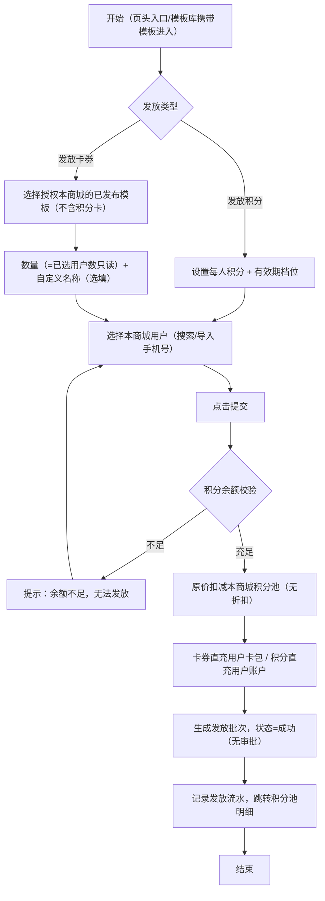

# 品牌商城端产品需求文档（积分管理与营销卡券）

| 字段   | 内容                                    |
| ---- | ------------------------------------- |
| 文档名称 | 积分管理与营销卡券系统-品牌商城端 PRD                 |
| 当前版本 | V1.1                                  |
| 文档日期 | 2026-09-08                            |
| 文档性质 | 自《PRD-积分管理与营销卡券系统-V1.1》按端拆分：品牌商城端完整规格 |
| 使用角色 | 品牌商城运营                                |
| 原型目录 | 积分PRD/22/                             |

# 1. 详细需求

## 1.1. 品牌商城端系统

### 1.1.1. 营销管理模块

#### 1.1.1.0. 端定位与平台端差异（通用规则）

##### 1. 功能概述

- **功能描述**：品牌商城端管理**本商城**积分池与用户权益（积分+卡券），向本商城 C 端用户发放卡券或积分。
- **数据权限**：仅可见/操作本商城数据（含本商城 C 端用户）；平台充值与平台代发记录**只读**。
- **积分来源**：本商城积分池由平台运营充值（1 平台积分 = 1 元，线下对公转账）；充值到池不直接进入用户账户，发放到账后才形成用户积分。

##### 2. 品牌端与平台端能力差异总表（2026-09-01 已确认口径）

| 能力项       | 平台端（平台代发）              | 品牌端（用户权益发放）                          |
| --------- | ---------------------- | ------------------------------------ |
| 发放目标商城    | 任选品牌商城（冻结不可选）          | **固定为本商城（不可选）**                      |
| 发放对象      | 同一品牌商城下用户（搜索/导入手机号）    | **仅本商城用户**                           |
| 发放方式      | 选人直充 / 生成卡密 / 使用已有卡密   | **仅支持选人直充**（生成卡密、使用已有卡密入口已移除，二期评估开放） |
| 整体折扣      | 可启用（折扣率 0.1–1，需运营主管审批） | **无此功能**，消耗 = 兑换单价 × 数量，原价扣减         |
| 可发卡券类型    | 按授权范围全部 6 类            | **不支持发放积分卡**（模板选择列表与模板库均不展示积分卡类型）    |
| 审批环节      | 仅启用整体折扣需企微审批           | **无审批环节**，提交成功后直接执行，记录状态即为"成功"       |
| 空白卡密管理    | 有（生成/激活/作废）            | 无                                    |
| 卡券模板管理    | 新建/编辑/审核/停用            | **只读模板库**（仅授权本商城 + 已发布，"用此模板发放"）     |
| 积分池充值     | 可操作（运营手动充值）            | **不可充值**，仅"购买积分指引"弹窗引导线下对公转账         |
| 发放记录状态    | 成功/待审批/失败/已冻结/已作废      | **不含"待审批"**（成功/失败/已冻结/已作废）           |
| 积分池明细操作范围 | 平台代发记录                 | **仅"品牌发放"记录**可冻结/作废/重发（平台充值、平台代发仅查看） |

##### 3. 引用平台端的通用规则

卡券 6 类型与字段矩阵、双段有效期、批次/卡券/发放记录状态机、核销口径（次卡首次支付核销/礼品卡余额制/积分卡无核销统计）与本系统一致，详见《PRD-平台运营端-积分管理与营销卡券-V1.1》1.1.1.0，本端不重复展开。

##### 4. 品牌积分配置（全局）

- 平台端与品牌端配置**同一份数据**（积分名称 + 兑换比例），任一侧修改两边同步生效；比例枚举仅 **1 / 10 / 100** 三档。
- 积分池余额、收支明细及用户持有积分均按此名称与比例展示（如"1 积分 = 10 苏银豆"）；底层计算统一使用平台积分。
- 名称与比例替换 C 端所有积分展示文案（详见小程序端 PRD）。

***

#### 1.1.1.1. 商城积分管理页面

##### 1. 功能概述

- **功能描述**：查看本商城积分池余额与积分池明细（平台充值/品牌发放/平台代发全部流水），可对本商城发起的发放记录冻结/作废；积分池明细即本页列表，详情独立页（跳 1.1.1.2）。
- **业务描述**：品牌端获取积分的唯一途径为线下对公转账后由平台运营充值；本页提供"购买积分指引"引导。
- **使用角色**：品牌商城运营（晓琳）。
- **触发条件**：登录品牌端，进入"营销管理 > 商城积分管理"菜单。

##### 2. 界面设计

###### 2.1 页面原型

[商城积分管理原型页面](file:///c:/Users/power/Documents/trae_projects/积分原型/积分PRD/22/06.商城积分管理-原型页面.html)

###### 2.2 页面结构

统计卡：商城积分池余额 / 已消耗积分 / 品牌积分配置（"1 积分 = 10 苏银豆"）/ 品牌积分余额（换算展示）。

页头操作：**用户权益发放**（跳 1.1.1.3）/ **购买积分指引**（弹窗）/ **品牌积分配置**（弹窗）。

筛选与列表字段同平台端积分池明细：

| 字段名称        | 数据类型   | 数据来源  | 格式说明                         |
| ----------- | ------ | ----- | ---------------------------- |
| 发放批次号       | String | 发放记录表 | J=充值/积分发放，C=卡券发放，P=平台代发      |
| 业务类型        | Enum   | 发放记录表 | 平台充值 / 品牌发放 / 平台代发           |
| 业务对象        | String | 发放记录表 | 发放时自定义的卡券名称（或"积分充值到账"），非模板类型 |
| 发放目标        | String | 发放记录表 | 用户昵称或"多用户"（明细在详情页）           |
| 发放数量        | Number | 发放记录表 | 张/人                          |
| 收入积分 / 支出积分 | Number | 发放记录表 | +绿色 / −红色                    |
| 剩余积分        | Number | 积分池表  | 两位小数                         |
| 状态          | Enum   | 发放记录表 | **成功/失败/已冻结/已作废（无"待审批"）**    |
| 备注          | String | 发放记录表 | -                            |
| 操作人/时间      | String | 操作日志表 | -                            |

###### 2.3 行操作（按来源与状态）

| 记录来源 | 可用操作                                                      |
| ---- | --------------------------------------------------------- |
| 平台充值 | 查看详情（只读）                                                  |
| 平台代发 | 查看详情（只读）                                                  |
| 品牌发放 | 按状态：成功→查看详情/冻结/作废；失败→查看详情/重新发放/作废；已冻结→查看详情/解冻/作废；已作废→查看详情 |

作废返还至**本商城**积分池（返还 = 未使用部分 × 单张积分成本）。

###### 2.4 关键弹窗

| 弹窗         | 要点                                                                        |
| ---------- | ------------------------------------------------------------------------- |
| 购买积分指引     | 暂仅支持线下对公转账，线上支付未开放；流程：①联系平台运营确认金额与比例 ②对公转账备注商城编码 ③平台核实后手动充值 ④在积分池明细查看充值记录 |
| 品牌积分配置     | 积分名称\*（≤20 字）+ 兑换比例\*（1/10/100）；与平台端同一份数据，任一侧修改两边同步                       |
| 冻结/作废/重新发放 | 同平台端两步制规则（冻结→作废，仅未使用部分返还；失败分类处理）                                          |

##### 3. 业务逻辑

###### 3.1 流程图

冻结→作废两步制流程同平台端（冻结原因必填 → 已冻结 → 作废弹窗展示可返还部分 → 未核销/未使用部分返还本商城积分池），详见平台端 PRD 1.1.1.2。

###### 3.2 业务规则

| 规则编号           | 规则名称   | 适用场景   | 规则描述                                   | 错误提示      |
| -------------- | ------ | ------ | -------------------------------------- | --------- |
| RULE-BRAND-001 | 余额不足阻止 | 权益发放   | 发放时积分余额不足阻止提交                          | 余额不足，无法发放 |
| RULE-BRAND-002 | 数据范围   | 全部页面   | 仅可见/操作本商城数据；平台充值与平台代发记录只读              | -         |
| RULE-BRAND-003 | 预警暂缓   | 积分池    | 积分池余额预警（月均消耗口径）本期不实现                   | -         |
| RULE-BRAND-004 | 无待审批   | 明细状态   | 品牌发放无审批环节，提交成功后记录状态直接为"成功"；状态枚举不含"待审批" | -         |
| RULE-BRAND-005 | 配置双向同步 | 品牌积分配置 | 与平台端同一份数据，任一侧修改两边同步生效；比例仅 1/10/100     | -         |

##### 4. 交互设计

###### 4.1 输入项说明

| 字段名称       | 字段类型 | 必填 | 数据类型   | 长度限制  | 校验规则 | 取值范围     | 提示文案       | 备注      |
| ---------- | ---- | -- | ------ | ----- | ---- | -------- | ---------- | ------- |
| 积分名称（配置弹窗） | 文本输入 | 是  | String | ≤20   | 非空   | -        | 如"苏银豆"     | 对外展示名   |
| 兑换比例（配置弹窗） | 下拉选择 | 是  | Enum   | -     | -    | 1/10/100 | 1 平台积分 = ? | 修改后两端同步 |
| 冻结原因       | 文本输入 | 是  | String | 1-200 | 非空   | -        | 请填写冻结原因    | 记入操作日志  |
| 作废原因       | 文本输入 | 是  | String | 1-200 | 非空   | -        | 请填写作废原因    | 作废前须先冻结 |
| 重新发放原因     | 文本输入 | 是  | String | 1-200 | 非空   | -        | 请填写重发原因    | 失败记录可用  |

###### 4.2 错误提示文案

| 校验项     | 提示文案             |
| ------- | ---------------- |
| 发放余额不足  | 余额不足，无法发放        |
| 积分名称为空  | 请输入积分名称          |
| 非本方记录操作 | 该记录由平台操作，品牌端仅可查看 |

***

#### 1.1.1.2. 积分池明细详情页面

##### 1. 功能概述

- **功能描述**：查看本商城积分池单条记录详情，三种面板：平台充值 / 积分发放（品牌端发起）/ 卡券发放。
- **使用角色**：品牌商城运营（晓琳）。
- **触发条件**：从商城积分管理列表点击"查看详情"进入（支持 recordId/type 参数自动切换面板）。

##### 2. 界面设计

###### 2.1 页面原型

[积分池明细详情原型页面](file:///c:/Users/power/Documents/trae_projects/积分原型/积分PRD/22/06a.积分池明细详情-原型页面.html)

###### 2.2 面板要点

| 面板   | 内容要点                                                                                                       |
| ---- | ---------------------------------------------------------------------------------------------------------- |
| 平台充值 | 充值基本信息 + 充值详情（本次积分/前后余额/原因/凭证编号）+ 凭证图片；提示：充值不直接进入用户账户                                                      |
| 积分发放 | 发放基本信息（**发放主体=品牌端**、含积分有效期档位）+ 积分消耗详情（人数/人均/前后余额/积分来源=本商城积分池）+ 发放用户列表（可导出）                                 |
| 卡券发放 | 发放基本信息 + 卡券信息（模板/类型/面值/兑换单价/双段有效期/使用范围/数量/实际抵扣金额=已核销张数×面值）+ 积分消耗详情（应消耗=实际消耗，**无折扣字段**）+ 发放对象列表（可导出）+ 操作时间轴 |

与平台端差异：发放主体显示"品牌端"；无折扣率/折扣原因区块；本端详情为**独立页面**（平台端为弹窗/页面双形态）。

***

#### 1.1.1.3. 用户权益发放页面

##### 1. 功能概述

- **功能描述**：品牌商城消耗本商城积分池，向本商城用户发放卡券或积分。
- **使用角色**：品牌商城运营（晓琳）。
- **触发条件**：①商城积分管理页头"用户权益发放"；②卡券发放管理页头"+ 发放卡券"；③模板库"用此模板发放"（携带模板 ID 预选）。

##### 2. 界面设计

###### 2.1 页面原型

[用户权益发放原型页面](file:///c:/Users/power/Documents/trae_projects/积分原型/积分PRD/22/06b.用户权益发放-原型页面.html)

###### 2.2 表单结构

**卡券路径**：

- 选择卡券模板（仅"**授权本商城 + 已发布**"模板；模板只读，仅可查看与发放）。
- 设置数量和改名：发放数量\*（选人直充下 = 已选用户数，只读联动）+ 自定义名称（选填，缺省用模板名）。
- 选择发放用户：仅本商城用户；搜索（用户名/ID/手机号）、全选当前页/清空/导入手机号（未匹配条数反馈）。

**积分路径**：

- 每人发放积分\*（实时换算品牌积分展示，如"= N 苏银豆"）。
- 积分有效期\*（1 年/2 年/3 年/无）。
- 发放备注（选填）；总消耗 = 每人积分 × 用户数。

**确认弹窗**：预览（发放类型/模板/数量/单价/用户/消耗积分/剩余积分）+ 余额校验（不足拦截）；提交后**无审批环节**直接执行，生成发放批次并跳转积分池明细。

##### 3. 业务逻辑

###### 3.1 品牌端用户权益发放流程

###### 3.2 业务规则

| 规则编号           | 规则名称    | 适用场景 | 规则描述                                             | 错误提示        |
| -------------- | ------- | ---- | ------------------------------------------------ | ----------- |
| RULE-BSEND-001 | 仅本商城用户  | 选用户  | 单次仅向本商城用户发放                                      | -           |
| RULE-BSEND-002 | 无折扣     | 发放卡券 | 品牌端无整体折扣能力，消耗 = 兑换单价 × 数量                        | -           |
| RULE-BSEND-003 | 模板范围    | 选模板  | 仅可使用平台授权（勾选"品牌商城可用"）且已发布的模板；模板只读                 | 该卡券类型未授权    |
| RULE-BSEND-004 | 积分有效期必选 | 发放积分 | 必须选择有效期档位（1年/2年/3年/无）                            | 请选择积分有效期    |
| RULE-BSEND-005 | 禁发积分卡   | 发放卡券 | 品牌商城端不支持发放积分卡，模板选择列表与模板库均不展示积分卡类型（2026-09-01 确认） | 该卡券类型不可发放   |
| RULE-BSEND-006 | 仅选人直充   | 发放方式 | 发放方式固定为选人直充；生成卡密、使用已有卡密入口已移除（二期评估开放）             | -           |
| RULE-BSEND-007 | 发放数量上限  | 发放   | 单次发放上限 1000 张【待确认-8】                             | 单次最多发放1000张 |

##### 4. 交互设计

###### 4.1 输入项说明

| 字段名称   | 字段类型 | 必填 | 数据类型   | 校验规则             | 提示文案       |
| ------ | ---- | -- | ------ | ---------------- | ---------- |
| 卡券模板   | 卡片单选 | 是  | Enum   | 仅授权本商城+已发布，不含积分卡 | 请选择卡券模板    |
| 发放数量   | 只读联动 | 是  | Number | =已选用户数           | 随用户选择自动计算  |
| 自定义名称  | 文本输入 | 否  | String | ≤50 字            | 缺省使用模板名称   |
| 每人发放积分 | 数字输入 | 是  | Number | 正整数，>0           | 实时换算品牌积分展示 |
| 积分有效期  | 下拉选择 | 是  | Enum   | 1年/2年/3年/无       | 请选择积分有效期   |
| 发放用户   | 列表多选 | 是  | Array  | 仅本商城用户           | 支持导入手机号    |

###### 4.2 错误提示文案

| 校验项   | 提示文案      |
| ----- | --------- |
| 余额不足  | 余额不足，无法发放 |
| 未选模板  | 请选择卡券模板   |
| 未选用户  | 请选择发放用户   |
| 未选有效期 | 请选择积分有效期  |

***

#### 1.1.1.4. 卡券发放管理页面

##### 1. 功能概述

- **功能描述**：查看本商城相关的所有卡券发放（品牌发放/平台代发），批次展开查看核销明细；维护本商城可用的卡券模板库（只读）。
- **业务描述**：合并 V1.0 品牌端独立"卡券模板列表"菜单，模板能力收敛为本页 Tab2 模板库（只读 + 用此模板发放）。
- **使用角色**：品牌商城运营（晓琳）。
- **触发条件**：进入"营销管理 > 卡券发放管理"菜单。

##### 2. 界面设计

###### 2.1 页面原型

[卡券发放管理原型页面](file:///c:/Users/power/Documents/trae_projects/积分原型/积分PRD/22/07.卡券发放管理-原型页面.html)

###### 2.2 Tab1 发放卡券明细

统计卡：卡券批次总数 / 已发放卡券(张) / 已核销(张) / 核销率。
筛选：批次号/卡券名称、卡券类型（**5 类，无积分卡**）、来源（品牌发放/平台代发）、发放方式、批次状态。

树形结构（批次行 + 卡号行展开）：

| 层级  | 字段                                                                                      |
| --- | --------------------------------------------------------------------------------------- |
| 批次行 | 批次号、生成时间、业务内容（模板+面值）、数量、来源、发放方式、核销率、批次状态、操作                                             |
| 卡号行 | 卡号/发放编号（直充 CPN- 前缀）、密码（直充"—"，卡密掩码）、卡券名称、来源、兑换用户、兑换时间、核销时间（次卡"X/Y 次"、礼品卡"N 笔消费"）、卡券状态、操作 |

操作范围：品牌侧可对**本商城发起的品牌发放批次**冻结/作废（作废返还本商城积分池）；**平台代发批次仅可查看**。

###### 2.3 Tab2 卡券模板库

- 仅展示"授权本商城 + 已发布"的模板，且**不展示积分卡类型**（品牌端不可发放积分卡）。
- **只读**：无编辑/审核/停用权限；卡片/列表双视图切换。
- 每模板提供"**用此模板发放**"→ 跳 1.1.1.3（携带模板 ID 预选）。
- 模板信息：面值 / 兑换积分（X 积分/张）/ 双段有效期 / 使用范围 / 使用说明。

##### 3. 业务逻辑

###### 3.1 业务规则

| 规则编号           | 规则名称 | 规则描述                                                                 |
| -------------- | ---- | -------------------------------------------------------------------- |
| RULE-BVIEW-001 | 仅查看  | 平台代发批次与平台充值记录只读，品牌端不可冻结/作废                                           |
| RULE-BVIEW-002 | 使用发放 | 模板库仅可"用此模板发放"，模板配置修改须由平台端操作                                          |
| RULE-BVIEW-003 | 核销口径 | 次卡首次订单支付即核销（展示"X/Y 次"）；礼品卡首次消费即核销（展示"N 笔消费"）；同平台端 RULE-ISSUE-002/003 |

###### 3.2 状态机设计

批次状态（发放中/已发完/已冻结/已作废）与卡券状态流转同平台端 PRD 1.1.1.0-④⑤；作废前置必须冻结，返还 =（已发放−已核销）× 兑换单价，入**本商城**积分池。

***

#### 1.1.1.5. 用户权益总览页面

##### 1. 功能概述

- **功能描述**：查看本商城 C 端用户的权益持有总览（积分余额、即将过期、卡券持有），下钻单用户权益流水。
- **使用角色**：品牌商城运营（晓琳）。
- **触发条件**：进入"营销管理 > 用户权益总览"菜单。

##### 2. 界面设计

###### 2.1 页面原型

[用户权益总览原型页面](file:///c:/Users/power/Documents/trae_projects/积分原型/积分PRD/22/08.用户权益总览-原型页面.html)

统计卡：C 端用户数 / 积分总余额 / 即将过期积分 / 未使用卡券（随筛选联动）。
筛选：关键字（昵称/手机号掩码匹配）、积分余额区间（≥2000 / 1000\~2000 / <1000）、复选"仅看即将过期"、"仅看有未使用卡券"。

###### 2.2 输出项说明

| 字段名称     | 数据类型     | 格式说明             |
| -------- | -------- | ---------------- |
| 用户       | String   | 头像+昵称            |
| 手机号      | String   | 138\*\*\*\*8888  |
| 积分总余额    | Number   | 各期限批次合计          |
| 即将过期     | Number   | 7 天内到期批次合计，无则"-" |
| 未使用卡券    | Number   | N 张              |
| 已使用/失效卡券 | Number   | 已核销/已作废/已过期合计    |
| 注册时间     | DateTime | -                |

与平台端差异：**无品牌商城筛选项**（固定本商城）；支持**导出勾选**用户权益数据。
默认排序：即将过期倒序 → 积分余额倒序。行操作：查看权益流水（携带 userId 下钻）。

##### 3. 业务逻辑

积分期限批次数据模型同平台端（期限类型/获得日期/剩余积分/到期日/是否即将过期；同期限多批并存；7 天内到期标记"即将过期"）。

***

#### 1.1.1.6. 用户权益流水页面

##### 1. 功能概述

- **功能描述**：查看本商城 C 端用户的积分与卡券统一流水明细，可查看用户资产明细（积分剩余批次+卡券持有）。
- **使用角色**：品牌商城运营（晓琳）。
- **触发条件**：从用户权益总览下钻，或菜单进入（支持 userId 预选）。

##### 2. 界面设计

###### 2.1 页面原型

[用户权益流水原型页面](file:///c:/Users/power/Documents/trae_projects/积分原型/积分PRD/22/08a.用户权益流水-原型页面.html)

筛选：业务（全部/积分/卡券）、时间区间、类型（联动分组）、关联单号。

流水类型枚举：积分类——发放/积分卡到账/消费/退货返还/售后补偿/过期清零；卡券类——发放/兑换/核销/过期/作废。

###### 2.2 输出项说明

| 字段名称  | 数据类型     | 格式说明                                             |
| ----- | -------- | ------------------------------------------------ |
| 时间    | DateTime | YYYY-MM-DD HH:mm:ss                              |
| 业务    | Enum     | 积分/卡券                                            |
| 类型    | Enum     | 见枚举表                                             |
| 对象    | String   | 积分行=期限标签（临期加粗）；卡券行=名称+面值                         |
| 变动/余额 | String   | 积分：+300/-50 及余额；卡券：±1 张及"抵扣 ¥50"                 |
| 关联单号  | String   | 积分 J+日期+3 位 / 卡券 C+日期+3 位（每日自增重置，可复制）；过期无单号显示"-" |
| 状态    | Enum     | 未使用（蓝）/已核销（绿）/即将过期（橙）/已过期（灰）/已作废（红）              |
| 备注    | String   | 如"积分抵扣(优先扣即将过期)""批次作废"                           |

与平台端差异：仅本商城用户；**详情为独立页面**（平台端为弹窗）。

###### 2.3 用户资产明细（三 Tab）

① 积分剩余明细：汇总卡 + 批次表（按到期日升序、不限期最后）；② 剩余卡券（**积分卡发放后积分即到账，不在此展示**）；③ 已使用卡券（含实际抵扣金额/关联单号）。

***

# 2. 非功能需求

## 2.1. 性能需求

| 指标名称   | 指标要求                     |
| ------ | ------------------------ |
| 页面加载时间 | 首屏 ≤ 3 秒                 |
| 操作响应时间 | 普通操作 ≤ 500ms             |
| 列表查询   | 1000 条以内 ≤ 1 秒           |
| 批量导出   | 10000 条以内 ≤ 30 秒         |
| 发放执行   | 单批次 1000 张以内异步发放，完成后状态回写 |

## 2.2. 兼容性需求

| 类型  | 要求                                         |
| --- | ------------------------------------------ |
| 浏览器 | Chrome 80+、Firefox 75+、Safari 13+、Edge 80+ |
| 分辨率 | 最低 1366×768，推荐 1920×1080                   |

## 2.3. 安全需求

| 安全项  | 要求                                 |
| ---- | ---------------------------------- |
| 数据隔离 | 品牌商城数据相互隔离；仅可见/操作本商城数据（含本商城 C 端用户） |
| 权限控制 | RBAC；平台充值/平台代发记录品牌端只读              |
| 操作审计 | 冻结/解冻、作废、重发、品牌积分配置变更等敏感操作全量日志（含原因） |
| 积分安全 | 变动必有流水可追溯；发放批次幂等（防重复发放）            |

## 2.4. 外部依赖

| 依赖      | 说明                            | 负责方  |
| ------- | ----------------------------- | ---- |
| 品牌商城主数据 | 与现有运营平台"品牌商城列表"共表（含企业、联系人）    | 现有系统 |
| 卡券模板    | 由平台端创建并授权（勾选"品牌商城可用"），品牌端只读使用 | 平台端  |
| 积分池充值   | 线下对公转账 → 平台运营手动充值，品牌端无线上充值    | 平台运营 |

# 3. 附录

## 3.1. 术语表

| 术语      | 说明                                      |
| ------- | --------------------------------------- |
| 品牌商城积分池 | 平台为本商城开设的积分储值账户（TOB）；1 积分 = 1 元；充值不直达用户 |
| C 端用户积分 | 发放到用户个人账户的积分（TOC）；全场通用、按期限批次管理；不可提现/转赠  |
| 品牌积分    | 前台展示概念（名称+比例 1/10/100）；平台端与品牌端双向同步同一份数据 |
| 用户权益发放  | 品牌端消耗本商城积分池，向本商城用户发放卡券/积分；仅选人直充、无折扣、无审批 |
| 卡券模板库   | 品牌端只读模板集合（授权本商城+已发布，不含积分卡），可"用此模板发放"    |
| 权益      | 用户权益 = 积分 + 卡券 统一视角（总览/流水/资产明细按此组织）     |
| 即将过期    | 7 天内到期的积分批次；支付扣减优先扣即将过期批次               |
| 业务对象    | 积分池明细字段 = 发放时自定义的卡券名称（或"积分充值到账"）        |

## 3.2. 编号规则（品牌端相关）

| 编号类型    | 格式           | 示例            |
| ------- | ------------ | ------------- |
| 积分批次流水号 | JYYYYMMDD001 | J20260701001  |
| 卡券批次流水号 | CYYYYMMDD001 | C20260705001  |
| 平台代发批次号 | PYYYYMMDD001 | P20260615001  |
| 直充卡号    | CPN-         | CPN-20260101x |
| 卡券模板编号  | M00001       | M00001        |

## 3.3. 存量功能合并与废弃清单（品牌端相关）

| 存量功能               | 处理                              |
| ------------------ | ------------------------------- |
| 品牌端旧"卡券模板列表"独立菜单   | 合并 → 卡券发放管理 Tab2 模板库（只读+用此模板发放） |
| 品牌端旧"发放卡券/积分页面"    | 删除 → 由用户权益发放页（06b）替代            |
| 品牌端旧"积分兑换比例设置"     | 下线 → 并入品牌积分配置（一处配置双向同步）         |
| 品牌端生成卡密/使用已有卡密入口   | 移除 → 一期仅选人直充，二期评估开放             |
| 品牌端积分池余额预警（月均消耗口径） | 暂不实现 → 写入"暂不实现"清单               |

## 3.4. 待确认问题

| #  | 问题                      | 当前口径                  |
| -- | ----------------------- | --------------------- |
| 8  | 发放数量上限统一值               | 1000 张/次（沿用 V1.0 与原型） |
| 14 | 存量积分数据迁移方案（期限批次划分、比例换算） | 待定，需单独出迁移方案           |
| 二期 | 品牌端开放生成卡密/使用已有卡密        | 已确认一期移除，二期评估          |

## 3.5. 相关文档

| 文档名称                 | 路径                                               |
| -------------------- | ------------------------------------------------ |
| 母文档（三端合一版）           | PRD-积分管理与营销卡券系统-V1.1.md                          |
| 平台运营端拆分 PRD（通用规则引用源） | PRD-平台运营端-积分管理与营销卡券-V1.1.md                      |
| C 端小程序拆分 PRD         | PRD-小程序端-积分卡券-V1.1.md / PRD-小程序支付-积分卡券抵扣-V1.1.md |
| 会议转写                 | 682341519\_会议转写.txt                              |

# 4. 版本记录

| 版本号  | 修改日期       | 修改人 | 修改内容                                                                   |
| ---- | ---------- | --- | ---------------------------------------------------------------------- |
| V1.1 | 2026-09-08 | 产品部 | 基于母文档 V1.1 按端拆分为品牌商城端独立 PRD；固化 2026-09-01 确认口径：仅选人直充、无整体折扣、禁发积分卡、发放无审批 |

