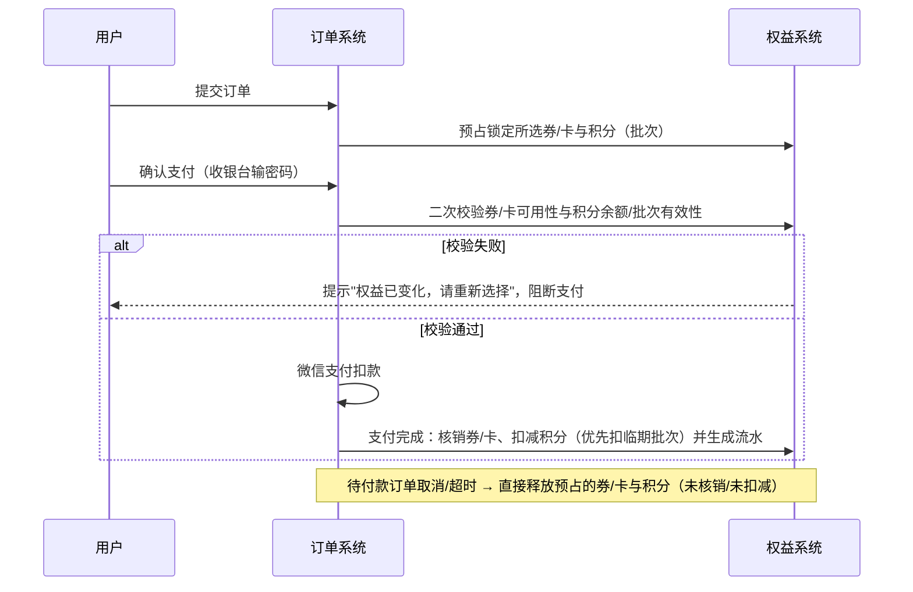
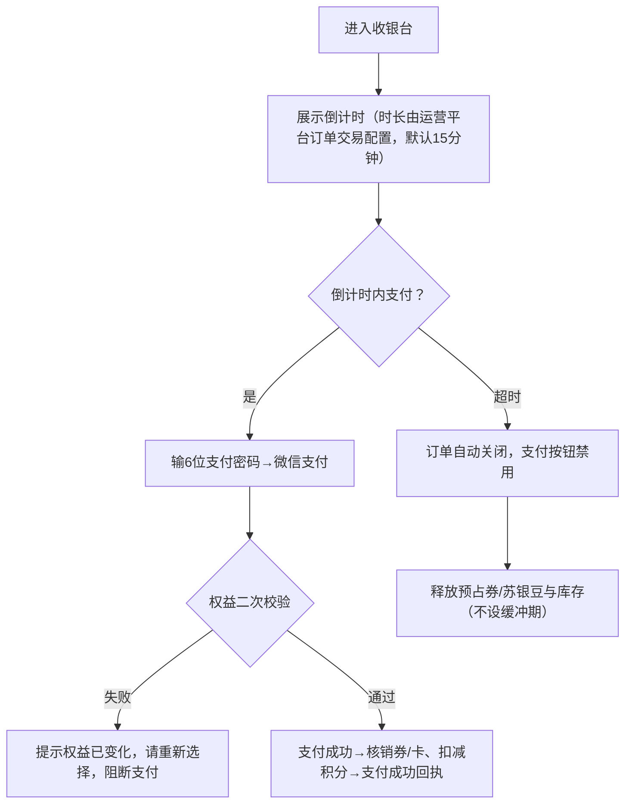
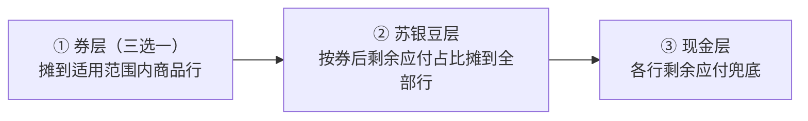
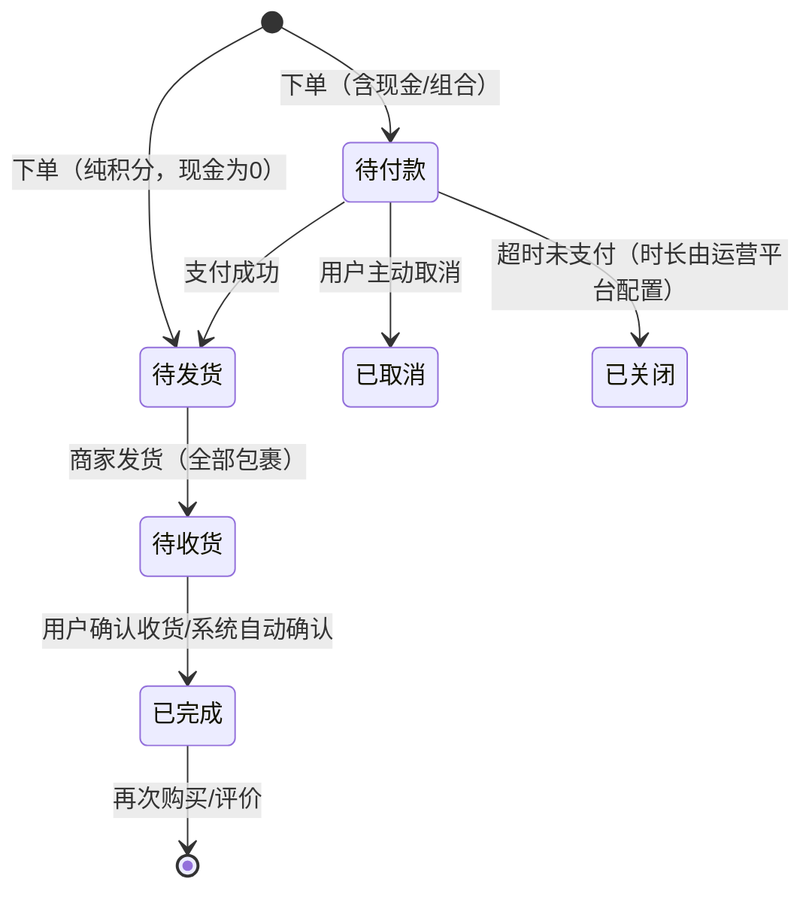
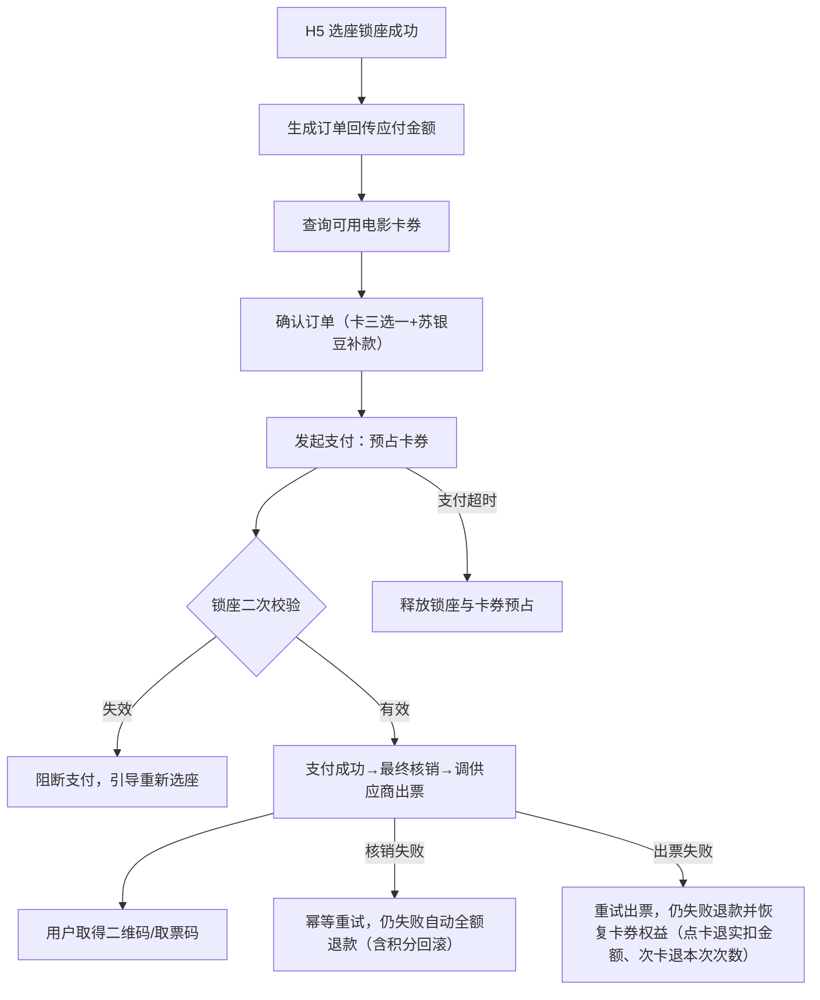

# 小程序支付产品需求文档（积分卡券抵扣与支付）

| 字段 | 内容 |
| ---- | ---- |
| 文档名称 | 积分管理与营销卡券系统-小程序支付（抵扣/分摊/退款/状态机）PRD |
| 当前版本 | V1.1 |
| 文档日期 | 2026-09-08 |
| 文档性质 | 自《小程序商城PRD》§4.3/4.4/5/6/11 与《PRD-积分管理与营销卡券系统-V1.1》§1.3.4/2.3.4 按域拆分：支付抵扣完整规格 |
| 使用角色 | C 端用户 |
| 适用场景 | 实物商品、虚拟商品、蛋糕叔叔、电影购票（4 场景规则一致） |
| 原型说明 | 无独立原型，按 2026-09-01 评审口径补规则与流程图 |

# 1. 详细需求

## 1.1. 小程序支付系统

### 1.1.1. 支付总体规则（通用）

#### 1.1.1.0. 支付组合、抵扣顺序与锁定机制

##### 1. 功能概述
- **功能描述**：确认订单 → 支付执行全链路的积分（苏银豆）与卡券抵扣规则，覆盖组合互斥、抵扣顺序、支付形态分流、权益锁定/校验/核销/释放。
- **计算基准**：底层按平台积分（1 积分 = 1 元）核算，C 端按品牌积分（如 100 苏银豆 = 1 元）展示，**不展示批次**。
- **总价公式**：`应付现金 = max(0, 商品金额 + 运费 − 卡券抵扣 − 苏银豆抵扣)`；卡券与苏银豆抵扣基准均为**商品金额（不含运费）**；当前免邮运费为 0；所有分摊/抵扣/退还四舍五入到**个位豆**。

##### 2. 支付组合互斥表

| 组合 | 是否允许 |
| --- | --- |
| 纯现金 | ✔ |
| 优惠券 + 现金 | ✔ |
| 卡（礼品卡/次卡）+ 现金 | ✔（礼品卡可多张叠加） |
| 积分 + 现金 | ✔ |
| 优惠券 + 积分 + 现金 | ✔ |
| 卡 + 积分 + 现金 | ✔ |
| 纯积分兑换商品（无现金） | ✔ 积分商城全额兑换场景 |
| 优惠券 + 卡（同时使用） | ✘ 三选一互斥 |
| 优惠券 + 优惠券 | ✘ 单选 |
| 礼品卡 + 礼品卡 | ✔ 可叠加 |
| 礼品卡 + 次卡 | ✘ |
| 次卡 + 次卡 | ✔ 可多选（电影购票场景除外） |

##### 3. 卡券类型抵扣规则（三选一）

| 类型 | 抵扣规则 | 选择限制 |
| --- | --- | --- |
| 代金券 | 固定面额，无门槛直接抵 | 优惠券族每单限 1 张 |
| 满减券 | 固定减免，按适用范围商品金额判门槛，不达不可用 | 同上 |
| 折扣券 | 抵扣 = 适用商品金额 ×（1 − 折扣率），取 min(折扣额, 封顶额) | 同上 |
| 礼品卡 | 按余额抵扣，可多选、可拆分多次消费 | 与次卡、优惠券互斥 |
| 商品次卡 | 按次核销，消耗次数 = min(剩余次数, 商品数量)；每次抵扣 = min(单次上限, 单品价格)，超出由苏银豆/现金补足 | 可多选；与礼品卡、优惠券互斥 |

- 结算抽屉按**订单商品类型**筛选可用卡券：普通商品 → 优惠券族/礼品卡/商品次卡；电影票 → 电影次卡/点卡；蛋糕 → 以垂直品类章节为准。不达门槛的券在抽屉内置灰。

##### 4. 权益锁定机制（终版口径 2026-09-01）

##### 5. 业务规则

| 规则编号 | 规则名称 | 规则描述 | 错误提示 |
| --- | --- | --- | --- |
| RULE-PAY-001 | 抵扣顺序 | 先优惠券或卡（三选一）→ 再苏银豆 → 最后现金 | - |
| RULE-PAY-002 | 默认关闭 | 进入确认订单页积分开关默认关闭、优惠券/卡默认不选 | - |
| RULE-PAY-003 | 最大可抵 | 启用积分后默认按本单最大可抵额填充（上限=商品金额不含运费），用户可下调 | - |
| RULE-PAY-004 | 积分无限制 | 苏银豆不设品类/品牌限制，全场通用 | - |
| RULE-PAY-005 | 优先扣临期 | 支付扣减优先扣即将过期批次；同批按获得时间先后 | - |
| RULE-PAY-006 | 预占锁定 | 下单预占；确认支付二次校验；支付完成核销扣减；取消/超时释放预占 | 权益已变化，请重新选择 |
| RULE-PAY-007 | 算价防变 | 提交时后端重新算价，价格变动提示后阻断 | 商品价格已变化，请确认后重新提交 |

***

### 1.1.2. 确认订单抵扣交互模块

#### 1.1.2.1. 确认订单页（抵扣部分）

##### 1. 功能概述
- **功能描述**：下单与支付的核心决策页，统一承载商品/蛋糕/电影票场景（商品类型决定数量可否改、有无地址、配送方式；支付规则一致）。
- **使用角色**：C 端用户。
- **触发条件**：购物车结算 / 商品详情立即购买 / 电影锁座回传 / 蛋糕 H5 回传。

##### 2. 界面设计
###### 2.1 页面原型
无独立原型（复用小程序确认订单页，原型待页面级 PRD 补充）。

###### 2.2 页面要素

| 模块 | 规则 |
| --- | --- |
| 收货地址 | 默认带入默认地址；地址必填，无地址拦截提交（电影票场景无地址） |
| 商品行 | 只读展示本次结算商品；数量由上游带入，一般不可编辑 |
| 卡券抽屉选择 | 按订单商品类型筛选可用卡券；优惠券每单限 1 张；不达门槛置灰 |
| 苏银豆开关 + 修改 | 开关**默认关闭**；开启后默认最大化抵扣 + 一行摘要 + "修改"弹窗调少 |
| 订单备注 | 选填，上限 200 字；无备注订单详情不展示 |
| 配送方式 | 商品：快递免邮；蛋糕：商家配送免邮+预计送达时段；电影票：无配送；当前全场景免邮 |
| 底部合计 | 均为 **¥ 现金应付**（纯积分形态为 ¥0.00） |

##### 3. 业务逻辑
###### 3.1 三种支付形态分流（系统自动推断，用户无需选支付方式）

| 券/卡后现金应付 | 行为 | 提交按钮 |
| --- | --- | --- |
| ¥0（苏银豆或卡券已抵完） | 直接成功，不进收银台，订单直达待发货 | 确认兑换 |
| ¥>0 且用了苏银豆/卡券 | 进收银台（展示抵扣明细 + 现金） | 组合支付 |
| ¥>0 且未用苏银豆/卡券 | 进收银台 | 立即支付 |

###### 3.2 合计展示随支付方式变化
纯积分 →"X 苏银豆"；组合 →"X 苏银豆 + ¥Y"；纯现金 →"¥Y"。

***

### 1.1.3. 收银台与支付模块

#### 1.1.3.1. 待付款收银台页面

##### 1. 功能概述
- **功能描述**：从订单列表"去支付"进入的收银台，两步交互：确认信息 → 输入 6 位支付密码。
- **使用角色**：C 端用户。
- **触发条件**：订单列表/详情"去支付"（仅待付款订单）。

##### 2. 界面设计
###### 2.1 页面原型
无独立原型（小程序收银台弹窗，原型待页面级 PRD 补充）。

###### 2.2 页面要素
展示订单号、下单时间、**支付倒计时（红色）**；地址/商品/数量/积分抵扣**只读锁定**，仅完成现金支付。

##### 3. 业务逻辑
###### 3.1 支付倒计时与关闭流程

###### 3.2 业务规则

| 规则编号 | 规则名称 | 规则描述 | 错误提示 |
| --- | --- | --- | --- |
| RULE-CASHIER-001 | 倒计时配置 | 未支付超时时长由运营平台"订单交易配置"（默认 15 分钟）；结束自动关闭、按钮禁用、释放库存与预占权益，**不设缓冲期** | - |
| RULE-CASHIER-002 | 只读锁定 | 收银台内地址/商品/数量/积分抵扣只读，不可修改 | - |
| RULE-CASHIER-003 | 支付方式 | 小程序收银台弹窗内完成微信支付；订单支付页可选微信/支付宝 | - |

#### 1.1.3.2. 支付成功回执页面

##### 1. 功能概述
- **功能描述**：支付完成后的结果页；**纯积分下单同样进入此页**。
- **页面要素**：成功动画 + 订单信息卡（编号、支付方式、**券/苏银豆/现金分摊**、实付）+ "查看订单/返回首页" + "猜你喜欢"。
- **展示粒度**：分摊明细为**订单级汇总**（券/礼品卡/苏银豆/现金四项总额）；商品行级分摊额系统留存供退款计算，C 端不逐行展示。

***

### 1.1.4. 优惠分摊计算模块

#### 1.1.4.1. 优惠抵扣分摊规则（券/礼品卡/苏银豆 → 商品行）

##### 1. 功能概述
- **功能描述**：下单支付时将各级抵扣**分摊到商品行并随订单持久化快照**；退款按同一口径直接使用分摊结果，**不重算**。
- **分摊链**：卡券三类互斥，同一订单实际只有一条串行链：**选中的一类卡券 → 苏银豆 → 现金**，逐级分摊。

###### 分摊串行链流程

##### 2. 分摊规则表

| 层级 | 资产 | 摊到哪些商品行 | 分摊基准 | 尾差处理 |
| --- | --- | --- | --- | --- |
| ① 券 | 代金券/满减券 | **适用范围内**的商品行（全场券=全部行） | 适用行商品金额（单价×数量）占比 | 计入当级基准金额最大的行，金额并列取列表靠前行 |
| ① 券 | 折扣券 | 适用商品行 | 每行折扣额 = 行商品金额 ×（1 − 折扣率）；整单封顶额超出时在适用行内按比例缩减 | 同上 |
| ① 券 | 商品次卡 | 对应商品行 | 按次核销**天然挂行、不做比例分摊**；每次抵扣 = min(单次上限, 单品价格)，超出部分留给下一层级 | — |
| ① 券 | 礼品卡（可多张） | **适用范围内**的商品行（无限制时=全部行） | 多张合并计算，按适用行商品金额占比 | 计入当级基准金额最大的行 |
| ② 苏银豆 | 苏银豆 | 全部商品行 | 按**券层抵扣后各行剩余应付**占比，四舍五入到**个位豆** | 同上 |
| ③ 现金 | — | — | 各行剩余应付（兜底） | — |

##### 3. 业务规则

| 规则编号 | 规则名称 | 规则描述 |
| --- | --- | --- |
| RULE-ALLOC-001 | 行级恒等式 | `行卡券分摊 + 行苏银豆分摊 + 行现金 = 行商品金额`（当前免邮不含运费） |
| RULE-ALLOC-002 | 快照留存 | 分摊在下单支付时逐行快照并随订单持久化；退款直接使用，不重算 |
| RULE-ALLOC-003 | 苏银豆扣减 | 苏银豆支付按"即将过期优先"扣减批次；C 端不展示批次 |
| RULE-ALLOC-004 | 展示粒度 | C 端仅展示订单级汇总四项（券/礼品卡/苏银豆/现金）；行级留存供售后退款 |

**示例**（满减券 + 苏银豆，行 A ¥120 / 行 B ¥80，全场满 200 减 30）：券 30 按 120:80 摊 → A −18、B −12；券后剩余 A 102、B 68；苏银豆抵 50 按 102:68 摊 → A −30（3000 豆）、B −20（2000 豆）；现金兜底 A ¥72、B ¥48。每行核对恒等式成立。

***

### 1.1.5. 退款分摊模块

#### 1.1.5.1. 退款优惠分摊规则（已支付订单退款）

##### 1. 功能概述
- **功能描述**：退款时按订单留存的行级分摊快照回退各资产，不重算。

##### 2. 退款回退矩阵

| 资产 | 退款处理 |
| --- | --- |
| 现金 | 按 SKU 现金分摊额原路退回支付渠道（1-3 工作日） |
| 苏银豆 | 按 SKU 豆分摊额返还等额豆，按原批次有效期恢复，**过期不返** |
| 礼品卡 | **抵扣部分退回礼品卡余额**（按 SKU 分摊额返还，恢复后可继续消费） |
| 其他卡券（优惠券/次卡） | **核销即作废，全额/部分退款均不退回** |
| 运费 | 部分退款不退运费；整单取消且运费由消费者承担时除外 |

##### 3. 业务规则

| 规则编号 | 规则名称 | 规则描述 |
| --- | --- | --- |
| RULE-REFUND-001 | 跨批次拆回 | 跨批次退款的豆按"批次 × SKU 双向按比例"拆回各批次、恢复原有效期；退款时已过期批次对应豆不再返还 |
| RULE-REFUND-002 | 待付款取消 | 券与苏银豆为预占锁定、未核销/未扣减，直接释放 |
| RULE-REFUND-003 | 补偿另走客诉 | 商家/平台责任补偿走客诉补偿发放（人工审批、平台预算承担，不退原核销的优惠券/次卡） |
| RULE-REFUND-004 | 明示过期量 | 提交售后前权益提醒弹窗明示：现金原路退；苏银豆未过期退回、已过期不退（明示过期数量）；礼品卡抵扣退回；优惠券/次卡核销后不退回 |

***

### 1.1.6. 订单状态机模块

#### 1.1.6.1. 订单主状态流转

##### 1. 状态机设计

##### 2. 各状态定义与可执行操作

| 状态 | 触发/条件 | 可执行操作 |
| --- | --- | --- |
| 待付款 | 含现金未支付 | 取消订单 / 立即支付 / 去支付 |
| 待发货 | 已支付、等待发货 | 仅查看（如需取消走售后【仅退款】） |
| 待收货 | 所有包裹均已发出 | 查看物流 / 确认收货 |
| 已完成 | 用户手动确认，或系统自动确认（物流签收后 N 天或发货后 M 天兜底，取先到，由运营平台配置） | 再次购买 / 评价 |
| 已取消 | 待付款用户主动取消（选原因→二次确认，释放预占） | 查看详情 / 再次购买 |
| 已关闭 | 待付款超时未支付（系统关闭，释放库存） | 查看详情 / 再次购买 |

##### 3. 包裹中间态规则

| 规则编号 | 规则名称 | 规则描述 |
| --- | --- | --- |
| RULE-ORDER-001 | 多包裹聚合 | 一单可拆多包裹，按物流单号聚合显示；订单主状态 = 所有包裹物流状态取最滞后值（待发货 < 运输中 < 已签收） |
| RULE-ORDER-002 | 中间态不入库 | 部分发货/部分签收为中间态，**仅订单详情展示，不作为主状态入库**；订单列表归并展示"待收货" |
| RULE-ORDER-003 | 签收门槛 | 只要有包裹未签收，订单不自动流转"已完成"；手动确认优先于系统自动确认 |
| RULE-ORDER-004 | 部分发货禁取消 | 部分发货状态不允许取消订单 |

***

### 1.1.7. 垂直品类支付模块

#### 1.1.7.1. 电影票支付链路

##### 1. 功能概述
- **功能描述**：选购（影院/场次/选座）由内嵌第三方 H5 承接；锁座后本站承接订单确认、电影卡核销与支付、出票与状态同步。
- **使用角色**：C 端用户。

##### 2. 电影卡核销规则（已定稿）

| 规则 | 说明 |
| --- | --- |
| 每单三选一 | 不使用电影卡 / 仅一张点卡 / 仅一张次卡；点卡与次卡同单互斥 |
| 点卡抵扣 | min(余额, 应付金额) |
| 次卡抵扣 | min(单次金额上限, 应付金额) |
| 补款 | 剩余应付 > 0 时由现金/苏银豆补款 |
| 不叠加 | 电影卡与商城优惠券、满减不叠加；选电影卡则禁用优惠券/满减入口 |
| 接口约束 | 拒绝同时携带点卡 ID 与次卡 ID 的请求 |

##### 3. 业务逻辑
###### 3.1 电影票支付链路流程

###### 3.2 业务规则

| 规则编号 | 规则名称 | 规则描述 |
| --- | --- | --- |
| RULE-MOVIE-001 | 算价一致性 | 支付前预占、支付成功后核销共用同一算价公式并读取订单卡券模式快照，避免中途改券双扣 |
| RULE-MOVIE-002 | 锁座风控 | 发起支付前二次校验锁座有效性，失效阻断并引导重新选座 |
| RULE-MOVIE-003 | 异常恢复 | 核销失败幂等重试后自动全额退款（含积分回滚）；出票失败重试后退款并恢复卡券权益 |

订单状态：待支付 → 支付成功待出票 → 已出票 / 出票失败 / 已关闭 / 已退款。

#### 1.1.7.2. 蛋糕（蛋糕叔叔）支付链路

##### 1. 功能概述
- **功能描述**：选购由内嵌蛋糕叔叔 H5 承接；本站承接聚合订单、统一微信支付与履约状态同步（待支付→制作中→配送中→完成）。
- **链路**：联合登录授权（微信 openid → 本站 Token → 蛋糕叔叔鉴权、持久化绑定）→ web-view 嵌入 H5 选购 → 本站创建聚合订单 + 微信支付 → 履约状态回调本站状态机，同步订单列表与后台对账。

##### 2. 待确认问题（两处口径待评审收口）

| 编号 | 问题 | 当前处理 |
| --- | --- | --- |
| Q5 | 蛋糕订单承接形式：回跳本站确认订单页 vs H5 内 JS Bridge 就地承接 | 待统一，两种体感不同 |
| Q6 | 蛋糕是否承接卡券核销：联调方案未定义 | 待确认；若需则补充适用范围/互斥/核销时机 |

***

# 2. 非功能需求

## 2.1. 性能需求
| 指标名称 | 指标要求 |
| --- | --- |
| 算价响应 | 抵扣项变更实时重算 ≤ 500ms |
| 支付成功率回调 | 支付渠道回调 ≤ 3 秒内驱动订单状态流转 |
| 核销幂等 | 支付完成核销/扣减接口幂等，防双扣 |

## 2.2. 兼容性需求
| 类型 | 要求 |
| --- | --- |
| 小程序容器 | 微信小程序基础库 2.x+ |
| PC 端商城 | **包含在本期范围**（2026-09-01 确认）：支付抵扣与相关权益页面随小程序同步改造，计算逻辑两端一致，仅交互形态不同（PC 侧栏内嵌输入，小程序用修改抽屉+收银台弹窗） |

## 2.3. 安全需求
| 安全项 | 要求 |
| --- | --- |
| 权益校验 | 确认支付时后端二次校验券/卡可用性与积分批次有效性 |
| 预占防超卖 | 券/卡/积分预占原子化，释放幂等 |
| 支付密码 | 收银台 6 位支付密码；订单仅所属用户可支付 |
| 接口约束 | 电影票接口拒绝同时携带点卡 ID 与次卡 ID |
| 对账 | 行级分摊快照持久化，支持售后退款追溯 |

# 3. 附录

## 3.1. 术语表
| 术语 | 说明 |
| --- | --- |
| 纯积分/纯现金/组合支付 | 全额苏银豆 / 全额现金 / 苏银豆+现金 |
| 三选一互斥 | 优惠券、礼品卡、次卡同一订单只能用其中一类；任一类均可与苏银豆叠加 |
| 预占锁定 | 下单时锁定券/卡与积分批次，支付完成核销，取消/超时释放 |
| 优惠抵扣分摊 | 券→苏银豆→现金串行链逐级分摊到商品行，尾差入最大行，行级快照留存 |
| 商品行（SKU 行） | 购物车、订单、售后的最小操作粒度；分摊与退款均按行 |
| 电影点卡/次卡 | 电影购票专用卡；点卡按余额、次卡按单次上限抵扣，同单互斥 |
| 聚合订单 | 垂直品类（蛋糕）由本站统一创建、支付、对账的订单形态 |

## 3.2. 相关流程口径来源
| 口径 | 来源 |
| --- | --- |
| 预占锁定模型（终版） | 2026-09-01 评审二次确认（V1.1 待确认 #2 已闭环） |
| 优惠分摊串行链与行级快照 | 小程序商城 PRD v1.5 |
| 电影卡核销规则（已定稿） | 小程序商城 PRD §11.2 |
| 支付倒计时/自动确认配置化 | 运营平台"订单交易配置" |

## 3.3. 待确认问题
| 编号 | 问题 | 当前口径 |
| --- | --- | --- |
| Q5 | 蛋糕订单承接形式 | 待评审统一 |
| Q6 | 蛋糕是否承接卡券核销 | 待确认 |
| 8 | 发放数量上限（上游约束） | 1000 张/次 |
| 14 | 存量积分数据迁移方案（影响退款批次恢复） | 待定，需单独出迁移方案 |

## 3.4. 相关文档
| 文档名称 | 路径 |
| --- | --- |
| 母文档（三端合一版） | PRD-积分管理与营销卡券系统-V1.1.md |
| 小程序商城全量 PRD | 小程序商城PRD.MD |
| 小程序端-资产拆分 PRD（姊妹篇） | PRD-小程序端-积分卡券-V1.1.md |
| 平台运营端拆分 PRD | PRD-平台运营端-积分管理与营销卡券-V1.1.md |
| 品牌商城端拆分 PRD | PRD-品牌商城端-积分管理与营销卡券-V1.1.md |

# 4. 版本记录
| 版本号 | 修改日期 | 修改人 | 修改内容 |
| --- | --- | --- | --- |
| V1.1 | 2026-09-08 | 产品部 | 自小程序商城 PRD 与母文档 V1.1 拆分为支付独立 PRD：组合互斥/预占锁定（终版口径）/三种支付形态/优惠分摊串行链/退款回退矩阵/订单状态机/电影与蛋糕支付链路 |
