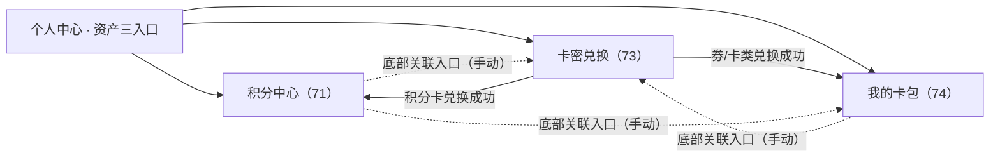
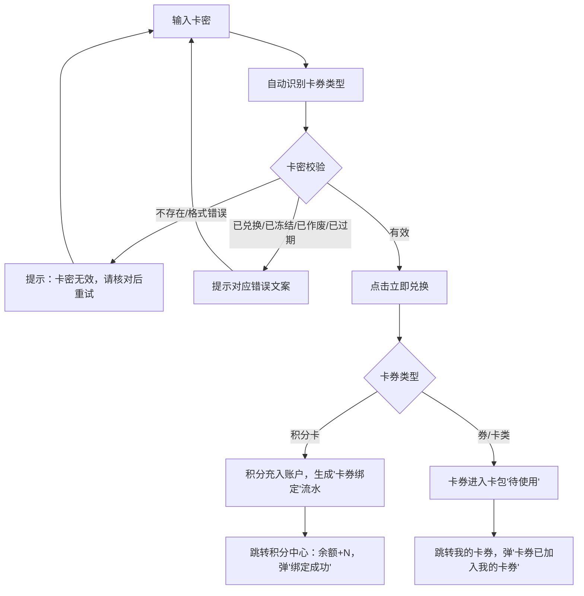

# 小程序端产品需求文档（积分卡券资产）

| 字段 | 内容 |
| ---- | ---- |
| 文档名称 | 积分管理与营销卡券系统-小程序端（资产与权益）PRD |
| 当前版本 | V1.1 |
| 文档日期 | 2026-09-08 |
| 文档性质 | 自《PRD-积分管理与营销卡券系统-V1.1》§2.3 与《小程序商城PRD》§9 按端拆分：C 端积分卡券资产页完整规格 |
| 使用角色 | C 端用户（企业员工/会员） |
| 所属系统 | 数智链云 S2B2C 协同平台 · 苏银豆商城小程序 |
| 原型文件 | 71（积分中心）/ 73（卡密兑换）/ 74（我的卡券） |

# 1. 详细需求

## 1.1. 小程序端系统

### 1.1.1. 资产与权益模块

#### 1.1.1.0. 总则、入口与页面关系

##### 1. 功能概述
- **总则**：C 端原有积分相关页面**全部作废**（原我的积分/积分明细旧版、原卡券兑换页、原卡券列表页），小程序仅保留**积分中心、我的卡包、卡密兑换**三处与积分使用直接相关。
- **品牌积分展示**：品牌积分名称（如"苏银豆"）与兑换比例替换小程序所有积分展示文案（示例 100 苏银豆 = 1 元，1 豆 = ¥0.01）；C 端**不展示批次**，扣减由后台自动处理（优先扣即将过期）。
- **无自助获取**：无 C 端领券中心、签到、秒杀获券、任务等自主获取路径；资产唯一来源为 **B 端发放与卡密兑换**。

##### 2. 三页关系与入口

- 三个**独立页面，互不内嵌弹窗**；卡密兑换成功后按类型自动分流；各页底部提供相互跳转入口（手动），功能内聚、互不嵌套。
- 个人中心头部统计区提供三个独立入口：积分中心（余额、收支明细、即将过期、积分规则）/ 我的卡包（三 Tab 卡券列表）/ 卡密兑换（输入卡密、类型识别、立即兑换）。
- **登录态**：三页均为受保护页，未登录拦截跳登录页，登录成功回原页。

##### 3. 资产来源与到期提醒

| 项 | 规则 |
| --- | --- |
| 积分来源 | 平台/品牌发放、积分卡选人直充、积分卡卡密兑换（流水记"卡券绑定"）、订单退款返还、客诉补偿 |
| 卡券来源 | 平台代发/品牌发放（选人直充入卡包）、卡密兑换（券/卡类） |
| 积分到期 | 按批次到期日 23:59:59 自动过期清零（生成"过期清零"流水，无关联单号，不返还不补偿）；积分中心标红"7 天内过期"；购物扣减**即将过期优先** |
| 卡券到期 | 超过兑换窗口（未兑换）或使用窗口（已兑换）自动过期；到期自动从"待使用"归入"已过期"并置灰 |
| 卡券到期提醒 | 当前仅页面展示，主动推送待确认（见附录待确认 Q4） |

##### 4. 积分核心规则（C 端视角摘要）

| 规则 | 说明 |
| --- | --- |
| 获取 | 平台发放、卡券绑定、积分卡卡密兑换；无签到/领券/任务 |
| 使用 | 下单抵扣现金（先卡券后苏银豆）或全额积分兑换指定商品；不设品类限制，不可提现/转赠 |
| 扣减 | 支付按"即将过期优先"，同批按获得时间先后 |
| 有效期 | 按批次设有效期（1年/2年/3年/无四档），到期清零 |
| 退款回退 | 按原抵扣等额返还并恢复原有效期；批次已过期不再返还；积分下单预占锁定、确认支付校验、支付完成扣减；待付款取消/超时直接释放预占 |

***

#### 1.1.1.1. 积分中心页面

##### 1. 功能概述
- **功能描述**：用户积分（品牌积分名，如"苏银豆"）余额、收支明细、即将过期批次的管理与展示；原"积分使用规则"独立页合并为页内抽屉。
- **业务描述**：无批次选择交互（后台自动按"优先扣临期"扣减），仅展示余额、明细与 7 天内到期预警；**明确无"去兑换"按钮**，只做展示与明细，不内嵌兑换表单/弹窗。
- **使用角色**：C 端用户。
- **触发条件**："我的/商城首页 → 积分余额"入口；卡密兑换积分卡成功后落地本页。

##### 2. 界面设计
###### 2.1 页面原型
[积分中心原型页面](file:///c:/Users/power/Documents/trae_projects/积分原型/积分PRD/71.积分中心-原型页面.html)

###### 2.2 页面结构

| 模块 | 内容 |
| --- | --- |
| Hero 余额卡 | 我的 XX（品牌积分名）余额 / 可抵金额（=余额×比例）/ **7 天内即将过期豆数（红色警示）** |
| Tab 收支明细 | 页内二次筛选：全部/已获取/已消耗/过期；明细行：描述/时间（秒级）/变动值（+红/−黑/过期灰） |
| Tab 即将过期 | 到期时间（精确到 23:59:59）+ 该批次豆数 |
| 规则抽屉 | 底部半屏弹层，"我知道了"关闭 |

###### 2.3 明细类型枚举

| 类别 | 类型 |
| --- | --- |
| 收入 | 平台发放 / 卡券绑定（积分卡兑换到账）/ 订单退款（返还，正向记录并注明订单号） |
| 支出 | 订单抵扣 / 纯积分兑换商品 |
| 过期 | 过期清零 |

###### 2.4 积分使用规则（抽屉文案，5 条）
1. **积分获取**：主要由平台发放，或通过兑换积分卡卡密获得，以账户收支明细为准。
2. **积分使用**：下单时勾选抵扣现金（与卡券叠加，先扣卡券再扣积分）；也可全额积分兑换指定商品；抵扣不设品类限制，不可提现、不可转赠。
3. **扣减顺序**：支付时按"即将过期优先"扣减。
4. **有效期**：按批次设置有效期，到期未使用自动清零；标红提醒 7 天内过期的积分。
5. **退款与回退**：订单退款按原抵扣金额等额返还并恢复原有效期；批次已过期部分不再返还；积分下单时预占锁定、确认支付时校验可用性、支付完成后扣减；待付款订单取消直接释放预占。

##### 3. 交互设计

| 场景 | 交互 |
| --- | --- |
| 卡密兑换回传（积分卡） | 余额增加；明细头部插入"卡券绑定 +N"；自动切回"收支明细+全部"；弹"绑定成功，+N XX" |
| 空态 | 暂无记录 |

***

#### 1.1.1.2. 卡密兑换页面

##### 1. 功能概述
- **功能描述**：统一卡密兑换入口，输入卡密自动识别卡券类型（6 类），兑换后按类型自动路由。**替代原独立卡券兑换页**，所有类型卡密共用同一入口。
- **使用角色**：C 端用户。
- **触发条件**：个人中心"卡密兑换"入口、积分中心/我的卡包底部关联入口。

##### 2. 界面设计
###### 2.1 页面原型
[卡密兑换原型页面](file:///c:/Users/power/Documents/trae_projects/积分原型/积分PRD/73.卡密兑换-原型页面.html)

###### 2.2 页面结构
Hero 标语卡 → 表单卡（\*卡密输入框，maxlength 64，autocomplete off / **卡券类型自动识别区**（输入后显示类型）/ 立即兑换按钮 / 最近兑换历史）→ 底部关联入口（积分中心 / 我的卡包）。

提示文案：请核对卡密后提交，区分大小写。支持积分卡、优惠券、满减券、折扣券、商品次卡（如电影次卡）及礼品卡。

###### 2.3 输入项说明

| 字段名称 | 字段类型 | 必填 | 数据类型 | 长度限制 | 校验规则 | 提示文案 |
| --- | --- | --- | --- | --- | --- | --- |
| 卡密 | 文本输入 | 是 | String | ≤64 | 区分大小写；有效性/已兑换/有效期校验 | 请输入卡密（区分大小写） |

##### 3. 业务逻辑
###### 3.1 卡密兑换流程

###### 3.2 业务规则

| 规则编号 | 规则名称 | 规则描述 | 错误提示 |
| --- | --- | --- | --- |
| RULE-REDEEM-001 | 大小写敏感 | 卡密校验区分大小写，长度 ≤64 | 卡密无效，请核对后重试 |
| RULE-REDEEM-002 | 状态拦截 | 已兑换/已冻结/已作废/已过期卡密不可兑换 | 该卡密已使用/已冻结/已作废/已过期 |
| RULE-REDEEM-003 | 兑换即绑定 | 兑换到谁账户即归谁（积分卡兑换后积分入兑换人账户） | - |

**注（2026-09-01 已确认）**：积分卡支持卡密兑换——平台代发生成积分卡卡密后，用户在本页兑换，积分直接充入账户（流水记"卡券绑定"）；**品牌商城端不可发放积分卡**（仅平台代发可发）。

###### 3.3 错误码表

| 错误码 | 提示文案 |
| --- | --- |
| REDEEM-001 | 卡密无效，请核对后重试 |
| REDEEM-002 | 该卡密已被使用 |
| REDEEM-003 | 该卡密已冻结，请联系客服 |
| REDEEM-004 | 该卡密已作废 |
| REDEEM-005 | 该卡密已过兑换有效期 |

***

#### 1.1.1.3. 我的卡券页面（卡包）

##### 1. 功能概述
- **功能描述**：用户持有的全部卡券（优惠券族/次卡/礼品卡）的展示与使用入口。
- **使用角色**：C 端用户。
- **触发条件**：个人中心"我的卡包"入口；卡密兑换券类成功后落地本页。

##### 2. 界面设计
###### 2.1 页面原型
[我的卡券原型页面](file:///c:/Users/power/Documents/trae_projects/积分原型/积分PRD/74.我的卡券-原型页面.html)

###### 2.2 页面结构
- **粘性三 Tab（带数量角标）**：待使用 / 已使用 / 已过期。
- Tab 内**不按卡券属性分组**，卡片按获得时间倒序（最新获取在最前）。
- 余额用尽或不可用的次卡/礼品卡归"已使用"（按钮"已用尽"）；已使用/已过期普通券置灰并显示状态行（含订单号）。

###### 2.3 卡片字段（按卡型）

| 卡型 | 展示要点 |
| --- | --- |
| 普通券（优惠券/满减券/折扣券） | 类型徽标+名称、门槛/面值、有效期、"去使用"按钮、底栏使用规则（点击弹完整说明） |
| 次卡 | 上述 + "消费记录"按钮；面值总 N 次·单次抵扣金额 ¥X；余额 N 次；消费记录抽屉（商品/时间/扣次数） |
| 礼品卡 | 上述 + "消费记录"按钮；卡号（SV-前缀脱敏）；面值/已用/余额；到账时间与有效期至；消费记录抽屉（商品/时间/扣减金额） |

###### 2.4 使用规则文案要点（卡包底部说明）

- 优惠券/次卡/礼品卡**三选一**；均可与积分（苏银豆）叠加。
- 满减券之间不可叠加；单笔订单限用 1 张红包。
- **退单规则**：满减券/兑换券退单成功后券不退回；次卡单次核销后不退回使用次数；礼品卡/电影卡退票按实付金额退回卡余额。
- 礼品卡不可提现、不可转赠；余额可拆分多次消费、支持多卡叠加。

##### 3. 交互设计

| 场景 | 交互 |
| --- | --- |
| "去使用" | 普通券 → 商品列表/下单流程（按卡型商品限制过滤）；电影次卡 → 内嵌第三方 H5 购票 |
| 卡密兑换回传（券类） | 待使用列表头部插卡，弹"卡券已加入我的卡券" |
| 消费记录 | 次卡/礼品卡卡片"消费记录"按钮 → 抽屉展示明细 |
| 已使用/已过期 | 卡片置灰、按钮置灰、不可操作 |
| 空态 | 暂无待使用/已使用/已过期卡券；暂无消费记录 |

***

# 2. 非功能需求

## 2.1. 性能需求
| 指标名称 | 指标要求 |
| --- | --- |
| 页面加载时间 | 首屏 ≤ 3 秒 |
| 操作响应时间 | 普通操作 ≤ 500ms |
| 余额与角标刷新 | 支付/兑换/退款事件驱动实时刷新 |

## 2.2. 兼容性需求
| 类型 | 要求 |
| --- | --- |
| 小程序容器 | 微信小程序基础库 2.x+ |
| 积分名称适配 | 所有积分文案按品牌积分配置（名称+比例）动态渲染，无硬编码 |

## 2.3. 安全需求
| 安全项 | 要求 |
| --- | --- |
| 登录态 | 三页均为受保护页，未登录拦截 |
| 卡密安全 | 输入区分大小写；卡号/密码掩码展示；兑换防重放 |
| 数据隔离 | 仅订单/权益所属用户可查看自身资产 |
| 流水可追溯 | 积分/卡券变动必有流水（关联单号：积分 J+日期+3 位、卡券 C+日期+3 位） |

# 3. 附录

## 3.1. 术语表
| 术语 | 说明 |
| --- | --- |
| 苏银豆 | 品牌积分 C 端展示名（示例 100 苏银豆 = 1 元）；按品牌积分配置动态替换 |
| 积分中心 | 苏银豆余额、收支明细、即将过期的独立页面 |
| 我的卡包 | 优惠券/满减券/折扣券/礼品卡/各类次卡的持有列表（待使用/已使用/已过期） |
| 卡密兑换 | 输入卡密兑换；积分卡充入积分余额，其他类型充入卡包 |
| 即将过期 | 7 天内到期的积分批次，积分中心红色预警；支付扣减优先扣该批次 |
| 礼品卡 | 余额型卡，按余额抵扣，可多选、可拆分多次消费，不可提现/转赠 |
| 次卡/点卡 | 按次/按点核销的权益卡（如电影次卡、电影点卡、商品次卡） |
| 卡券绑定 | 积分卡兑换到账的流水类型 |

## 3.2. 编号规则（C 端相关）
| 编号类型 | 格式 | 示例 |
| --- | --- | --- |
| C 端订单号 | SY+YYYYMMDD+4 位序号 | SY202606140089 |
| 礼品卡卡号（脱敏展示） | SV-YYYY-MM-\*\*\*\* | SV-2026-07-5502\*\*\*\* |
| 积分流水关联单号 | J+日期+3 位（每日自增重置） | J20260701001 |
| 卡券流水关联单号 | C+日期+3 位（每日自增重置） | C20260705001 |

## 3.3. 存量功能废弃清单（C 端相关）
| 存量功能 | 处理 |
| --- | --- |
| 旧 C 端积分页面（我的积分/积分明细旧版） | 下线 → 替换为积分中心 |
| 旧 C 端"卡券兑换"页 | 下线 → 替换为统一卡密兑换（自动识别 6 类卡型） |
| 旧 C 端卡券列表页 | 下线 → 替换为我的卡券（卡包） |
| 积分商城/纯积分兑换商品入口 | 保留（明细类型"纯积分兑换"） |

## 3.4. 待确认问题
| 编号 | 问题 | 当前口径 |
| --- | --- | --- |
| Q4 | 卡券到期主动推送（消息中心/订阅消息） | 当前仅页面展示，待确认是否纳入 |
| 11 | 原型需同步修复项（74 礼品卡有效期示例改双段口径等） | 2026-09-01 确认不跟进，清单留存备查 |

## 3.5. 相关文档
| 文档名称 | 路径 |
| --- | --- |
| 母文档（三端合一版） | PRD-积分管理与营销卡券系统-V1.1.md |
| 小程序商城全量 PRD（浏览/交易/账户/售后等） | 小程序商城PRD.MD |
| 平台运营端拆分 PRD | PRD-平台运营端-积分管理与营销卡券-V1.1.md |
| 品牌商城端拆分 PRD | PRD-品牌商城端-积分管理与营销卡券-V1.1.md |
| 小程序支付拆分 PRD（姊妹篇） | PRD-小程序支付-积分卡券抵扣-V1.1.md |

# 4. 版本记录
| 版本号 | 修改日期 | 修改人 | 修改内容 |
| --- | --- | --- | --- |
| V1.1 | 2026-09-08 | 产品部 | 基于母文档 V1.1 §2.3 与小程序商城 PRD §9 拆分为 C 端资产独立 PRD；固化口径：三页独立、无自助获取、积分卡支持卡密兑换 |
