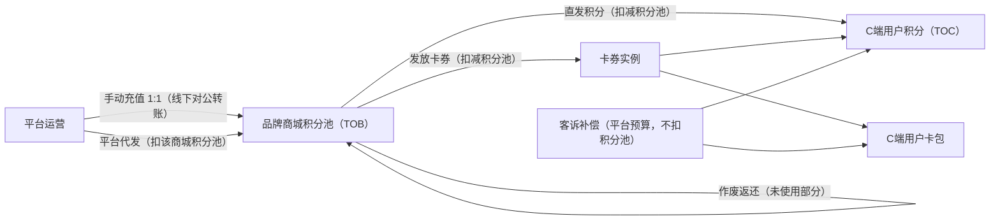
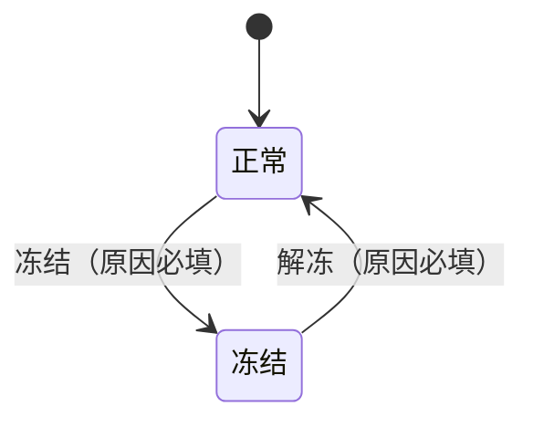
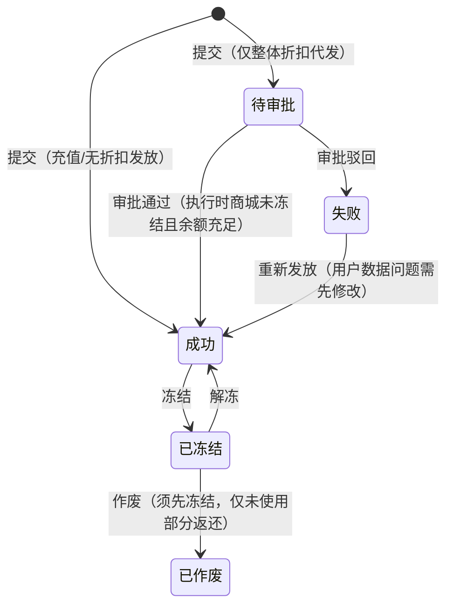
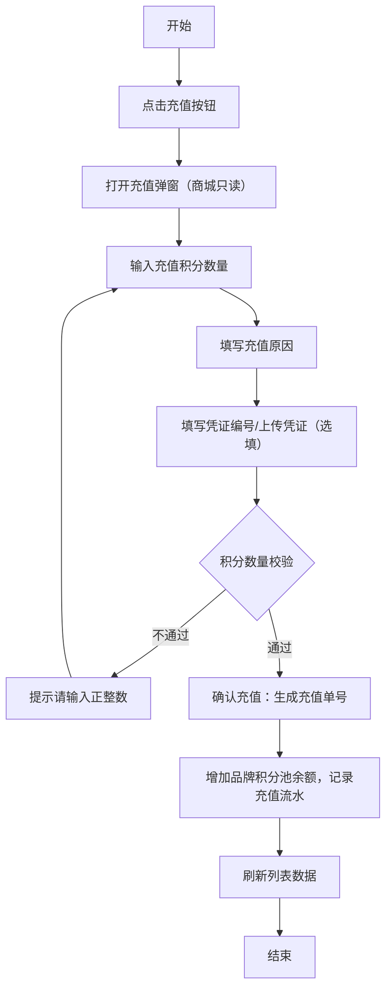
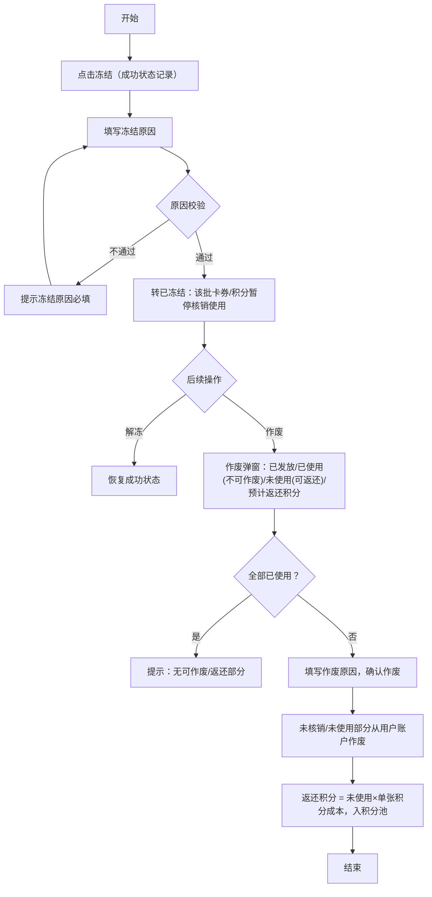
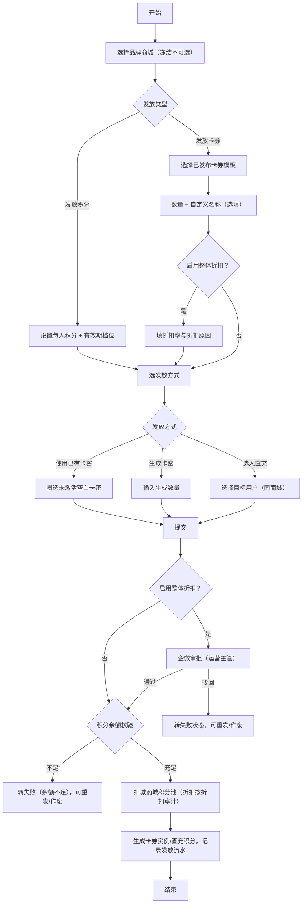
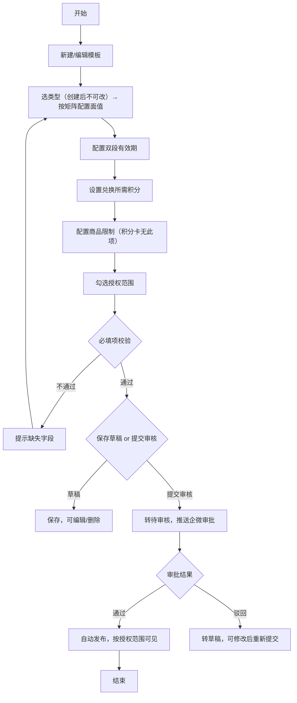
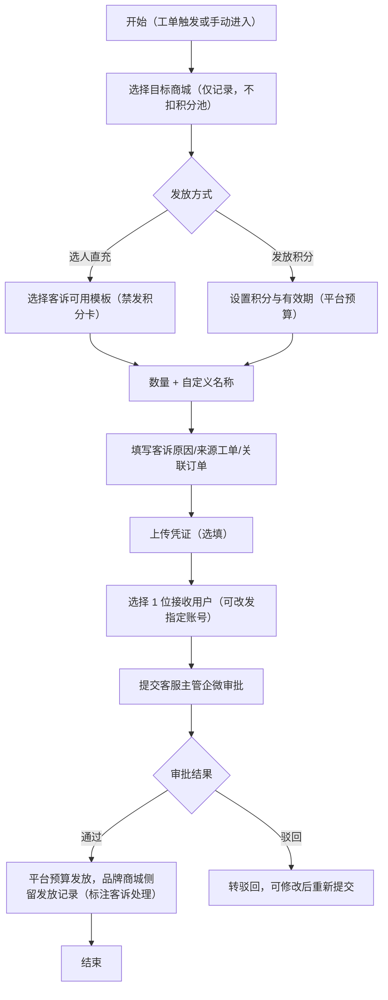

# 平台运营端产品需求文档（积分管理与营销卡券）

| 字段 | 内容 |
| ---- | ---- |
| 文档名称 | 积分管理与营销卡券系统-平台运营端 PRD |
| 当前版本 | V1.1 |
| 文档日期 | 2026-09-08 |
| 文档性质 | 自《PRD-积分管理与营销卡券系统-V1.1》按端拆分：平台运营端完整规格 |
| 使用角色 | 平台运营专员、运营主管（企微审批）、客服专员/主管 |

# 1. 详细需求

## 1.1. 平台运营端系统

### 1.1.1. 积分卡券模块

#### 1.1.1.0. 总体业务规则（通用）

##### 1. 功能概述
- 平台端统一管理双积分体系：**品牌商城积分池（TOB 储值，1 积分=1 元，充值不直达用户）** 与 **C 端用户积分（TOC，发放到账后全场通用）**。
- 平台代发、品牌发放、卡密兑换共用同一套 6 类卡券模板；发放到用户侧即计入商城"已消耗积分"。

##### 2. 双积分体系架构

- 已消耗积分 = 发放到用户侧即计入（卡券生成扣减 + 直发积分），非用户实际消费；余额 = 累计充值 − 已消耗。
- 品牌积分名称/比例仅为前台展示换算（比例档位仅 1/10/100），底层结算统一平台积分。

##### 3. 卡券类型 × 字段适用矩阵（6 类）

| 能力/配置 | 优惠券 | 满减券 | 折扣券 | 商品位次卡 | 礼品卡 | 积分卡 |
| --- | --- | --- | --- | --- | --- | --- |
| 面值配置 | 固定金额+最高优惠（选填）；不支持折扣 | 满减门槛+减免金额 | 折扣率+最高优惠+最低消费 | 可用次数+单次抵扣金额 | 面值金额 | 积分面值 |
| 商品限制 | ✔ 必配 | ✔ 必配 | ✔ 必配 | ✔ 必配 | ✔ 必配 | ✘ 无 |
| 兑换后有效时长 | 自定义天数（≥1，不可 0/不限） | 同左 | 同左 | 同左 | 同左 | 档位 1年/2年/3年/无 |
| 核销口径 | 支付核销即结束 | 同左 | 同左 | 首次订单支付即核销，剩余次数可用 | 首次消费即核销，余额跨订单扣减 | 无核销统计，兑换即入积分账户 |
| 退款规则 | 不返还 | 同左 | 同左 | 核销后不退次数 | 按实付退回卡余额 | 按积分退款规则回退 |
| 发放方式 | 直充/生成卡密/使用已有卡密 | 同左 | 同左 | 同左 | 同左 | 同左（支持卡密，2026-09-01 确认） |

- **商品限制（除积分卡）**：自营五选一互斥——通兑/指定分类（多选）/指定单品/指定品牌（多选）/不支持自营（选时第三方范围必填）；第三方范围：电影票/蛋糕叔叔，**多选**，与自营独立可同时配置。
- **双段有效期**：①发放后有效天数（兑换窗口，≥1，逾期作废）；②兑换后有效时长（使用窗口）。
- **计价逻辑**：消耗积分 = 兑换所需积分 × 生成数量。

##### 4. 状态机汇总

**① 商城积分池状态**

冻结 = 止付（禁充值与发放），与 C 端用户积分使用无关，已发放权益不受影响。

**② 发放记录状态（积分池明细）**

待审批不支持撤回/编辑；驳回后重发，原启用整体折扣的重走企微审批。

**③ 卡券模板状态**：草稿 →（提交审核）→ 待审核 →（企微通过，自动发布）→ 已发布 →（停用）→ 草稿；审核期间维持原版本；已发布仅"使用说明"可内联修改。

**④ 发放批次状态**：发放中/已发完/已冻结/已作废；作废前置必须冻结，返还 =（已发放−已核销）×兑换单价。

**⑤ 卡券实例状态**：未激活 →（激活）→ 未兑换 →（用户兑换）→ 已兑换 →（首次支付核销）→ 已核销；分支：已过期（超任一窗口）、已冻结、已作废。次卡/礼品卡核销后剩余次数/余额继续可用。

##### 5. 企微审批场景

| 场景 | 审批人 | 说明 |
| --- | --- | --- |
| 卡券模板新建/编辑 | 运营主管 | 通过后自动发布 |
| 平台代发（仅启用整体折扣时） | 运营主管 | 未启用折扣无审批直接执行 |
| 客诉补偿发放（全量） | 客服主管 | 平台预算承担 |

##### 6. 暂不实现清单
- 积分池余额预警（月均消耗口径，本期不做）；
- 阶梯满减（后续版本）；
- 平台端旧"审批管理"页面（替换为企微审批 + 远航审批管理模块，本系统仅留场景定义与跳转入口）。

***

#### 1.1.1.1. 商城积分列表页面

##### 1. 功能概述
- **功能描述**：管理各品牌商城积分池，支持手动充值、品牌积分配置、冻结/解冻，查看充值记录。
- **业务描述**：品牌商城主数据与现有运营平台"品牌商城列表"**共用同一张表**（含所属企业、客户联系人），未充值商城余额为 0 也展示。
- **使用角色**：平台运营专员（道馨）。
- **触发条件**：进入"积分卡券 > 商城积分列表"菜单。

##### 2. 界面设计
###### 2.1 页面原型
[商城积分列表原型页面](file:///c:/Users/power/Documents/trae_projects/积分原型/积分PRD/11/10.商城积分列表-原型页面.html)

###### 2.2 Tab1 积分池
统计卡：覆盖品牌商城数 / 平台总积分 / 已消耗积分 / 剩余积分。筛选：关键字（名称/编码）、状态（全部/正常/冻结）。

| 字段名称 | 数据类型 | 数据来源 | 格式说明 |
| --- | --- | --- | --- |
| 品牌商城 | String | 品牌商城基础信息表（与运营平台共表） | 名称+编码 |
| 所属企业 | String | 品牌商城基础信息表 | 企业客户名称 |
| 客户联系人 | String | 品牌商城基础信息表 | 姓名+手机号 |
| 商城积分池余额 | Number | 积分池表 | 两位小数千分位 |
| 已消耗积分 | Number | 积分流水表 | 发放到用户侧即计入 |
| 累计充值 | Number | 积分流水表 | 两位小数千分位 |
| 品牌积分比例 | String | 品牌积分配置 | 如"1 积分 = 100 苏银豆" |
| 品牌积分余额 | Number | 换算值 | 余额×比例，展示用途 |
| 状态 | Enum | 积分池表 | 正常/冻结 |
| 最近充值操作 | String | 操作日志 | 操作人+时间 |

行操作：充值 / 品牌积分配置 / 积分池明细（跳 1.1.1.2）/ 平台代发（跳 1.1.1.4）/ 冻结（已冻结显示解冻）。

###### 2.3 Tab2 充值记录
筛选：关键字（充值单号/原因/凭证编号）、品牌商城、充值时间区间。

| 字段名称 | 数据类型 | 格式说明 |
| --- | --- | --- |
| 充值单号 | String | J+日期+序号，如 J20260701001 |
| 品牌商城 | String | 名称+编码 |
| 充值类型 | Enum | 运营充值 |
| 充值积分 | Number | 正数 |
| 充值后余额 | Number | 两位小数 |
| 凭证编号 | String | PZ+日期+序号（可空） |
| 充值原因 | String | 文本 |
| 操作时间 | DateTime | 操作人+时间 |

##### 3. 业务逻辑
###### 3.1 手动充值积分流程

###### 3.2 业务规则

| 规则编号 | 规则名称 | 适用场景 | 规则描述 | 错误提示 |
| --- | --- | --- | --- | --- |
| RULE-POINTS-001 | 积分数量校验 | 手动充值 | 必须为正整数 | 请输入正整数 |
| RULE-POINTS-002 | 充值原因必填 | 手动充值 | 不能为空 | 请填写充值原因 |
| RULE-POINTS-003 | 充值上限 | 手动充值 | 单次上限 10,000,000【待确认-8】 | 充值积分数量超出单次上限 |
| RULE-POINTS-004 | 冻结商城不可充值 | 手动充值 | 已冻结商城禁止充值与发放 | 该品牌商城已冻结，无法操作 |
| RULE-POINTS-005 | 比例档位 | 品牌积分配置 | 兑换比例仅可选 1/10/100 | - |
| RULE-POINTS-006 | 配置双向同步 | 品牌积分配置 | 平台端与品牌端同一份数据，任一侧修改两边同步 | - |
| RULE-POINTS-007 | 冻结止付 | 冻结积分池 | 冻结后禁充值与发放；与 C 端用户积分使用无关 | - |
| RULE-POINTS-008 | 冻结/解冻原因必填 | 冻结/解冻 | 均必填并记入操作日志 | 请填写冻结原因/解冻原因 |

##### 4. 交互设计
###### 4.1 输入项说明（充值/配置/冻结弹窗）

| 字段名称 | 字段类型 | 必填 | 数据类型 | 长度限制 | 校验规则 | 取值范围 | 提示文案 |
| --- | --- | --- | --- | --- | --- | --- | --- |
| 品牌商城 | 只读展示 | - | String | - | - | - | 从列表行进入，不可改 |
| 充值积分数量 | 数字输入 | 是 | Number | 1-10000000 | 正整数 | >0 | 请输入充值积分数量 |
| 充值原因 | 文本输入 | 是 | String | 1-200 | 非空 | - | 如：线下对公转账 |
| 凭证编号 | 文本输入 | 否 | String | ≤50 | - | - | 如转账流水号（选填） |
| 上传凭证 | 文件上传 | 否 | File | - | 图片/PDF | jpg/png/pdf | 请上传充值凭证（选填） |
| 积分名称（配置） | 文本输入 | 是 | String | ≤20 | 非空 | - | 如"苏银豆" |
| 兑换比例（配置） | 下拉选择 | 是 | Enum | - | - | 1/10/100 | 1 平台积分 = ? |
| 冻结原因 | 文本输入 | 是 | String | 1-200 | 非空 | - | 如：违规操作、账户异常 |
| 解冻原因 | 文本输入 | 是 | String | 1-200 | 非空 | - | 请填写解冻原因 |

###### 4.2 错误提示文案

| 校验项 | 提示文案 |
| --- | --- |
| 积分数量为空/格式错误 | 请输入正整数 |
| 充值原因为空 | 请填写充值原因 |
| 商城已冻结 | 该品牌商城已冻结，无法操作 |
| 积分名称为空 | 请输入积分名称 |

##### 5. 扩展功能
操作日志：充值（操作人/时间/商城/数量/原因/凭证/单号）、品牌积分配置变更、冻结/解冻（原因必录）。

***

#### 1.1.1.2. 商城积分池明细页面

##### 1. 功能概述
- **功能描述**：查看品牌商城积分池收支明细（平台充值/品牌发放/平台代发全部流水），可对平台代发记录发起冻结/作废，作废后未使用部分返还积分池。
- **使用角色**：平台运营专员（道馨）。
- **触发条件**：从商城积分列表点击"积分池明细"进入。

##### 2. 界面设计
###### 2.1 页面原型
[商城积分池明细原型页面](file:///c:/Users/power/Documents/trae_projects/积分原型/积分PRD/11/10a.商城积分池明细-原型页面.html)

顶部商城信息卡：当前余额 / 已消耗积分 / 累计充值。筛选：关键字（批次号/业务对象/备注）、操作时间区间、业务类型（积分池充值/品牌发放/平台代发，**仅 3 个枚举**）、状态（成功/待审批/失败/已冻结/已作废）。

###### 2.2 输出项说明

| 字段名称 | 数据类型 | 数据来源 | 格式说明 |
| --- | --- | --- | --- |
| 发放批次号 | String | 发放记录表 | J=充值/积分发放，C=卡券发放，P=平台代发 |
| 业务类型 | Enum | 发放记录表 | 积分池充值/品牌发放/平台代发 |
| 业务对象 | String | 发放记录表 | **即发放时自定义的卡券名称（或"积分充值到账"），非模板类型**；如"员工生日福利卡（专属积分卡）100积分 × 500张" |
| 发放目标 | String | 发放记录表 | 用户昵称或"多用户"（明细在详情页） |
| 发放数量 | Number | 发放记录表 | 张/人 |
| 收入积分 | Number | 发放记录表 | +绿色 |
| 支出积分 | Number | 发放记录表 | −红色 |
| 剩余积分 | Number | 积分池表 | 两位小数 |
| 状态 | Enum | 发放记录表 | 成功/待审批/失败/已冻结/已作废 |
| 备注 | String | 发放记录表 | 如"9折折扣申请，待运营主管审批" |
| 操作人/时间 | String | 操作日志表 | - |

###### 2.3 行操作（按状态）
成功：查看详情/冻结/作废；待审批：查看详情/审批进度（跳审批管理模块）；失败：查看详情/重新发放/作废；已冻结：查看详情/解冻/作废；已作废：查看详情。

##### 3. 业务逻辑
###### 3.1 冻结→作废两步制流程

###### 3.2 业务规则

| 规则编号 | 规则名称 | 规则描述 | 错误提示 |
| --- | --- | --- | --- |
| RULE-RECORD-001 | 冻结原因必填 | 冻结原因不能为空 | 请填写冻结原因 |
| RULE-RECORD-002 | 作废前置 | 作废前需先冻结该批次 | 请先冻结该批次后再作废 |
| RULE-RECORD-003 | 作废返还范围 | 仅未核销/未使用部分返还；已核销部分不作废不返还 | - |
| RULE-RECORD-004 | 全部已使用不可作废 | 该批发放已全部使用时不可作废 | 该批发放已全部使用，无可作废/返还部分 |
| RULE-RECORD-005 | 失败分类处理 | 用户数据问题（手机号错误/注销等，引导返回发放页修改）/系统问题（可直接重发）；重发原因必填 | - |
| RULE-RECORD-006 | 操作范围 | 平台端仅可操作平台代发记录；品牌发放记录由品牌端操作 | - |
| RULE-RECORD-007 | 审批在途限制 | 待审批不支持撤回/编辑；驳回重发原启用折扣的重走审批 | - |

###### 3.3 状态机设计
见 1.1.1.0-②。

***

#### 1.1.1.3. 积分池明细详情页面

##### 1. 功能概述
- **功能描述**：查看积分池单条记录详情，按记录类型分三种面板：积分池充值 / 积分发放 / 卡券发放。
- **使用角色**：平台运营专员（道馨）。
- **触发条件**：从积分池明细点击"查看详情"进入（支持 recordId/type 参数自动切换面板）。

##### 2. 界面设计
###### 2.1 页面原型
[积分池明细详情原型页面](file:///c:/Users/power/Documents/trae_projects/积分原型/积分PRD/11/10b.积分池明细详情-原型页面.html)

###### 2.2 三种面板要点

| 面板 | 内容要点 |
| --- | --- |
| 积分池充值 | 充值基本信息 + 积分充值详情（本次充值/前后余额/原因/凭证编号/入账账户）+ 凭证图片；提示：充值不直接进入用户账户 |
| 积分发放 | 发放基本信息（含**积分有效期档位**、发放主体=平台代发、发放原因）+ 积分消耗详情（人数/人均/成功失败数/前后余额）+ 发放用户列表（可导出）；提示：仅向同一品牌商城下用户直充 |
| 卡券发放 | 发放基本信息（方式/状态/目标商城）+ 卡券信息（预览/模板/类型/面值/**兑换单价**/**双段有效期**/使用范围/数量/**实际抵扣金额=已核销张数×面值**）+ 积分消耗详情（应消耗/**折扣率与折扣原因**/实际消耗）+ 发放对象列表（用户/时间/卡券状态/卡券编号，底部核销统计，可导出）+ 商城信息卡与操作时间轴（提交→审批通过→开始发放→发放完成） |

***

#### 1.1.1.4. 平台代发页面

##### 1. 功能概述
- **功能描述**：平台代替品牌商城发放卡券或积分，消耗该品牌商城积分池。
- **业务描述**：分步表单：选品牌商城 → 发放类型（卡券/积分）→ 配置 → 发放方式与用户 → 提交（仅启用整体折扣需企微审批，其余直接执行）。
- **使用角色**：平台运营专员（道馨）。

##### 2. 界面设计
###### 2.1 页面原型
[平台代发原型页面](file:///c:/Users/power/Documents/trae_projects/积分原型/积分PRD/11/10c.平台代发-原型页面.html)

###### 2.2 表单结构
- **第 1 步 选择品牌商城**（必填）：下拉搜索；冻结商城标注"(已冻结)"不可选。
- **第 2 步 发放类型**：发放卡券 / 发放积分。
- **卡券路径**：选已发布模板（展示详情卡：兑换单价/优惠内容/双段有效期/使用范围/门槛）→ 数量 + 自定义名称（选填）→ **启用整体折扣**（选填：折扣率 0.1–1、折扣原因必填，需运营主管审批）→ 选发放方式。
- **积分路径**：每人发放积分*（实时换算品牌积分，如"= 1000 苏银豆"）+ **积分有效期***（1年/2年/3年/无）+ 备注；总消耗 = 每人积分 × 用户数。
- **三种发放方式**：①选人直充（每人 1 张，数量=已选用户数只读联动）；②生成卡密（系统生成卡号+密码，线下传递）；③使用已有卡密（从空白卡密池按卡号区间圈选未激活卡密，支持导入卡号，激活后自动关联模板/面值/商城，扣费与激活数一致）。
- **选择发放用户**：搜索（用户名/ID/手机号）、全选/清空/导入手机号；**单次仅向同一品牌商城用户发放**（生成卡密无需选用户）。
- **提交弹窗**：预览（类型/商城/模板/数量/单价/折扣率/方式或用户/消耗积分/剩余积分）+ 余额校验（不足拦截）。

##### 3. 业务逻辑
###### 3.1 平台代发流程

###### 3.2 业务规则

| 规则编号 | 规则名称 | 规则描述 | 错误提示 |
| --- | --- | --- | --- |
| RULE-SEND-001 | 余额校验 | 消耗积分（折扣时=应消耗×折扣率）≤ 积分池余额 | 余额不足，无法发放 |
| RULE-SEND-002 | 数量上限 | 单次发放上限 1000 张【待确认-8】 | 单次最多发放1000张 |
| RULE-SEND-003 | 折扣审批 | 启用整体折扣必填折扣原因，经运营主管审批生效 | 请填写折扣原因 |
| RULE-SEND-004 | 积分卡发放方式 | 积分卡支持全部三种方式：直充即到账，卡密经用户兑换到账（2026-09-01 确认） | - |
| RULE-SEND-005 | 同商城限制 | 单次仅向同一品牌商城下的用户发放 | - |
| RULE-SEND-006 | 积分有效期必选 | 档位必选（1年/2年/3年/无） | 请选择积分有效期 |
| RULE-SEND-007 | 仅折扣需审批 | 未启用折扣提交后直接校验余额并执行 | - |
| RULE-SEND-008 | 商城状态校验 | 审批通过执行时校验商城状态；已冻结转失败（原因：商城已冻结） | 该品牌商城已冻结，无法发放 |

***

#### 1.1.1.5. 卡券模板列表页面

##### 1. 功能概述
- **功能描述**：统一管理 6 种卡券模板；模板经企微审批发布后供平台代发、品牌商城发放（按授权范围）、客诉补偿使用。
- **业务描述**：**合并原"积分卡管理"与"电影票次卡管理"**；商品次卡为通用概念（可限品类/品牌/单品）。
- **使用角色**：平台运营专员（道馨）。

##### 2. 界面设计
###### 2.1 页面原型
[卡券模板列表原型页面](file:///c:/Users/power/Documents/trae_projects/积分原型/积分PRD/11/11.卡券模板列表-原型页面.html)

筛选：关键字（名称/ID）、类型（6 类）、状态（已发布/待审核/草稿）。

###### 2.2 输出项说明

| 字段名称 | 数据类型 | 格式说明 |
| --- | --- | --- |
| 模板名称 | String | 名称+模板ID（M0000x） |
| 卡券类型 | Enum | 6 类 |
| 面值/有效期 | String | 面值 + "发放后 X 天 · 兑换后 Y 天"（积分卡为档位） |
| 兑换积分 | Number | X 积分/张 |
| 商品限制 | String | 通兑 / 指定分类+品类 / 第三方：电影票 等 |
| 授权范围 | Enum | 品牌商城可用 / 客诉可用 / 两者 / 仅平台自用 |
| 使用次数 | Number | 累计核销次数 |
| 累计发放量 | Number | 累计发放张数 |
| 状态 | Enum | 已发布/待审核/草稿 |
| 创建人/时间 | String | - |

行操作：已发布：查看/停用（转草稿）；草稿：编辑/查看/提交审核/删除；待审核：查看/审批进度。批量：批量停用。

***

#### 1.1.1.6. 卡券模板编辑页面

##### 1. 功能概述
- **功能描述**：新建/编辑卡券模板，配置基本信息、面值、双段有效期、兑换积分、商品限制、授权范围，提交企微审批。
- **使用角色**：平台运营专员（道馨）。

##### 2. 界面设计
###### 2.1 页面原型
[卡券模板编辑原型页面](file:///c:/Users/power/Documents/trae_projects/积分原型/积分PRD/11/11a.卡券模板编辑-原型页面.html)

###### 2.2 表单分区

| 分区 | 要点 |
| --- | --- |
| 1 基本信息 | 模板名称*（≤50 字）、模板类型*（6 类，**创建后不可修改**）、封面图（选填，600×400，jpg/png ≤2MB）、使用说明（选填 ≤200 字） |
| 2 卡券面值设置 | 按类型动态展示（矩阵见 1.1.1.0）；优惠券不支持折扣 |
| 3 有效期设置 | 发放后有效天数*（≥1）+ 有效时长*（非积分卡：自定义天数；积分卡：档位 1年/2年/3年/无） |
| 4 兑换设置 | 兑换所需积分*（积分/张）；消耗 = 单价 × 数量 |
| 5 商品限制 | 五选一互斥 + 第三方多选；**积分卡不展示本区** |
| 6 授权范围 | 复选"品牌商城可用"/"客诉可用"；都不勾 = 仅平台自用 |
| 底部 | 保存草稿 / 提交审核（确认弹窗："审核通过后自动发布"；修改提交时"审核期间维持原版本"） |

##### 3. 业务逻辑
###### 3.1 模板创建/审批流程

###### 3.2 业务规则

| 规则编号 | 规则名称 | 规则描述 | 错误提示 |
| --- | --- | --- | --- |
| RULE-TEMPLATE-001 | 模板名称唯一 | 名称不能重复 | 该模板名称已存在 |
| RULE-TEMPLATE-002 | 兑换积分为正 | 必须为正整数 | 请输入正整数 |
| RULE-TEMPLATE-003 | 有效期必填 | 发放后有效天数≥1；有效时长按类型必填 | 请配置有效期 |
| RULE-TEMPLATE-004 | 面值校验 | 各面值字段>0；折扣率 1–99；满减门槛>减免金额 | 减免金额不能大于等于满减门槛 |
| RULE-TEMPLATE-005 | 类型不可改 | 模板类型创建后不可修改 | - |
| RULE-TEMPLATE-006 | 编辑重审 | 已发布模板编辑后重审，审核期间维持原版本；全部字段可编辑 | - |
| RULE-TEMPLATE-007 | 使用说明可改 | 已发布模板仅"使用说明"支持内联修改 | - |
| RULE-TEMPLATE-008 | 停用转草稿 | 停用后转草稿，可编辑/删除/重新提交 | - |
| RULE-TEMPLATE-009 | 积分卡无商品限制 | 积分卡类型无商品限制配置 | - |

***

#### 1.1.1.7. 卡券模板查看页面

##### 1. 功能概述
- **功能描述**：查看卡券模板完整信息（只读）。
- **使用角色**：平台运营专员（道馨）。

##### 2. 界面设计
###### 2.1 页面原型
[卡券模板查看原型页面](file:///c:/Users/power/Documents/trae_projects/积分原型/积分PRD/11/11b.卡券模板查看-原型页面.html)

信息卡片：① 基本信息（编号/名称/类型/状态/授权范围/使用说明——已发布可内联编辑）；② 卡券面值设置（预览+类型特有字段）；③ 兑换与有效期；④ 商品限制（自营/第三方）；⑤ 创建与修改信息 + 操作时间轴。

***

#### 1.1.1.8. 卡券发放管理页面

##### 1. 功能概述
- **功能描述**：按发放批次管理所有卡券，批次行展开查看每张卡/每人的发放与核销明细；管理空白卡密生成与激活。
- **业务描述**：**合并原"卡密池管理"**——空白卡密生成与激活入口并入本页"空白卡券"Tab，激活动作通过"平台代发→使用已有卡密"完成。
- **使用角色**：平台运营专员（道馨）。

##### 2. 界面设计
###### 2.1 页面原型
[卡券发放管理原型页面](file:///c:/Users/power/Documents/trae_projects/积分原型/积分PRD/11/12.卡券发放管理-原型页面.html)

###### 2.2 Tab1 激活卡券（批次树）
统计卡：批次总数 / 已发放(张) / 已核销(张) / 核销率。筛选：批次号/模板关键字、类型、来源（平台代发/品牌发放）、发放方式、目标商城、批次状态、卡券状态、兑换用户。
- **批次行**：批次号 | 生成时间 | 业务内容（模板+面值）| 数量 | 来源 | 目标商城 | 发放方式 | 核销率 | 批次状态 | 操作（详情/冻结/解冻/作废）。
- **卡号行（展开）**：卡号/发放编号（直充 CPN- 前缀、卡密 C 前缀）| 密码（直充"—"，卡密 ••••后4位）| 卡券名称 | 来源 | 品牌商城 | 兑换用户/时间 | 核销时间（**次卡"X/Y 次"、礼品卡"N 笔消费"**）| 卡券状态 | 操作。

###### 2.3 Tab2 空白卡券
筛选：卡号区间。列表：卡号（BC+日期+6 位）| 密码（掩码）| 生成时间 | 状态（未激活）| 操作（详情/激活→跳平台代发/作废）。底部：批量激活 / 批量作废 / 导出勾选。

###### 2.4 关键弹窗

| 弹窗 | 要点 |
| --- | --- |
| 生成空白卡密 | 仅含卡号+密码，**不关联**模板/面值/商城；数量 1–10,000；批次备注 ≤100 字；密码 18 位数字+字母 |
| 冻结卡券批次 | 该批次无法继续兑换/核销（含已兑换未使用）；冻结为作废前置；原因必填 |
| 作废卡券批次 | 未使用卡券彻底作废，返还=（已发放−已核销）×兑换积分 入积分池；须先冻结；原因必填 |
| 批次详情 | 基础信息+核销统计四宫格；积分卡提示"兑换后直接计入用户积分账户，无核销统计"；次卡"首次使用即算核销"；礼品卡"余额制，首次消费即核销" |
| 卡券单张详情 | 卡券信息+使用信息（次卡核销次数、礼品卡面值/已消费/余额、实际抵扣金额）+ 核销记录子表 |

##### 3. 业务逻辑
状态机见 1.1.1.0-④⑤。补充规则：

| 规则编号 | 规则名称 | 规则描述 |
| --- | --- | --- |
| RULE-ISSUE-001 | 单卡冻结范围 | 单张冻结仅限"未兑换/已兑换未核销"；解冻回到原状态 |
| RULE-ISSUE-002 | 核销口径-次卡 | 首次订单支付即核销，剩余次数继续可用，展示"X/Y 次" |
| RULE-ISSUE-003 | 核销口径-礼品卡 | 首次消费即核销，余额跨订单多次扣减，展示"N 笔消费" |
| RULE-ISSUE-004 | 核销口径-积分卡 | 兑换后直接计入用户积分账户，无核销统计 |
| RULE-ISSUE-005 | 空白卡密激活 | 须通过"平台代发→使用已有卡密"激活，扣费与激活数一致 |

***

#### 1.1.1.9. 用户权益总览页面

##### 1. 功能概述
- **功能描述**：按品牌商城查看 C 端用户权益持有总览（积分余额、即将过期、卡券持有），下钻单用户权益流水。权益 = 积分 + 卡券 统一视角。
- **使用角色**：平台运营专员（道馨）、客服专员（刘艳）。

##### 2. 界面设计
###### 2.1 页面原型
[用户权益总览原型页面](file:///c:/Users/power/Documents/trae_projects/积分原型/积分PRD/11/13.用户权益总览-原型页面.html)

统计卡：C 端用户数 / 积分总余额 / 即将过期积分 / 未使用卡券（随筛选联动）。
筛选：关键字（昵称/手机号掩码匹配）、品牌商城、积分余额区间（≥2000 / 1000~2000 / <1000）、复选"仅看即将过期"、"仅看有未使用卡券"。

###### 2.2 输出项说明

| 字段名称 | 数据类型 | 格式说明 |
| --- | --- | --- |
| 用户 | String | 头像+昵称 |
| 所属商城 | String | 商城名称 |
| 手机号 | String | 138****8888 |
| 积分总余额 | Number | 各期限批次合计 |
| 即将过期 | Number | 7 天内到期批次合计，无则"-" |
| 未使用卡券 | Number | N 张 |
| 已使用/失效卡券 | Number | 已核销/已作废/已过期合计 |
| 注册时间 | DateTime | - |

默认排序：即将过期倒序 → 积分余额倒序。行操作：查看权益流水（携带 userId 下钻）。

##### 3. 业务逻辑
积分期限批次数据模型：期限类型（1年期/2年期/3年期/不限）+ 获得批次日期 + 剩余积分 + 到期日（不限期显示"长期"）+ 是否即将过期；同期限可多批并存。示例：3,550 = 1年期 200（临期）+ 1年期 300 + 不限 500 + 2年期 2,450 + 3年期 100。

***

#### 1.1.1.10. 用户权益流水页面

##### 1. 功能概述
- **功能描述**：按品牌商城查看 C 端用户积分与卡券统一流水明细，可查看用户资产明细（积分剩余批次+卡券持有）。
- **使用角色**：平台运营专员（道馨）、客服专员（刘艳）。
- **触发条件**：从用户权益总览下钻，或菜单进入（支持 userId 预选）。

##### 2. 界面设计
###### 2.1 页面原型
[用户权益流水原型页面](file:///c:/Users/power/Documents/trae_projects/积分原型/积分PRD/11/13a.用户权益流水-原型页面.html)

筛选：业务（全部/积分/卡券）、时间区间、类型（联动分组）、关联单号。

流水类型枚举：积分类——发放/积分卡到账/消费/退货返还/售后补偿/过期清零；卡券类——发放/兑换/核销/过期/作废。

###### 2.2 输出项说明

| 字段名称 | 数据类型 | 格式说明 |
| --- | --- | --- |
| 时间 | DateTime | YYYY-MM-DD HH:mm:ss |
| 业务 | Enum | 积分/卡券 |
| 类型 | Enum | 见枚举表 |
| 对象 | String | 积分行=期限标签（临期加粗）；卡券行=名称+面值 |
| 变动/余额 | String | 积分：+300/-50 及余额；卡券：±1 张及"抵扣 ¥50" |
| 关联单号 | String | 积分 J+日期+3 位 / 卡券 C+日期+3 位（每日自增重置，可复制）；过期无单号显示"-" |
| 状态 | Enum | 未使用（蓝）/已核销（绿）/即将过期（橙）/已过期（灰）/已作废（红） |
| 备注 | String | 如"积分抵扣(优先扣即将过期)""批次作废" |

###### 2.3 用户资产明细弹窗（三 Tab）
① 积分剩余明细：汇总卡 + 批次表（期限/批次日期/剩余/有效期/状态，按到期日升序、不限期最后）；② 剩余卡券（**积分卡发放后积分即到账，不在此展示**）；③ 已使用卡券（含实际抵扣金额/关联单号）。

***

### 1.1.2. 售后管理模块

#### 1.1.2.1. 客诉补偿管理页面

##### 1. 功能概述
- **功能描述**：平台向品牌商城客户发放的补偿卡券/积分的记录与统计，**不消耗品牌商城积分池**（平台补偿预算承担）。
- **使用角色**：客服主管（路宁）。
- **触发条件**：进入"售后管理 > 客诉补偿管理"菜单。

##### 2. 界面设计
###### 2.1 页面原型
[客诉补偿管理原型页面](file:///c:/Users/power/Documents/trae_projects/积分原型/积分PRD/11/18.客诉补偿管理-原型页面.html)

统计卡：全部批次总数 / 近 30 天补偿批次数 / 近 30 天补偿面值（券与积分分开累计）/ 审批中。
筛选：关键字（批次号/卡券编号）、补偿原因（客诉补偿/售后赔付/线下活动/其他）、品牌商城、状态（审批中/驳回/已发放/已使用）、核销状态。

###### 2.2 输出项说明

| 字段名称 | 数据类型 | 格式说明 |
| --- | --- | --- |
| 发放批次号 | String | CP-2026-00xx |
| 卡券信息 | String | 图标+名称+规格（"¥15元 × 1张 · 有效期1年"） |
| 补偿原因 | Enum | 四枚举 |
| 来源工单 | String | CS2026xxxx，可点击 |
| 补偿说明 | String | 文本 |
| 接收用户 | String | 姓名+手机号 |
| 所属商城 | String | - |
| 核销状态 | Enum | 已核销/未核销（积分类：已使用/未使用；审批中/驳回"—"） |
| 状态 | Enum | 审批中/驳回/已发放/已使用 |
| 操作人/时间 | String | - |

详情弹窗：批次基础信息（含发放方式、积分有效期、来源工单）+ 发放对象（接收人/用户 ID/所属商城/**商城订单号、下单人手机号**）+ 上传凭证 + 核销/使用信息 + 审批信息。
底部规则：补偿由平台预算承担；**补偿卡券冻结/作废后未核销部分不返还**（与平台代发相反）。

***

#### 1.1.2.2. 客诉补偿发放页面

##### 1. 功能概述
- **功能描述**：客服专员向品牌商城的单一客户发放补偿卡券或积分，提交客服主管企微审批。
- **使用角色**：客服专员（刘艳）发起；客服主管（路宁）审批。
- **触发条件**：菜单进入，或从客服工单"触发补偿"进入（自动预填商城与工单号）。

##### 2. 界面设计
###### 2.1 页面原型
[客诉补偿发放原型页面](file:///c:/Users/power/Documents/trae_projects/积分原型/积分PRD/11/18a.客诉补偿发放-原型页面.html)

###### 2.2 表单结构
- **目标商城**（必填，仅记录追溯，不扣积分池）。
- **第 1 步 发放方式**：选人直充（卡券）/ 发放积分（平台预算）。
- **第 2 步 卡券模板**（直充时）：仅"客诉可用"授权模板；**仅支持优惠券、满减券、折扣券、次卡，不可发放积分卡**。
- **第 3 步 数量与改名**：数量*（默认 1）、自定义名称（选填）。
- **积分模式**：每人发放积分*（默认 5，1 积分=1 元）+ 积分有效期*（1年/2年/3年/无）。
- **第 4 步 客诉信息**：客诉原因*（四枚举）、来源工单（选填，自动填入，工单侧标记"补偿发放中"）、商城订单号（选填，可"查询匹配"回填下单人手机号，**可修改即支持改发指定账号**）、补充说明、上传凭证（JPG/PNG ≤5MB）。
- **第 5 步 发放对象**：搜索 + **单选**；**每次仅 1 位用户**；支持导入手机号（选中首个匹配项）。

##### 3. 业务逻辑
###### 3.1 客诉补偿发放流程

###### 3.2 业务规则

| 规则编号 | 规则名称 | 规则描述 | 错误提示 |
| --- | --- | --- | --- |
| RULE-COMP-001 | 禁发积分卡 | 客诉通道不可发放积分卡 | 客诉通道不支持发放积分卡 |
| RULE-COMP-002 | 全量审批 | 所有客诉补偿需客服主管企微审批 | - |
| RULE-COMP-003 | 单人补偿 | 每次仅可补偿 1 位用户 | 每次仅可补偿1位用户 |
| RULE-COMP-004 | 原因必填 | 客诉原因必选 | 请选择客诉原因 |
| RULE-COMP-005 | 不扣积分池 | 平台预算承担；品牌商城侧在积分池明细以收支均为 0 的标记行留发放记录（备注"客诉处理"） | - |
| RULE-COMP-006 | 模板授权 | 模板须勾选"客诉可用"方可选择 | - |
| RULE-COMP-007 | 不返还 | 补偿卡券冻结/作废后未核销部分不返还 | - |

***

# 2. 非功能需求

## 2.1. 性能需求
| 指标名称 | 指标要求 |
| --- | --- |
| 页面加载时间 | 首屏 ≤ 3 秒 |
| 操作响应时间 | 普通操作 ≤ 500ms |
| 列表查询 | 1000 条以内 ≤ 1 秒 |
| 批量导出 | 10000 条以内 ≤ 30 秒 |
| 发放执行 | 单批次 1000 张以内异步发放，完成后状态回写 |

## 2.2. 兼容性需求
| 类型 | 要求 |
| --- | --- |
| 浏览器 | Chrome 80+、Firefox 75+、Safari 13+、Edge 80+ |
| 分辨率 | 最低 1366×768，推荐 1920×1080 |

## 2.3. 安全需求
| 安全项 | 要求 |
| --- | --- |
| 权限控制 | RBAC；操作范围按端隔离（平台端仅操作平台代发记录） |
| 操作审计 | 充值、配置、冻结/解冻、作废、重发、补偿等敏感操作全量日志（含原因） |
| 积分安全 | 变动必有流水可追溯；发放批次幂等 |
| 卡密安全 | 掩码展示；18 位数字+字母；兑换区分大小写 |

## 2.4. 外部依赖
| 依赖 | 说明 | 负责方 |
| --- | --- | --- |
| 企微审批 | 3 个审批模板（模板审核/平台代发/客诉补偿） | 企微侧配置 + 本系统对接 |
| 审批管理模块 | 审批进度由企微（简道云）同步，各页"审批进度"入口跳转 | 远航 |
| 品牌商城主数据 | 与现有运营平台"品牌商城列表"共表 | 现有系统 |
| 客服工单 | "触发补偿"预填表单；工单侧标记"补偿发放中" | 客服系统 |

# 3. 附录

## 3.1. 术语表
| 术语 | 说明 |
| --- | --- |
| 品牌商城积分池 | TOB 储值账户；1 积分=1 元；充值不直达用户；状态仅正常/冻结 |
| C 端用户积分 | TOC；全场通用；按期限批次管理；不可提现/转赠 |
| 品牌积分 | 前台展示概念（名称+比例 1/10/100），平台端与品牌端双向同步同一份数据 |
| 卡券模板六类型 | 优惠券/满减券/折扣券（券类，一次性）；商品次卡/礼品卡（卡类，有消费记录）；积分卡（积分载体，兑换即入积分中心） |
| 双段有效期 | 发放后有效天数（兑换窗口）+ 兑换后有效时长（使用窗口） |
| 整体折扣 | 平台代发可启用，实际消耗=应消耗×折扣率，需运营主管审批；品牌端无此能力 |
| 使用已有卡密 | 从空白卡密池圈选未激活卡密（BC 前缀），激活时关联模板/面值/商城 |
| 客诉补偿 | 平台预算承担，不扣积分池；每次 1 人；禁发积分卡；未核销部分不返还 |
| 业务对象 | 积分池明细字段=发放时自定义的卡券名称（或"积分充值到账"） |

## 3.2. 编号规则
| 编号类型 | 格式 | 示例 |
| --- | --- | --- |
| 积分批次流水号 | JYYYYMMDD001 | J20260701001 |
| 卡券批次流水号 | CYYYYMMDD001 | C20260705001 |
| 平台代发批次号 | PYYYYMMDD001 | P20260615001 |
| 空白卡密卡号 | BCYYYYMMDD000001 | BC202607000001 |
| 直充卡号 | CPN- | CPN-20260101x |
| 卡券模板编号 | M00001 | M00001 |
| 充值凭证编号 | PZYYYYMMDD001 | PZ20260701001 |
| 来源工单号 | CS2026xxxx | CS20260901001 |

## 3.3. 存量功能合并与废弃清单（平台端相关）
| 存量功能 | 处理 |
| --- | --- |
| 旧"积分卡管理"独立菜单 | 合并 → 卡券模板管理（积分卡类型） |
| 旧"电影票次卡管理"独立菜单 | 合并 → 通用商品次卡 |
| 旧"卡密池管理" | 合并 → 卡券发放管理 Tab2 空白卡券 |
| 平台端旧"审批管理"页面 | 替换 → 企微审批 + 远航审批管理模块 |
| 独立"客诉补偿发放统计"页 | 合并 → 统计卡并入客诉补偿管理页 |
| 旧"积分兑换比例设置"页 | 下线 → 并入品牌积分配置（一处配置双向同步） |

## 3.4. 待确认问题
| # | 问题 | 当前口径 |
| --- | --- | --- |
| 8 | 发放/充值数量上限统一值 | 充值 10,000,000、发放 1000 张/次、空白卡密 10,000 张/次 |
| 5/7 | 企微审批模板节点、远航审批进度交互协议 | 已移交其他产品跟进 |
| 14 | 存量积分数据迁移方案（批次划分/比例换算） | 待定，需单独出迁移方案 |

## 3.5. 相关文档
| 文档名称 | 路径 |
| --- | --- |
| 母文档（三端合一版） | PRD-积分管理与营销卡券系统-V1.1.md |
| 品牌商城端拆分 PRD | PRD-品牌商城端-积分管理与营销卡券-V1.1.md |
| C 端小程序拆分 PRD | PRD-小程序端-积分卡券-V1.1.md / PRD-小程序支付-积分卡券抵扣-V1.1.md |
| 会议转写 | 682341519_会议转写.txt |

# 4. 版本记录
| 版本号 | 修改日期 | 修改人 | 修改内容 |
| --- | --- | --- | --- |
| V1.1 | 2026-09-08 | 产品部 | 基于母文档 V1.1 按端拆分为平台运营端独立 PRD；含 2026-09-01 评审全部已确认口径 |
